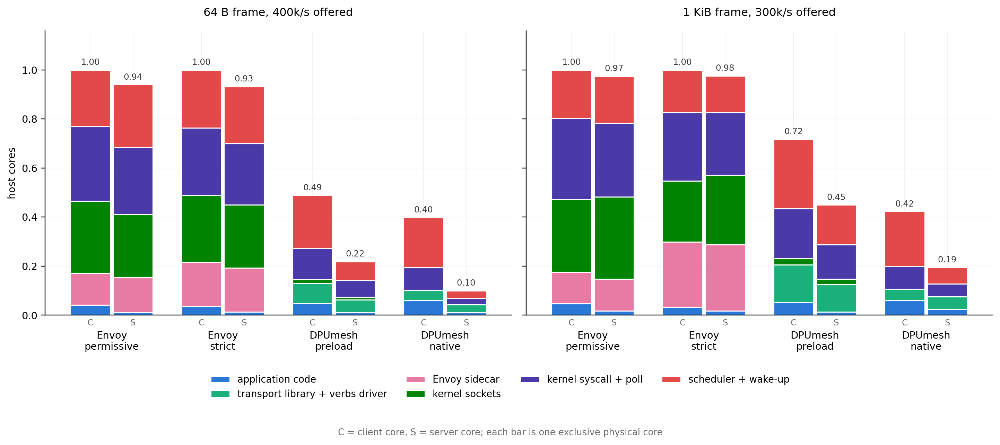
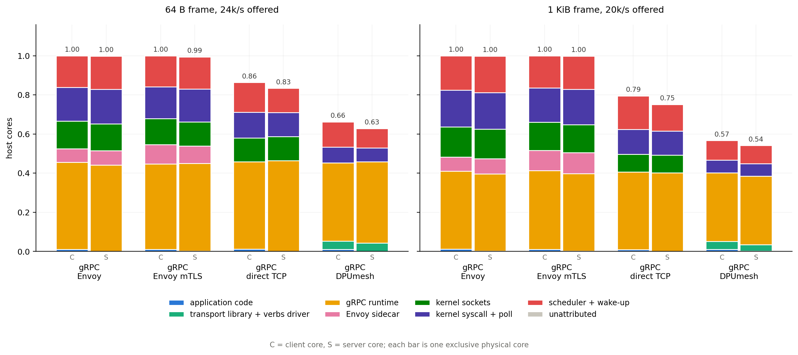
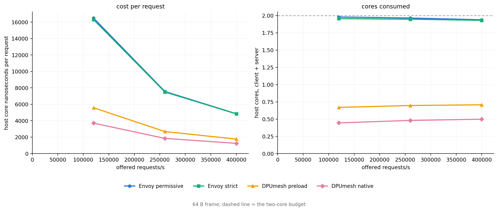
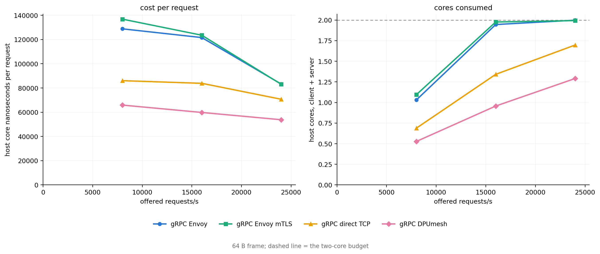

# DPUmesh Host-Core Attribution

`REPORT.md` and `REPORT_GRPC.md` say how much host CPU each path costs. This says
what that CPU is. Eight configurations — four L4 and four L7 — each own one
exclusive client core and one exclusive server core. Each core is sampled with
call stacks during a constant-rate open-loop run, at three offered rates for the
64 B frame and one for the 1 KiB frame, three repetitions per point. Every sample
is charged to the layer that asked for it, so the two-core budget resolves into
application code, transport library, gRPC runtime, Envoy sidecar, the kernel
network path, syscall and poll machinery, and the scheduler. The DPU ARM cores
each run consumes are measured over the same window.

The application is never the cost. It holds at 0.049–0.085 core across the four
L4 paths and 0.010–0.013 across the four L7 paths, whatever the transport
underneath — 2.5–14.2% of what an L4 path spends and 0.5–1.1% of an L7 path.

## How a core is charged

`perf record -C <core>` samples the whole core, so nothing on an exclusively
pinned core is missed. Sampling is one sample per fixed number of unhalted
cycles, which makes sample count proportional to busy time. Call stacks come
from DWARF; symbols for processes inside containers resolve through perf's
build-id cache.

Sample counts become cores through the endpoint's cgroup CPU usage over the same
window. That is scheduler accounting rather than the 100 Hz tick, which matters
because a core running in short bursts is under-counted by tick sampling: on the
lightest points `/proc/stat` reports a third of the cgroup figure.

Each sample is placed twice. Its **owner** is the deepest user-space frame
belonging to the application, the transport library, the gRPC runtime or Envoy;
a syscall, a driver call or a context switch is charged to the caller that
entered it. Its **site** is what the leaf frame is. The reported buckets combine
the two: user-space time goes to its owner, kernel time to the subsystem its
leaf names. That is what makes the paths comparable — on a socket path the
kernel *is* the transport, so charging `tcp_sendmsg` to the application that
called `send()` would credit DPUmesh with a saving it did not make.

Repetitions are reduced to the run whose endpoint core is the median of the
three, so every bucket comes from one observation and the buckets sum to the
reported total. Every process that is not part of the benchmark is confined to
the cores outside the benchmark range for the duration of a campaign.

## L4: where the two cores go



Cores consumed by the client and server cores together, 64 B frames at
400,000/s offered:

| Configuration | application | transport lib | Envoy | kernel sockets | kernel syscall + poll | scheduler + wake | host total | DPU ARM |
|---|---:|---:|---:|---:|---:|---:|---:|---:|
| Envoy permissive | 0.053 | — | 0.272 | 0.553 | 0.576 | 0.486 | 1.940 | 0.13 |
| Envoy strict | 0.049 | — | 0.360 | 0.529 | 0.526 | 0.468 | 1.931 | 0.13 |
| DPUmesh preload | 0.058 | 0.136 | — | 0.027 | 0.194 | 0.293 | 0.707 | 1.15 |
| DPUmesh native | **0.071** | **0.073** | — | **0.000** | **0.119** | **0.236** | **0.498** | 1.14 |

1 KiB frames at 300,000/s:

| Configuration | application | transport lib | Envoy | kernel sockets | kernel syscall + poll | scheduler + wake | host total | DPU ARM |
|---|---:|---:|---:|---:|---:|---:|---:|---:|
| Envoy permissive | 0.063 | — | 0.260 | 0.632 | 0.631 | 0.388 | 1.974 | 0.13 |
| Envoy strict | 0.051 | — | 0.536 | 0.532 | 0.532 | 0.324 | 1.976 | 0.13 |
| DPUmesh preload | 0.065 | 0.266 | — | 0.047 | 0.344 | 0.445 | 1.167 | 3.10 |
| DPUmesh native | **0.085** | **0.096** | — | **0.000** | **0.145** | **0.290** | **0.617** | 2.34 |

Both Envoy paths sit at the two-core budget. Native serves the same load on
0.498 core and preload on 0.707.

Envoy's own code is the smaller part of what the sidecar costs. At 64 B it burns
0.272 core inside the Envoy binary and 1.129 core in the kernel moving bytes to
and from it: the sidecar hop is two extra socket traversals, not two extra
function calls. Part of that kernel time is the CNI rather than TCP — netfilter
and the bridge appear in the profile as `nft_do_chain` and `__nf_conntrack_find_get`,
walked once per direction per hop.

mTLS lands where it should. Envoy's own code rises from 0.272 to 0.360 core at
64 B and from 0.260 to 0.536 at 1 KiB, tracking the byte count, while the kernel
columns fall slightly and the totals stay level.

Native's shape is the claim: the kernel network stack is not smaller, it is
**absent**. Its 0.498 core is 0.073 of library and verbs driver, 0.119 of syscall
and poll, 0.236 of scheduler, and 0.071 of application.

DPUmesh pays for that with the DPU. Native spends 1.14 ARM cores at 64 B and
2.34 at 1 KiB, against 0.13 for the Envoy paths, which is the idle cost of the
data-path process. Against Envoy it removes about 1.44 host cores and adds about
1.01 ARM cores at 64 B; at 1 KiB it removes 1.36 host and adds 2.21 ARM.

## L7: where the two cores go



64 B frames at 24,000/s offered:

| Configuration | application | gRPC runtime | transport lib | Envoy | kernel sockets | kernel syscall + poll | scheduler + wake | host total | DPU ARM |
|---|---:|---:|---:|---:|---:|---:|---:|---:|---:|
| gRPC Envoy | 0.011 | 0.885 | — | 0.144 | 0.278 | 0.349 | 0.331 | 1.999 | 0.11 |
| gRPC Envoy mTLS | 0.012 | 0.885 | — | 0.187 | 0.256 | 0.332 | 0.321 | 1.994 | 0.11 |
| gRPC direct TCP | 0.012 | 0.909 | — | — | 0.244 | 0.256 | 0.275 | 1.697 | 0.11 |
| gRPC DPUmesh | 0.010 | **0.816** | 0.084 | — | **0.000** | **0.153** | **0.227** | **1.291** | 1.83 |

1 KiB frames at 20,000/s:

| Configuration | application | gRPC runtime | transport lib | Envoy | kernel sockets | kernel syscall + poll | scheduler + wake | host total | DPU ARM |
|---|---:|---:|---:|---:|---:|---:|---:|---:|---:|
| gRPC Envoy | 0.013 | 0.793 | — | 0.150 | 0.307 | 0.374 | 0.362 | 1.998 | 0.11 |
| gRPC Envoy mTLS | 0.011 | 0.800 | — | 0.211 | 0.285 | 0.358 | 0.333 | 1.998 | 0.11 |
| gRPC direct TCP | 0.010 | 0.798 | — | — | 0.181 | 0.249 | 0.307 | 1.546 | 0.11 |
| gRPC DPUmesh | 0.012 | **0.700** | 0.074 | — | **0.000** | **0.129** | **0.192** | **1.108** | 1.52 |

The gRPC runtime is the fixed cost of this workload and it does not depend on the
transport: 0.70–0.91 core in every configuration, 41–63% of the whole budget.
HTTP/2 framing, the promise and filter machinery, protobuf and the allocator sit
above whatever carries the bytes.

That is why the L4 host-CPU advantage does not convert into an L7 one. What
DPUmesh removes at L7 is the same thing it removes at L4 — the network stack
(0.18–0.31 core), 40% of the syscall and poll time, and the sidecar — but it
removes it from underneath a runtime that costs more than everything it removes.
Against direct TCP with no proxy at all it still saves 0.41 core at 64 B and 0.44
at 1 KiB, for 1.7 and 1.4 ARM cores respectively.

## The application's share

Application code is the benchmark's own instructions plus the libc and vDSO calls
it makes directly. Its absolute cost is nearly constant across configurations
because the application does the same work in each: build a frame, check it,
stamp a timestamp, update a histogram.

| Frame | Configuration | application | host total | share |
|---|---|---:|---:|---:|
| 64 B | Envoy permissive | 0.053 | 1.940 | 2.7% |
| 64 B | Envoy strict | 0.049 | 1.931 | 2.5% |
| 64 B | DPUmesh preload | 0.058 | 0.707 | 8.2% |
| 64 B | DPUmesh native | 0.071 | 0.498 | **14.2%** |
| 64 B | gRPC Envoy | 0.011 | 1.999 | 0.5% |
| 64 B | gRPC direct TCP | 0.012 | 1.697 | 0.7% |
| 64 B | gRPC DPUmesh | 0.010 | 1.291 | 0.8% |

The share moves because the denominator does. Native's 14.2% is the same absolute
application cost measured against a budget four times smaller. On the socket
paths the application is noise next to the transport; on the native path the
transport has fallen far enough that the application starts to be visible.

## Scheduler and wake-up

The scheduler bucket is not sleeping — sleeping is idle. It is the cost of
entering and leaving sleep: `__schedule`, `psi_group_change`, the load-average
updates, FPU save and restore, and the run-queue locks. Who owns it at the
highest measured rate:

| Configuration | scheduler total | application | transport | gRPC | Envoy |
|---|---:|---:|---:|---:|---:|
| Envoy permissive | 0.486 | 0.153 | — | — | 0.329 |
| Envoy strict | 0.468 | 0.141 | — | — | 0.323 |
| DPUmesh preload | 0.293 | 0.151 | 0.141 | — | — |
| DPUmesh native | 0.236 | 0.170 | 0.064 | — | — |
| gRPC Envoy | 0.331 | 0.004 | — | 0.205 | 0.121 |
| gRPC direct TCP | 0.275 | — | — | 0.274 | — |
| gRPC DPUmesh | 0.227 | 0.010 | 0.110 | 0.106 | — |

The application-owned part is the load generator parking itself until the next
scheduled arrival, and every L4 configuration pays it identically because they
run the same generator. On native it is 0.170 of the 0.236, so native's
transport-attributable wake cost is 0.064 core and 34% of its 0.498 total is the
instrument. The comparison between configurations is unaffected: the generator is
the same in all of them and so is its cost.

## Cost against load





Host cores are strongly load-independent on the socket paths and only weakly
load-dependent on the DPUmesh paths, so cost per request falls steeply with load
everywhere. At 64 B:

| Configuration | 120,000/s | 260,000/s | 400,000/s |
|---|---:|---:|---:|
| Envoy permissive | 1.980 core, 16,499 ns | 1.965 core, 7,556 ns | 1.940 core, 4,849 ns |
| Envoy strict | 1.956 core, 16,300 ns | 1.948 core, 7,491 ns | 1.931 core, 4,828 ns |
| DPUmesh preload | 0.670 core, 5,585 ns | 0.697 core, 2,682 ns | 0.707 core, 1,769 ns |
| DPUmesh native | 0.445 core, 3,708 ns | 0.481 core, 1,850 ns | 0.498 core, 1,246 ns |

A ratio taken at one rate therefore measures how far each path is from its own
efficient operating point as much as it measures the path. The gRPC family
behaves the same way between 8,000/s and 24,000/s, where Envoy's cost per request
falls from 129 µs to 83 µs and DPUmesh's from 66 µs to 54 µs.

Host core nanoseconds per request at the highest measured rate, client and server
together:

| Configuration | offered/s | total | application | gRPC runtime | transport | scheduler |
|---|---:|---:|---:|---:|---:|---:|
| Envoy permissive | 400,000 | 4,849 | 132 | — | 3,503 | 1,214 |
| Envoy strict | 400,000 | 4,828 | 122 | — | 3,537 | 1,169 |
| DPUmesh preload | 400,000 | 1,769 | 145 | — | 891 | 732 |
| DPUmesh native | 400,000 | **1,246** | 177 | — | **478** | 590 |
| gRPC Envoy | 24,000 | 83,275 | 448 | 36,873 | 32,131 | 13,796 |
| gRPC Envoy mTLS | 24,000 | 83,068 | 502 | 36,878 | 32,288 | 13,387 |
| gRPC direct TCP | 24,000 | 70,712 | 517 | 37,890 | 20,838 | 11,462 |
| gRPC DPUmesh | 24,000 | **53,795** | 433 | 33,992 | **9,878** | 9,462 |

The two families are at different operating points and per-message cost falls
with load, so the L4 and L7 rows are not a ratio of the same work. What survives
that caveat is the scale of the L7 term: one unary gRPC exchange costs 54–83 µs
of host core, while an entire L4 request and response — framing, transport and
both kernel traversals — costs 1.2–4.8 µs.

## Flame graphs

One per configuration, frame size and endpoint at the highest measured rate, in
[`core/flame/`](core/flame/). Frames are coloured by the layer they belong to:
blue application, aqua transport library, yellow gRPC runtime, pink Envoy, green
verbs and DOCA driver, violet libc and vDSO, grey kernel. Each graph is rooted on
the container that owns the thread, so an Envoy pod shows the application and the
sidecar as two towers.

Three to open first:

- [`envoy-permissive_48b_400000_client.svg`](core/flame/envoy-permissive_48b_400000_client.svg)
  — the widest branch under `sidecar1` is `Envoy::Api::OsSysCallsImpl::send`
  descending through `tcp_sendmsg` and `ip_finish_output2`, then straight into
  the softirq receive side, `br_handle_frame`, `br_nf_pre_routing` and
  `nft_do_chain` without returning from the syscall. That is the loopback hop
  through the CNI bridge, paid inline by the sending thread.
- [`dpumesh-native_48b_400000_client.svg`](core/flame/dpumesh-native_48b_400000_client.svg)
  — no network stack. `worker_fn` splits into transmit and reverse-ring drain, a
  `clock_gettime` tower that is the instrument, and an `epoll_pwait2` ending in
  `schedule_hrtimeout_range`, which is the generator waiting for its next arrival.
- [`grpc-dpumesh_48b_24000_client.svg`](core/flame/grpc-dpumesh_48b_24000_client.svg)
  — three towers: the DPUmesh progress thread `pe_progress_fn`, the adapter's
  reactor at `dpumesh::grpc::DmeshReactor::Impl::HandleReceiveRun`, and the
  benchmark's worker threads, where a thin blue `(anonymous namespace)::Issue`
  opens into a wide yellow region of `grpc_core` promise and filter machinery.

## Contract

| Axis | Value |
|---|---|
| Configurations | L4: Envoy permissive, Envoy strict, DPUmesh preload, DPUmesh native. L7: gRPC over Envoy permissive, Envoy mTLS, direct TCP, DPUmesh |
| Frames | symmetric 64 B and 1 KiB (16 B benchmark header plus 48 B or 1008 B body) |
| Load | constant-rate open loop, 8 persistent connections. L4 at 120,000, 260,000 and 400,000/s for 64 B and 300,000/s for 1 KiB; L7 at 8,000, 16,000 and 24,000/s for 64 B and 20,000/s for 1 KiB |
| Repetitions | 3 per point, 96 runs; the median endpoint core is reported |
| Acceptance | every run served its offered rate with `fail`, `reorder` and `overflow` zero |
| Host budget | one exclusive client core and one exclusive server core per configuration; an Envoy sidecar shares its application's core |
| Core placement | cores 18–25, NUMA node 1, SMT disabled, performance governor at 2.5 GHz; every non-benchmark process confined to cores 0–17 |
| Sampling | `perf record -C <cores> -e cycles -c 1,000,000..4,000,000 --call-graph dwarf,8192`, 10 s window taken 6 s into a 26 s run |
| Scale | cgroup `cpu.stat usage_usec` per endpoint over the sampling window |
| DPU | `N/K/A = 32/8/8`, L7 proxy disabled; ARM cores from per-thread ticks of the data-path process over the same window, 0.11–0.13 core at idle |
| Platform | `rapids4`, Intel Xeon Gold 6554S, Linux 5.15.0-186; Envoy `v1.30-latest`, unstripped build |

Limits. Repetition spread is under 3% of the endpoint core at every point except
two, where one repetition of three came in low: DPUmesh native at 64 B and
260,000/s by a third, and gRPC over direct TCP at 8,000/s by a fifth. The unattributed bucket is below 0.1% of busy time everywhere. Samples
whose unwind recovers no user frame are charged to the kernel subsystem their leaf
names. Host and DPU cores are not interchangeable: the DPU figure counts BlueField
ARM cores.

## Reproduction

Deploy the scope, pin it, confine everything else, then run the campaign. Runs
must not overlap: two configurations under load contend for the DPU and the
memory system even on disjoint cores.

```sh
BENCH_ENVOY_DEBUG=1 DPUMESH_DPA_THREADS=32 DPUMESH_RINGS_PER_POD=8 \
DPUMESH_ARM_WORKERS=8 DPUMESH_PROXY_L7_SVC= BENCH_NUMA_POLICY=local \
BENCH_DEPLOY_SCOPE=l4 ./bench/bench.sh deploy
./bench/bench.sh pin l4
./bench/suite/core_isolate.sh on

./bench/suite/core_campaign.sh --family l4 --out /tmp/core-l4
./bench/suite/core_report.sh /tmp/core-l4/*/ --out bench/report/core --stem l4
```

For the L7 family, deploy with `BENCH_DEPLOY_SCOPE=grpc`, pin with
`./bench/bench.sh pin grpc`, and use `--family grpc`. `./bench/suite/core_isolate.sh off`
returns the confined processes to every core.

`core_campaign.sh` drives `core_profile.sh` over the matrix; `core_profile.sh`
records one point; `core_report.sh` classifies the samples, writes the CSVs under
[`core/data/`](core/data/), renders the flame graphs and draws the figures. Raw
`perf.data` files are several hundred megabytes each and are not kept in the
tree; the derived CSVs are.
