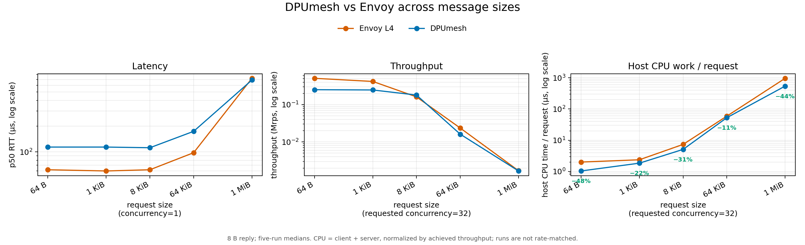
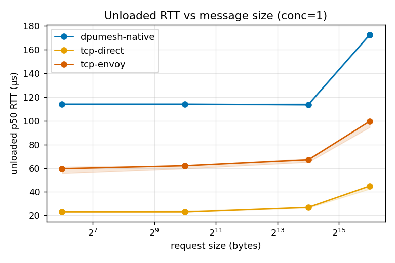
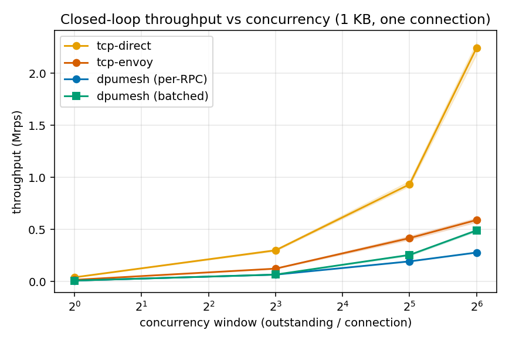
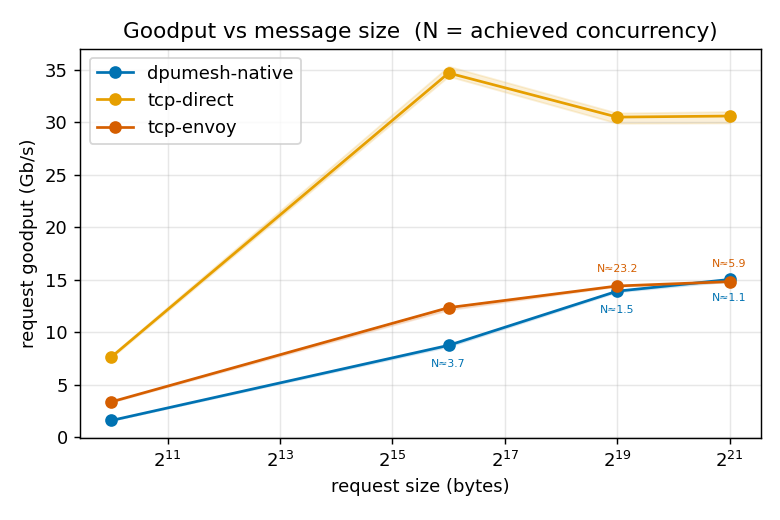
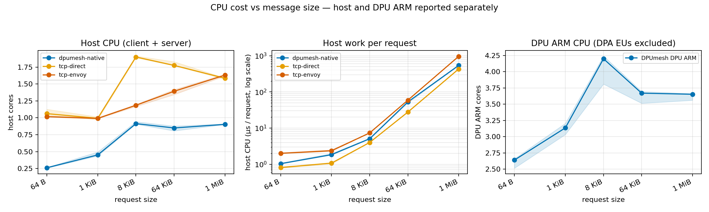

# Current Native L4 Evaluation

This report describes the ABI 4 native L4 implementation measured on
2026-07-22 KST. It contains no historical ABI data and no custom L7 result.

## Compared paths

```text
dpumesh-native  bench_dpumesh ─ libdpumesh ─ PCIe/DPA ─ DPU ARM proxy
                                 ─ DPA/PCIe ─ echo_dpumesh

tcp-envoy      bench_sock ─ client Envoy tcp_proxy ─ Service
                           ─ server Envoy tcp_proxy ─ echo_sock

tcp-direct     bench_sock ─ kernel TCP/Service ─ echo_sock
```

`tcp-envoy` is the primary mesh baseline because both compared paths traverse a
proxy layer. `tcp-direct` is the no-proxy lower bound.

Every point uses one client thread and one connection, a 10-second measurement
after warmup, five repetitions, rotating transport order, and the fair CPU
profile. Values below are per-metric medians; figure bands are deterministic 95%
bootstrap confidence intervals. All 285 main runs and 75 CPU runs completed with
zero failure, drop, overflow, or reorder.

## Core trade-off

The simplest current result is that DPUmesh does not yet broadly match Envoy's
latency or throughput, but uses less host CPU time per completed request. Host
work per request is lower at every size in the CPU sweep: by 48% at 64 B, 22% at
1 KiB, 31% at 8 KiB, 11% at 64 KiB, and 44% at 1 MiB. Occupied cores are not used
for this comparison because the paths achieve different throughput. Per-request
normalization removes the first-order rate effect, but it is not a substitute for
a rate-matched CPU run.



## Results

### Latency and concurrency

At 1 KiB and concurrency one, DPUmesh pays the DPU traversal cost: p50 is
114 µs versus 60 µs through Envoy and 23 µs through direct TCP. At 1 MiB the
DPUmesh p50 is 691 µs, slightly below Envoy's 723 µs.

With a balanced 1 KiB request and 1 KiB reply at concurrency 64, DPUmesh reaches
0.449 Mrps, 5.4% below Envoy's 0.475 Mrps. Their p50 values are 124 and 126 µs;
DPUmesh p99 is higher at 188 versus 141 µs. Direct TCP reaches 1.129 Mrps.





### Goodput by request size

The response is 8 B and requested concurrency is 32. `N` is achieved
concurrency computed as throughput × average RTT.

The 512 KiB and 1 MiB L4 requests are logical benchmark frames, not single
allocations. `bench_dpumesh` splits each frame into `dmesh_post_max()`-bounded
posts; the ordered L4 byte stream carries them as 8 KiB transport units, and the
receiver reframes the stream using the benchmark header's payload length. The
separate in-tree L7 codec's 128 KiB frame limit does not apply because this
campaign has `DPUMESH_PROXY_L7_SVC` disabled.

| Request | Direct TCP Gb/s (N) | Envoy Gb/s (N) | DPUmesh Gb/s (N) |
|---:|---:|---:|---:|
| 8 KiB | 31.20 (28.8) | 10.45 (31.8) | **11.73 (30.8)** |
| 64 KiB | 34.13 (31.4) | **12.24 (32.0)** | 8.47 (3.7) |
| 512 KiB | 30.91 (32.1) | **14.36 (23.3)** | 13.47 (1.5) |
| 1 MiB | 30.80 (32.2) | **14.46 (11.5)** | 14.03 (1.3) |

At 8 KiB, DPUmesh delivers 12.3% more goodput than Envoy, with p50 185 versus
195 µs and p99 247 versus 405 µs, while both paths sustain approximately the
requested window. This is a useful reference point, not the overall result. At
64 KiB and above, the native benchmark does not maintain the same outstanding
window, so its low latency is not a like-for-like loaded-latency win. The
large-message points are retained as achieved goodput, with `N` shown explicitly.



### CPU

CPU is measured as process tick deltas; 1.0 means one fully occupied core. Host
client and server costs are summed. Envoy includes both sidecars. DPU ARM is a
separate processor domain and is not added to host cores. DPA execution units are
not represented by ARM process CPU.

| Request | Direct host | Envoy host | DPUmesh host | DPU ARM | DPUmesh throughput vs Envoy |
|---:|---:|---:|---:|---:|---:|
| 64 B | 1.06 | 1.02 | **0.26** | 2.64 | -50% |
| 1 KiB | 0.99 | 0.99 | **0.45** | 3.14 | -41% |
| 8 KiB | 1.90 | 1.19 | **0.91** | 4.20 | **+12%** |
| 64 KiB | 1.78 | 1.39 | **0.85** | 3.67 | -32% |
| 1 MiB | 1.59 | 1.63 | **0.90** | 3.65 | -2% |

At 8 KiB, DPUmesh improves throughput by 12%, lowers host CPU by 23%, and lowers
host work per request by 31% versus Envoy. This is evidence of host-side offload
in one operating region, not a broad performance or total-CPU-efficiency claim;
the ARM cost remains substantial.



## Conclusion

DPUmesh currently has three primary optimization targets: the small-message DPU
traversal floor, DPU ARM cost, and the large-message outstanding-window collapse.
The 8 KiB point and lower host CPU show that the architecture can be competitive
in a limited region, but they do not yet support a broad performance claim.

Raw repetitions, aggregates, provenance, and startup configuration are in
[`data/`](data/). Exact deployment details are in [DEPLOY.md](DEPLOY.md).
