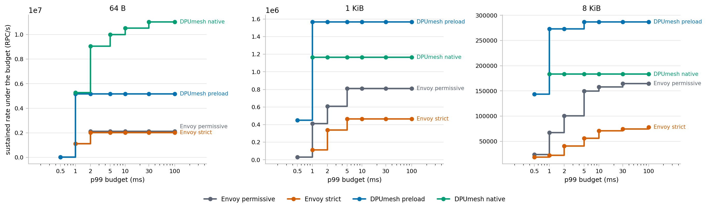

# DPUmesh L4 Evaluation

Four L4 paths carry the same request/response workload under one client core and
one server core each: Envoy as a plaintext TCP proxy, Envoy with mutual TLS on
the inter-pod leg, DPUmesh through the POSIX preload shim, and DPUmesh through
its native API. Three measurements describe them — the host CPU each consumes at
a shared offered load, the rate each sustains under a latency budget, and the
rate each delivers when latency is left unbounded.

## Host CPU at matched load


Host cores consumed by the client and server cores together, at loads every
configuration serves:

| Frame | Offered/s | Envoy permissive | Envoy strict | DPUmesh preload | DPUmesh native |
|---|---:|---:|---:|---:|---:|
| 64 B | 505,396 | 1.877 | 1.853 | 0.709 | **0.503** |
| 64 B | 1,010,793 | 1.842 | 1.853 | 0.753 | **0.529** |
| 64 B | 1,516,189 | 1.752 | 1.742 | 0.805 | **0.603** |
| 64 B | 1,819,427 | 1.651 | 1.673 | 0.880 | **0.622** |
| 1 KiB | 112,710 | 1.954 | 1.964 | 0.622 | **0.393** |
| 1 KiB | 225,421 | 1.957 | 1.949 | 0.982 | **0.531** |
| 1 KiB | 338,131 | 1.937 | 1.896 | 1.223 | **0.611** |
| 1 KiB | 405,757 | 1.934 | 1.904 | 1.368 | **0.670** |
| 8 KiB | 18,619 | 1.265 | 1.439 | 0.501 | **0.265** |
| 8 KiB | 37,239 | 1.931 | 1.964 | 0.789 | **0.445** |
| 8 KiB | 55,858 | 1.963 | 1.956 | 1.100 | **0.567** |
| 8 KiB | 67,029 | 1.963 | 1.963 | 1.285 | **0.620** |

Native serves every load for a third of what the sidecar costs, and the shim for
about half. The gap is not a fixed ratio: Envoy's cost per message falls steeply
as load rises — 3,714 ns at 505,396/s down to 908 ns at 1,819,427/s — because a
byte-stream socket returns whatever queued since the last read, so a busier
connection places more messages in each read and each wake. Native falls too,
from 996 ns to 342 ns, but from a much lower start. A ratio taken at one load
therefore measures how far each path is from its own efficient operating point as
much as it measures the path.

Both Envoy paths sit within 2% of each other at 64 B. They separate as frames
grow and the cipher follows the byte count.

## Why cost per request falls with load

The tables above have a shape worth stating plainly: the server core *falls* as
offered load rises, from 0.935 at 303,238/s to 0.518 at 2,021,585/s on the
sidecar path, while every one of those rates is delivered in full. Seven times
the traffic on half the core is a claim that needs evidence, not a hand wave —
the alternative explanation is that the CPU figure is simply wrong.

It is batching, and the wake count says so. Counting every context switch across
all threads of each endpoint over the same window as the CPU sample, on the
sidecar path at 64 B:

| Offered/s | Delivered | Server wakes/request | Server ns/request |
|---:|---:|---:|---:|
| 300,000 | 1.000 | 0.123 | 3,225 |
| 600,000 | 1.000 | 0.054 | 1,491 |
| 1,200,000 | 1.000 | 0.021 | 700 |
| 1,800,000 | 1.000 | 0.012 | 414 |
| 2,100,000 | 0.998 | **0.007** | **272** |

Wakes per request fall 17.6× while cost per request falls 11.9×. One wake serves
about 8 requests at the low end and about 143 at the high end, which is well
inside what a 64 KiB socket buffer holds at this frame size. Had the CPU figure
been wrong, the wake count would have stayed flat while the cost fell; it moves
first and further.

The consequence is that **cost per request is not a property of a path** — it is
a property of a path at a load. Batching depth is set by queue occupancy, which
the offered rate itself determines, so the independent variable moves a parameter
that then dominates the result. Every per-request figure in this report is
therefore quoted with the load it was taken at, and comparisons between paths are
made at equal load.

## Rate under a latency budget



A single "maximum rate" rewards whichever path queues deepest: a deeper queue
amortises the per-wake cost over more messages, and the offered rate is still
delivered, just later. The number means nothing until a latency ceiling is
attached, and any one ceiling decides the ranking. The curve below reports, for
each p99 budget, the highest rate a path delivered while staying under it.

64 B:

| p99 budget | Envoy permissive | Envoy strict | DPUmesh preload | DPUmesh native |
|---|---:|---:|---:|---:|
| 1 ms | 1,109,324 | 1,109,472 | 5,165,483 | **5,266,120** |
| 2 ms | 2,118,088 | 2,019,876 | 5,165,483 | **9,063,105** |
| 5 ms | 2,118,088 | 2,019,876 | 5,165,483 | **10,002,506** |
| 10 ms | 2,118,088 | 2,019,876 | 5,165,483 | **10,525,543** |
| 30 ms | 2,118,088 | 2,019,876 | 5,165,483 | **11,034,591** |

At 64 B native leads at every budget by 4.3× to 5.0×, and the lead does not
depend on where the line is drawn. Envoy stops improving past 2 ms: its host
cores are already spent, so a looser budget buys it nothing. Native keeps
converting a looser budget into rate up to 30 ms, which is what a path bound by
queueing rather than by cycles looks like.

The 1 KiB and 8 KiB panels order the two DPUmesh paths the other way: the shim
is above native at every budget, by 1.35× at 1 KiB and by 1.49–1.57× at 8 KiB.
Both stay well above the sidecar — at 8 KiB the shim carries 273,062/s under a
1 ms budget where Envoy manages 67,028/s, and 287,033/s under 5 ms against
149,871/s.

Budgets tighter than 1 ms are sparsely covered at L4. The rate grid starts high
enough that few points land under 500 µs, so that column is a property of the
grid rather than of the paths.

## Delivered rate, with the latency it costs

The highest rate each configuration delivered at 98% or better, and what the
median and tail were there:

| Frame | Configuration | Delivered/s | vs permissive | Client | Server | p50 | p99 |
|---|---|---:|---:|---:|---:|---:|---:|
| 64 B | Envoy permissive | 2,021,585 | 1.00× | 0.995 | 0.621 | 875 µs | 1,455 µs |
| 64 B | Envoy strict | 2,021,585 | 1.00× | 0.995 | 0.660 | 978 µs | 1,624 µs |
| 64 B | DPUmesh preload | 4,973,858 | 2.46× | 0.981 | 0.548 | **336 µs** | **578 µs** |
| 64 B | DPUmesh native | **10,532,411** | **5.21×** | 0.995 | 0.624 | 1,241 µs | 8,140 µs |
| 1 KiB | Envoy permissive | 821,657 | 1.00× | 0.995 | 0.896 | 1,444 µs | 2,238 µs |
| 1 KiB | Envoy strict | 450,841 | 0.55× | 0.995 | 0.954 | 1,998 µs | 3,200 µs |
| 1 KiB | DPUmesh preload | **1,497,470** | **1.82×** | 0.995 | 0.928 | 336 µs | 572 µs |
| 1 KiB | DPUmesh native | 1,109,237 | 1.35× | 0.946 | 0.385 | **219 µs** | **634 µs** |
| 8 KiB | Envoy permissive | 157,709 | 1.00× | 0.995 | 0.994 | 5,399 µs | 9,711 µs |
| 8 KiB | Envoy strict | 74,477 | 0.47× | 0.995 | 0.988 | 7,068 µs | 16,475 µs |
| 8 KiB | DPUmesh preload | **287,424** | **1.82×** | 0.995 | 0.922 | 1,326 µs | 2,633 µs |
| 8 KiB | DPUmesh native | 183,241 | 1.16× | 0.947 | 0.391 | **178 µs** | **863 µs** |

The two DPUmesh paths are the same transport reached two ways, and which one
leads depends on the frame. At 64 B native delivers 2.1× the shim. At 1 KiB and
8 KiB the shim delivers 1.4×, and it does so without giving up latency: the
budget curve above puts the shim over native across every budget at those two
frames.

The medians in this table invite the opposite reading, and they should not be
read that way — each row sits at a different rate, so the comparison is not
like-for-like. Held at one rate the shim is ahead at both frames. At 1 KiB and
about 100,000/s the shim runs p50 544 µs and p99 955 µs against native's 776 µs
and 1,460 µs.

Native's latency is unusual in that it *falls* as load rises — p50 952 µs at
40,859/s, 776 µs at 100,562/s, 219 µs at its ceiling. A transport unit that is
not yet full waits for its deadline, and at low rates that wait is most of the
median; at high rates the unit fills before the deadline arrives. The shim
reaches the same effect through the socket buffer, which is why its cost per
message falls with load the way any socket path's does. Native also stops with a
core to spare at those frames — 0.946 client and 0.385 server — while the shim
runs its client core out.

## What it costs in total

Host cores are not the only cores. At the highest matched load of each frame:

| Frame | Configuration | Host | DPU ARM | Total |
|---|---|---:|---:|---:|
| 64 B @ 1,819,427/s | Envoy permissive | 1.651 | — | **1.65** |
| | DPUmesh preload | 0.880 | 1.34 | 2.22 |
| | DPUmesh native | **0.622** | 1.16 | 1.78 |
| 1 KiB @ 405,757/s | Envoy permissive | 1.934 | — | **1.93** |
| | DPUmesh preload | 1.368 | 4.11 | 5.48 |
| | DPUmesh native | **0.670** | 2.98 | 3.65 |
| 8 KiB @ 67,029/s | Envoy permissive | 1.963 | — | **1.96** |
| | DPUmesh preload | 1.285 | 4.79 | 6.08 |
| | DPUmesh native | **0.620** | 3.48 | 4.10 |

DPUmesh buys host cores with ARM cores, and the exchange rate worsens with frame
size: at 64 B native spends 1.16 ARM to save 1.03 host, at 8 KiB it spends 3.48
to save 1.34. Whether that is worth making depends on what a host core costs
against a card that is already in the machine — the two are not interchangeable,
and the table reports both rather than summing them into a verdict.

## Contract

| Axis | Value |
|---|---|
| Configurations | Envoy permissive TCP, Envoy strict mTLS, DPUmesh preload, DPUmesh native |
| Frames | symmetric request/response: 64 B, 1 KiB, 8 KiB |
| Frame format | 16 B benchmark header plus 48 B, 1008 B or 8176 B body |
| Load | constant-rate open loop; 8 persistent connections; 10 s per rate |
| Repetitions | one per retained rate; capacity search votes twice per candidate |
| Host budget | one exclusive client core and one exclusive server core per configuration |
| Core placement | cores 18–35, NUMA node 1, SMT disabled, 2.5 GHz performance governor |
| Host CPU | runqueue runtime of the endpoint cores (`/proc/schedstat`), which counts the application, its sidecar and the kernel threads working on their behalf |
| CPU window | 6 s, opened 2.5 s into each run so connection setup and teardown fall outside it |
| DPU | `N/K/A=32/8/8`; L7 disabled; ARM cores from per-tid ticks of the data-path process, 0.14 core at idle |
| Backend | exactly one ready server per configuration |
| Platform | `rapids4`, Intel Xeon Gold 6554S, Linux 5.15.0-186-generic |
| Software | Envoy `v1.30-latest`; swap disabled |

Envoy permissive, Envoy strict and DPUmesh preload run byte-identical
`bench_sock` and `echo_sock`. Native runs `bench_dpumesh` and `echo_dpumesh`.
Envoy strict authenticates and encrypts the inter-pod leg; DPUmesh does not, and
the two are not security-equivalent.

A rate is delivered when achieved/offered ≥ 0.98 with no failure, reorder or
histogram overflow, and the generator's own schedule holds. **Latency is not part
of that test**, which is why every delivered rate above is reported with the p50
and p99 observed there, and why the latency-budget curve rather than the
delivered ceiling is the comparison to read.

Cross-checks on this dataset: the three CPU definitions available per run — the
runqueue runtime reported here, the cgroup sum of application and sidecar, and
tick-sampled core busy — agree within 5% at every point, so the reported figure
does not depend on which is chosen. `fail`, `reorder` and `overflow` are zero
across all 116 retained runs.

Per-point medians are in
[`data/l4-20260810/measurements.csv`](data/l4-20260810/measurements.csv); the
capacity search is in [`data/l4-20260810/knees.csv`](data/l4-20260810/knees.csv); the
wake counts are in
[`data/l4-20260810/wakes_per_request.csv`](data/l4-20260810/wakes_per_request.csv).

## Reproduction

Create `.env` with `HOST_PASS`, `DPU_HOST` and `DPU_PASS`, then from the
repository root:

```sh
sudo swapoff -a

env DPUMESH_DPA_THREADS=32 DPUMESH_RINGS_PER_POD=8 DPUMESH_ARM_WORKERS=8 \
    DPUMESH_PROXY_L7_SVC= BENCH_NUMA_POLICY=local BENCH_DEPLOY_SCOPE=l4 \
    REPS=1 ./bench/suite/l4_proxy_data.sh --no-perf --out /tmp/l4run

python3 bench/suite/distill.py /tmp/l4run measurements.csv
python3 bench/suite/plot_final.py measurements.csv bench/report/figures
python3 bench/suite/plot_slo.py bench/report/figures slo_l4 /tmp/l4run
```

The collector deploys, validates pinning and the core budget, discovers each
path's capacity, and retains the matched and per-path rates around it. A campaign
holds `/tmp/dpumesh-bench.lock`: two under load contend for the DPU and the
memory system even on disjoint cores, and each one's traffic lands in the other's
CPU window.
