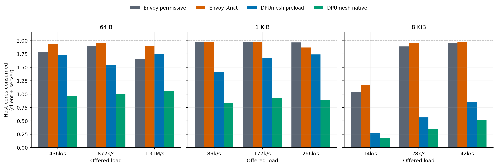
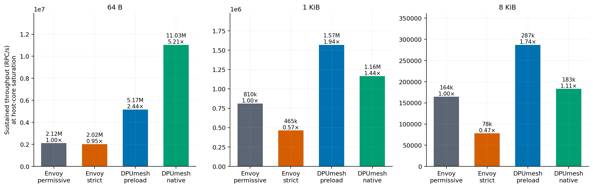

# DPUmesh L4 Evaluation

Four L4 paths carry the same request/response workload under one client core and
one server core each: Envoy as a plaintext TCP proxy, Envoy with mutual TLS on
the inter-pod leg, DPUmesh through the POSIX preload shim, and DPUmesh through
its native API. Two measurements describe them — the host CPU each consumes at a
shared offered load, and the throughput each sustains once a host core saturates.

## Host CPU at matched load



Host cores consumed by the client and server cores together, at loads every
configuration serves cleanly:

| Frame | Offered/s | Envoy permissive | Envoy strict | DPUmesh preload | DPUmesh native |
|---|---:|---:|---:|---:|---:|
| 64 B | 477,743 | 1.937 | 1.854 | 0.495 | **0.298** |
| 64 B | 1,433,229 | 1.768 | 1.759 | 0.691 | **0.465** |
| 64 B | 1,719,875 | 1.714 | 1.726 | 0.883 | **0.514** |
| 1 KiB | 108,561 | 1.954 | 1.925 | 0.413 | **0.195** |
| 1 KiB | 325,682 | 1.941 | 1.886 | 1.003 | **0.542** |
| 1 KiB | 390,818 | 1.800 | 1.919 | 1.124 | **0.612** |
| 8 KiB | 16,953 | 1.201 | 1.358 | 0.377 | **0.207** |
| 8 KiB | 50,858 | 1.951 | 1.950 | 0.994 | **0.541** |
| 8 KiB | 61,029 | 1.955 | 1.946 | 1.148 | **0.642** |

Both Envoy paths sit against the two-core budget from the lowest load measured
and stay there, so the remaining budget cannot absorb more traffic. Native serves
the same loads on 0.20–0.64 core, leaving 1.3–1.8 core free.

The gap at any single load is not a fixed efficiency ratio. Envoy's host cost per
message falls steeply with load, while native holds a flat cost across the same
range. The ratio at a matched load therefore measures how far Envoy is from its
own efficient operating point, and it closes as load rises.

## Throughput at host-core saturation



The highest offered rate each configuration serves cleanly, with the endpoint
cores observed there:

| Frame | Configuration | Sustained RPC/s | vs permissive | Client | Server | p99 |
|---|---|---:|---:|---:|---:|---:|
| 64 B | Envoy permissive | 1,719,897 | 1.00× | 0.977 | 0.738 | 1.11 ms |
| 64 B | Envoy strict | 1,719,837 | 1.00× | 0.981 | 0.745 | 1.26 ms |
| 64 B | DPUmesh preload | 1,806,362 | 1.05× | 0.602 | 0.295 | 1.03 ms |
| 64 B | DPUmesh native | **8,950,968** | **5.20×** | 0.892 | 0.557 | 1.31 ms |
| 1 KiB | Envoy permissive | 635,767 | 1.00× | 0.978 | 0.767 | 1.87 ms |
| 1 KiB | Envoy strict | 434,048 | 0.68× | 0.978 | 0.930 | 3.01 ms |
| 1 KiB | DPUmesh preload | 504,299 | 0.79× | 0.795 | 0.536 | 0.43 ms |
| 1 KiB | DPUmesh native | **997,430** | **1.57×** | 0.771 | 0.334 | 0.52 ms |
| 8 KiB | Envoy permissive | 134,102 | 1.00× | 0.977 | 0.963 | 3.44 ms |
| 8 KiB | Envoy strict | 67,824 | 0.51× | 0.974 | 0.962 | 6.86 ms |
| 8 KiB | DPUmesh preload | **161,718** | **1.21×** | 0.979 | 0.953 | 0.47 ms |
| 8 KiB | DPUmesh native | 144,496 | 1.08× | 0.766 | 0.413 | 0.56 ms |

Native leads at every frame size and by the widest margin at 64 B, where
per-message overhead dominates: Envoy spends a full client core on 1.72 M
messages while native spends 0.89 core on 8.95 M. At 8 KiB the preload shim
leads instead, because the native ceiling there is bound by the DPU rather than
by the host core, which stays at 0.77.

The two Envoy paths are identical at 64 B — 1.72 M each — because the sidecar's
per-connection TCP work, not the cipher, sets the limit there. They separate as
frames grow and encryption cost follows the byte count: strict falls to 0.68× of
permissive at 1 KiB and 0.51× at 8 KiB.

## Why the advantage narrows with frame size

Host cost per message at each configuration's own ceiling:

| Frame | Envoy permissive | DPUmesh native | Ratio |
|---|---:|---:|---:|
| 64 B | 997 ns | 162 ns | 6.15× |
| 1 KiB | 2,745 ns | 1,108 ns | 2.48× |
| 8 KiB | 14,467 ns | 8,159 ns | 1.77× |

What DPUmesh removes from the host — the sidecar hop, the socket calls, the
stack traversal — is per-message work of roughly fixed size. What remains is
per-byte work the application performs on its own payload, and that grows with
the frame. At 8 KiB both paths converge on a similar per-client-core bandwidth,
so the fixed saving is a small share of a much larger total.

Envoy's own cost per message is strongly load-dependent, because a byte-stream
socket returns whatever has queued since the last read and a busier connection
places more messages in each read and each event. Nothing configures this:
`TCP_NODELAY` is set on both endpoints, and socket buffers and Envoy buffer
limits are left at their defaults. Native is close to flat across the same range.

## Transmit ownership

A QP's transmit state has one mutator: the thread that owns the QP. Retention is
one bit on that QP's EQ plus a deadline stamp, and the tail is published by the
owner, from a later transmit call or from `dmesh_poll_eq`. A per-QP gate
serializes the two, and a QP whose owner is inside a transmit call keeps its
retention for a later pass. The channel timer wakes an EQ whose earliest tail
has come due and touches no transmit state.

Host cost tracks how often a partial unit reaches the ring. A stream that fills
its transport unit publishes one descriptor per unit; one that publishes short
tails pays far more than their own share, because the progress thread drains the
reverse rings until they are empty and then arms and sleeps, so an irregular
descriptor splits one drain into several.

Correctness, `fair` pin profile:

| Workload | Requests | fail | p50 |
|---|---:|---:|---:|
| loopback 8 KiB | 50,000 | 0 | 231 µs |
| stream 1 KiB (L7 framing) | 20,000 | 0 | 230 µs |
| verbs 8 KiB | 50,000 | 0 | 177 µs |
| preload 1 KiB, 8 connections | 5,000 | 0 | 163 µs |

## Contract

| Axis | Value |
|---|---|
| Configurations | Envoy permissive TCP, Envoy strict mTLS, DPUmesh preload, DPUmesh native |
| Frames | symmetric request/response: 64 B, 1 KiB, 8 KiB |
| Frame format | 16 B benchmark header plus 48 B, 1008 B or 8176 B body |
| Load | constant-rate open loop; 8 persistent connections; 10 s per rate |
| Host budget | one exclusive client core and one exclusive server core per configuration |
| Core placement | cores 18–25, NUMA node 1, SMT disabled, 2.5 GHz performance governor |
| Backend | exactly one ready server per configuration |
| DPU | `N/K/A=32/8/8`; L7 disabled |
| Platform | `rapids4`, Intel Xeon Gold 6554S, Linux 5.15.0-186-generic |
| Software | Envoy `v1.30-latest`; swap disabled |

Envoy permissive, Envoy strict and DPUmesh preload run byte-identical
`bench_sock` and `echo_sock`. Native runs `bench_dpumesh` and `echo_dpumesh`.
Envoy strict authenticates and encrypts the inter-pod leg; DPUmesh does not, and
the two are not security-equivalent.

A rate counts as clean when achieved/offered ≥ 0.98, admission drops ≤ 0.1% of
scheduled, and p99 ≤ 10 ms. The endpoint core budget is validated before
measurement: each configuration holds two exclusive cores, eight in total.

DPUmesh spends DPU ARM cores that Envoy does not. The comparison above is of
host CPU under a fixed host budget.

Across the 321 measured runs `fail`, `reorder` and `overflow` are zero; the
native path alone carried 1,398,051,390 requests. Per-point medians are in
[`data/l4-final-20260805/measurements.csv`](data/l4-final-20260805/measurements.csv).

## Reproduction

Create `.env` with `HOST_PASS`, `DPU_HOST` and `DPU_PASS`, then from the
repository root:

```sh
sudo swapoff -a

env DPUMESH_DPA_THREADS=32 DPUMESH_RINGS_PER_POD=8 DPUMESH_ARM_WORKERS=8 \
    DPUMESH_PROXY_L7_SVC= BENCH_NUMA_POLICY=local BENCH_DEPLOY_SCOPE=l4 \
    ./bench/suite/l4_proxy_data.sh --out /tmp/l4run

python3 bench/suite/distill.py /tmp/l4run measurements.csv
python3 bench/suite/plot_final.py measurements.csv bench/report/figures
```

The collector deploys, validates pinning and the core budget, discovers each
path's knee, and retains three repetitions per rate.
