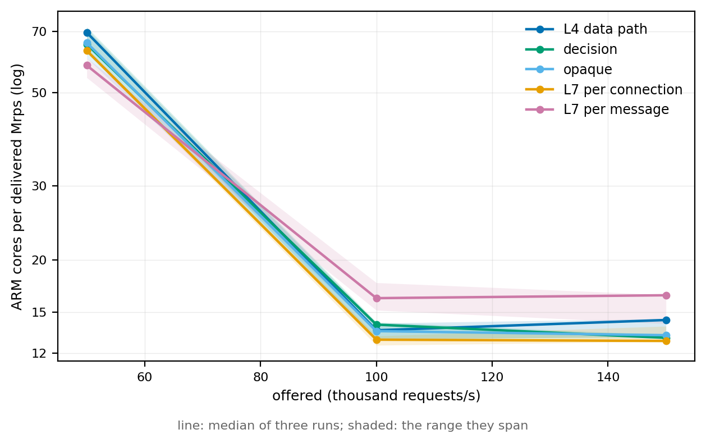
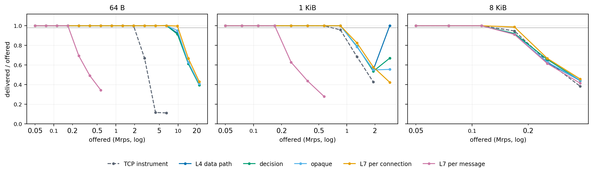
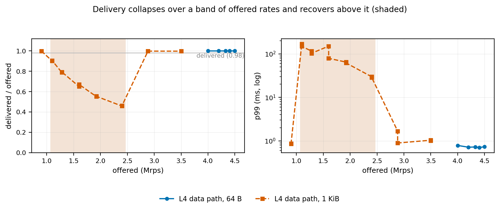

# DPUmesh L7 Evaluation

DPUmesh carries a service's bytes between pods without the host seeing them. An
L7 layer on the DPU changes that arrangement in one respect only: it decides
where a message goes. This report measures what that decision costs.

The cost has three parts, and they are paid on different clocks. **Per message**,
the layer pays for looking at the payload and choosing a destination. **Per
connection**, it pays to build the machinery that makes the choice. **Per
request**, it pays to publish the bytes it produced. Each part is measured
against a control that carries the identical workload through the same DPUmesh
datapath with no L7 layer at all, so what is attributed to the layer is what the
layer added.

## Per message: the cost envelope of the contract

Five operating points carry the same request/response workload over the same
transport, the same stack and the same pods. They differ in whether the L7 layer
sees the payload at all, and in how often it may change its mind about the
destination:

| Mode | The L7 layer sees | Destination chosen |
|---|---|---|
| `dataplane` | nothing — no service is assigned to the layer | once, at connect |
| `decision` | the flow, once per connection | once per connection |
| `opaque` | every byte, as an unframed stream | once per connection |
| `l7-conn` | every byte, framed into messages | once per connection |
| `l7-message` | every byte, framed into messages | once per message |

`decision` and `opaque` bracket the cost of carrying bytes through the layer
without framing them. `l7-conn` and `l7-message` share one code path and differ
only in a single setting, so the difference between them is the selection
granularity and nothing else.

These use the reference consumer in `linkerd/shim/l7_null.c`, not linkerd2-proxy.
What they describe is the cost envelope the adapter contract imposes on any
consumer, and the granularity a consumer chooses within it. Per-message selection
is what a real proxy does for HTTP/2 and gRPC; per-connection is what an opaque
or TCP route does.

### What the decision costs



Cost per request depends on the rate it is measured at — batching depth follows
queue occupancy, and the offered rate sets that. Modes compared at their own
operating points are therefore not comparable at all. These are the ARM cores
the data-path process spends per delivered Mrps at rates every mode serves,
median of three runs with the range in brackets:

| Mode | 50,000/s | 100,000/s | 150,000/s |
|---|---|---|---|
| `dataplane` | 69.58 (66.2–71.0) | 13.59 (12.9–14.1) | 14.38 (13.1–14.5) |
| `decision` | 65.26 (62.2–71.7) | 14.02 (13.0–14.2) | 13.04 (13.0–13.2) |
| `opaque` | 65.78 (60.5–66.1) | 13.53 (13.5–13.6) | 13.23 (13.2–13.2) |
| `l7-conn` | 63.00 (62.3–63.2) | **12.91** (12.5–13.2) | **12.82** (12.8–13.9) |
| `l7-message` | 58.10 (54.3–60.5) | **16.21** (15.2–17.6) | **16.47** (14.1–16.5) |

At 100,000/s and 150,000/s the four modes that fix a destination for the life of
a connection are indistinguishable: their medians span 12.8 to 14.4 and every
range overlaps its neighbours. Carrying the payload through the layer, framing
it, and re-emitting it costs nothing this measurement can separate from the
plain data path — `l7-conn` is if anything the cheapest of the four.

Per-message selection is separable. At 100,000/s its range, 15.2 to 17.6, clears
every other mode's, for about 20% more ARM per request. That is the whole of the
per-request cost of moving the choice from once per connection to once per
message.

The lowest rate is a different regime and does not compare modes. Every mode
costs four to five times as much per request there, and the ordering inverts:
`l7-message` is the cheapest at 50,000/s and the most expensive at 100,000/s.
The absolute cost falls as load rises — 3.48 cores at 50,000/s against 1.36 at
100,000/s on the plain data path — so below roughly 100,000/s something
load-independent dominates, and whichever mode is measured there wins by
accident. The effect was confirmed against a long-running stack rather than a
fresh deployment: three repeats of the 50,000/s point gave 350.9%, 345.1% and
356.0%, so it is reproducible and not a warm-up artefact.

### The limit is deliveries, not bytes



What per-message selection costs is not cycles per request but capacity, and the
evidence is that it stops at the same message rate whatever the message size.
Offered rates were ramped until delivery failed, with every rung offered twice
and accepted only when both repetitions delivered:

| Mode | Frame | Highest rate delivered | First rate refused | Achieved there |
|---|---|---:|---:|---:|
| `dataplane` | 64 B | 6,487,299 | 9,730,948 | 9,033,807 |
| `decision` | 64 B | 6,487,299 | 9,730,948 | 9,044,164 |
| `l7-message` | 64 B | **168,750** | 200,000 | **174,093** |

At 64 B `l7-message` saturates at about 174,000 messages per second. At 1 KiB it
plateaus at 168,731, and at 8 KiB at 157,541. Across a 128× range of message
size the ceiling moves by 10%. A destination fixed for the connection lets the
transport pack many messages into one delivery to the host; a destination that
changes per message cannot be packed, so each message becomes its own delivery.
The payload rides along; the delivery is the cost.

Reordering follows the same line. At matched load `l7-message` reorders 25,899
replies at 50,000/s and 317,909 at 150,000/s; every other mode reorders none,
because only per-message selection lets replies from different backends
interleave.

The figure also shows where the modes agree. At 8 KiB a message fills a delivery
on its own, so per-message selection gives up nothing: every mode lands between
157,541 and 173,882, as does the matched TCP path at 161,430. At 8 KiB this
measurement cannot separate the modes, and does not claim to.

### Why a single capacity number is misleading here



A ramp that stops at the first rate a path fails to deliver reports a number
that is not the path's capacity. The plain data path at 1 KiB refuses
1,281,442/s — and delivers 3,491,032/s. Two repetitions at each rate, on one
deployment:

| Offered/s | Achieved/s | Drops | p99 |
|---:|---:|---:|---:|
| 900,000 | 899,514 | 0 | 861 µs |
| 1,100,000 | 991,909 | 426,371 | 169,510 µs |
| 1,281,442 | 1,009,874 | 1,076,602 | 115,543 µs |
| 1,600,000 | 1,074,036 | 1,294,629 | 78,836 µs |
| 1,922,163 | 1,060,426 | 3,430,352 | 64,713 µs |
| 2,400,000 | 1,108,080 | 5,147,693 | 28,725 µs |
| 2,883,244 | **2,877,434** | 20,606 | **892 µs** |
| 3,500,000 | **3,491,032** | 33,091 | **1,034 µs** |

Between about 1.0 and 2.5 Mrps the path pins at roughly 1.05 Mrps and holds a
tail two orders of magnitude above its own median. Offer more and it recovers
completely, at 2.7× the rate it refused. Both repetitions of every rate agree,
and the recovery is as sharp on the way up as the collapse is on the way in.

The same path at 64 B is flat and clean over 4.0 to 4.5 Mrps — no drops, p99
between 703 and 784 µs — so the excursion is not the load generator, and it is
not present at every frame. What the regime shares is that the offered rate
exceeds what the path delivers per unit time while messages still arrive too
slowly to fill a delivery, so the queue grows instead of the batch. That reading
is consistent with every measurement here but is not established by them; the
band's boundaries were mapped, its mechanism was not.

The consequence is procedural. Every capacity above is the **lowest** rate at
which delivery first failed, which for a path that recovers is a lower bound
rather than a ceiling. It is the same rule the L4 evaluation applies, and it is
quoted here for continuity, not because it is the largest number the path can
produce.

### Latency

At one outstanding request, where no queue forms:

| Mode | 64 B | 1 KiB | 8 KiB |
|---|---|---|---|
| `dataplane` | 151 / 534 µs | 154 / 531 µs | 161 / 538 µs |
| `decision` | 158 / 550 µs | 152 / 532 µs | 177 / 581 µs |
| `opaque` | **122 / 210 µs** | **126 / 224 µs** | 155 / 524 µs |
| `l7-conn` | 125 / 253 µs | 124 / 204 µs | **154 / 526 µs** |
| `l7-message` | 230 / 494 µs | 232 / 522 µs | 258 / 608 µs |

`opaque` and `l7-conn` are not merely as fast as the plain data path, they are
faster, and the tail improves more than the median — p99 210 µs against 534 µs
at 64 B. Both copy the payload into a DPU-local buffer before sending it, which
releases the arrival staging a round earlier than the data path does, so the
sender's transmit credit returns sooner. The copy that looks like pure overhead
buys back more than it costs at this operating point.

`l7-message` pays about 80 µs of median regardless of size, which is the
reassembly the framed path performs before it can route.

### What the closed and open loops each measure

The two loops disagree, and the disagreement is informative rather than a fault
in either. Under a window of 32 requests on each of 8 connections the modes
deliver 1.330, 1.349, 1.344 and 1.372 Mrps at 1 KiB — and `l7-message` 0.226,
the same sixfold gap the capacity table shows. But that window delivers 1.33
Mrps where the open-loop ramp refuses 1.28: a self-clocked client never offers
more than the path absorbs, so it cannot enter the collapse band the open loop
walks into. At 64 B the ordering reverses, 0.216 Mrps against the open loop's
6.49, because 256 outstanding requests cannot reach 6.49 Mrps at this path's
latency; some 6,500 would be needed.

Read together: the open loop measures what the path does when something else
sets the rate, and the closed loop what it does when the client waits. Neither
is the capacity on its own, and neither is a cost measurement — cost per request
is quoted only at matched load, above.

## Per connection: what a Linkerd session costs

The mode study holds connections open. That hides the largest cost in the real
layer, because every client connection builds its own complete outbound
stack: the per-target closure calls `outbound.mk`, so a session constructs its
own discovery, protocol, endpoint and reconnect caches. That is what makes
concurrent sessions to one service independent, and it is paid per connection.

These points move the connection axis on purpose, in two directions, each
against an `L7_BACKEND=null` control carrying the identical workload with no
Linkerd layer. The control is what separates what a Linkerd session costs from
what a DPUmesh connection costs.

### Building one

Concurrency 8 on one client thread, twenty measured seconds. The reconnect
period is how many completions a client serves before it reconnects, so a
shorter period is more sessions per second at the same offered work.

| reconnect period | L7 sessions/s | L7 Mrps | L7 us/req | L7 p99 | L4 sessions/s | L4 Mrps | L4 us/req | L4 p99 |
|---|---:|---:|---:|---:|---:|---:|---:|---:|
| never | 0.0 | 0.010523 | 51.9 | 1200 | 0.0 | 0.010304 | 38.1 | 1221 |
| 4000 | 2.5 | 0.010293 | 53.2 | 1284 | 2.5 | 0.010080 | 38.3 | 1248 |
| 1000 | 10.0 | 0.010069 | 55.9 | 1398 | 10.1 | 0.010132 | 38.4 | 1249 |
| 250 | 36.1 | 0.009271 | 63.9 | 2716 | 40.1 | 0.010152 | 38.7 | 1256 |
| 60 | 109.7 | 0.007338 | 92.5 | 2766 | 167.5 | 0.010204 | 39.3 | 1248 |

Least squares over each set, with DPU cores as ARM us/req times Mrps:

```
L7:  cores = 0.548 + 1.20e-3 x sessions/s     ->  1,200 ARM core-us per session
L4:  cores = 0.389 + 0.073e-3 x sessions/s    ->     73 ARM core-us per session
```

**A DPUmesh connection costs 73 microseconds to build and tear down. Putting a
Linkerd session on it costs 1,200 — sixteen times more.** The per-session
outbound stack is essentially the entire figure.

The tables diverge in the same way. Under churn the L4 datapath does not move:
at 167 sessions per second its throughput and p99 are the same as at zero. The
L7 path at 110 sessions per second has lost 30% of its throughput and more than
doubled its p99. It reached only 110 because its own collapse left fewer
completions to reconnect on.

The synchronous half of that construction is instrumented. Over 9,565
opens and closes across four workers:

| phase | mean µs/build | share of the session cost |
|---|---:|---:|
| clone and configure the outbound template | 5.9 | 0.5% |
| construct the outbound layers | 107.8 | 9.3% |
| instantiate the target service | 34.7 | 3.0% |
| **synchronous total** | **148.5** | **12.9%** |

So the synchronous `outbound.mk` boundary explains about one eighth of the
slope. The rest is lazy discovery and policy work, task execution and teardown,
and the surrounding DPUmesh lifecycle. Locating it requires instrumenting those
asynchronous boundaries rather than assuming the whole figure is inside the
synchronous call.

### Carrying them

Total outstanding requests held at 128 (`conc` is per thread, so `conc × threads`
is the offered window), fifteen measured seconds. Sessions move; offered work
does not.

| live sessions | L4 us/req | L7 us/req | L7 / L4 | L4 Mrps | L7 Mrps | Mrps delta |
|---:|---:|---:|---:|---:|---:|---:|
| 1 | 2.298 | 3.843 | 1.67x | 0.193208 | 0.162243 | -16.0% |
| 2 | 3.207 | 6.057 | 1.89x | 0.189746 | 0.175622 | -7.4% |
| 4 | 5.348 | 8.746 | 1.64x | 0.179180 | 0.176261 | -1.6% |
| 8 | 8.315 | 15.206 | 1.83x | 0.161581 | 0.159318 | -1.4% |

This is the price of the L7 layer as a whole: 1.6× to 1.9× the ARM CPU of the
same workload through the same datapath without it. The throughput gap closes as
sessions rise — 16% at one session, 1.4% at eight — but the CPU ratio does not.
A closed loop at a fixed outstanding window is latency-bound, so with more
sessions the work spreads over four workers and the layer pays its cost in cores
that were otherwise idle rather than in delivered requests. The cost did not go
away; it stopped being visible in the throughput column.

**The curve itself is not the Linkerd layer.** The L4 control has no sessions, no
outbound stack and no `Worker::poll_internal`, and it still costs 262% more per
request at eight connections than at one. The L7 layer multiplies it by a roughly
constant 1.6× to 1.9× without bending its shape. Whatever makes a live connection
expensive is in the DPUmesh datapath; the Linkerd stack pays a proportional
surcharge on it. Three candidates are ruled out:

- **Backend fan-out.** Restricting the service to one backend pod left the L7
  numbers unchanged: 3.84 against 3.81 at one session, 6.06 against 6.15 at two.
- **Worker activation.** A per-thread breakdown at one and eight sessions
  (`dmesh-main` 9.9% → 34.6%, `dmesh-w0..w3` 46.1/2.5/2.1/2.1% → ~53% each,
  process 63.4% → 248.2%) shows an idle worker draws 2.1%, so the three idle
  ones account for at most 6 of the 185 points gained.
- **`Worker::poll_internal` walking every session.** It exists only in the L7
  build, and the L4 build shows the same curve.

## Per request: the output path

The adapter publishes a session's output one of two ways. The reservation path
asks DPUmesh for a chunk of the egress arena, copies the endpoint's queued bytes
straight into it and commits (`dmesh_l7_tx_reserve` / `dmesh_l7_tx_commit`). The
copy path drains the endpoint into a temporary buffer and hands that to
`dmesh_l7_send`, which copies it again. `DMESH_L7_TX_RESERVE` selects between
them, which is what makes the one copy between them measurable.

The setting is read when the DPU process starts, so each arm is its own full
deployment of the same tree, with the pods on the same cores at a fixed 2.5 GHz.
Delta is the reservation path relative to the copy path; spread is the range
across three repetitions.

| concurrency | ARM us/req, reserve | ARM us/req, copy | delta | ranges |
|---:|---:|---:|---:|---|
| 1 | 156.897 | 164.371 | **-4.5%** | 156.6–162.4 vs 159.0–169.7, overlapping |
| 32 | 11.554 | 12.086 | **-4.4%** | 11.35–11.63 vs 11.72–12.31, **disjoint** |
| 128 | 3.791 | 4.056 | **-6.5%** | 3.74–3.85 vs 3.92–4.06, **disjoint** |

| concurrency | Mrps, reserve | Mrps, copy | delta | p50 delta | p99 delta |
|---:|---:|---:|---:|---:|---:|
| 1 | 0.005407 | 0.005208 | +3.8% | -4.6% | -1.7% |
| 32 | 0.043218 | 0.042522 | +1.6% | -0.4% | -0.8% |
| 128 | 0.163616 | 0.160995 | +1.6% | -1.8% | +0.9% |

The reservation path costs less ARM CPU per request at every concurrency, and
the sign is the same on throughput and on both latency percentiles. At
concurrency 32 and 128 the three-run ranges do not overlap at all — the slowest
reserve run beat the fastest copy run — so those rows separate the paths rather
than merely favouring one. Concurrency 1 has the same sign and size but its
ranges overlap, so it agrees with the other two rather than standing on its own.

In absolute terms the saving is 0.265 ARM microseconds per request at
concurrency 128 and 0.53 at 32 — the right order for removing one copy of a 1 KB
payload together with the temporary allocation that carried it. The share is
larger at 128 because the denominator is smaller, not because the copy got
cheaper.

That figure is what fixes the priority between the two remaining costs. The
Linkerd share of a session is 1,127 µs; the copy this measures is 0.265 µs per
request. They break even at about 4,300 requests per connection, so for anything
that reconnects, session construction is worth far more than the output copy.

## Where the ARM cycles go

An attribution pass on the target BlueField cores, at the same 1 KiB workload.
`perf stat` covers the whole `dpumesh_dpu` process for 13 seconds and subtracts
an equal-duration idle sample before dividing by completed requests.

| concurrency | requests | Mrps | p50 µs | p99 µs | cycles/req | instructions/req | cache misses/req | process CPU µs/req |
|---:|---:|---:|---:|---:|---:|---:|---:|---:|
| 1 | 48,053 | 0.004908 | 168 | 538 | 328,893 | 297,343 | 2,091.23 | 159.55 |
| 32 | 421,637 | 0.042273 | 659 | 1,322 | 18,012 | 16,237 | 132.50 | 8.66 |
| 128 | 1,672,268 | 0.167382 | 705 | 1,318 | 6,705 | 6,011 | 59.83 | 3.26 |

The concurrency-1 row includes a large fixed progress/wakeup cost per request;
higher concurrency amortizes it. These are single samples and are attribution,
not a release comparison.

The flat profile puts the cost where the structural measurements put it:

| symbol/category | c1 | c32 | c128 |
|---|---:|---:|---:|
| `eventfd_write` | 3.18% | 2.87% | 3.76% |
| `px_worker_drain` | 2.46% | 2.29% | 3.89% |
| `__memcpy_generic` | 0.53% | 1.71% | 5.85% |
| `__aarch64_cas1_acq` | 1.75% | 0.91% | 1.28% |
| `__aarch64_cas1_rel` | 1.58% | 1.74% | 1.48% |
| `__aarch64_ldadd8_relax` | 1.07% | 0.77% | 1.42% |
| kernel `mutex_lock` (largest single symbol) | 0.52% | 0.88% | 0.60% |

Call graphs put `pump_side` and its children at about 3.18% for c32 and 4.88%
for c128. At c128 `copy_tx_into`/`memcpy` is the largest child on the output
side, and `DmeshIo::poll_read` with its copy children accounts for about 4.19%.
No allocator or Tokio scheduler symbol dominates. Copying is the one symbol that
grows with concurrency, which is why the output-path A/B above is worth its 5%
and why the remaining intermediate queue is the next copy to remove.

The shared C pool is not hot: the audit counter reached 16 shared-list
acquisitions with zero contention under multi-worker traffic, and no pool symbol
appears in the profiles. The bounded per-thread magazines are sufficient for this
workload.

The AArch64 atomics in the table are the parking-lot mutex fast path. `objdump`
shows the x86-64 build using `lock cmpxchg` where AArch64 calls
`__aarch64_cas1_acq`/`_rel`, which dispatch to LSE `casab`/`caslb` when
available and fall back to `ldaxrb`/`stxrb` loops otherwise; there is no explicit
`dmb` in these helpers. No x86/ARM performance ratio is claimed from this: that
needs an equivalent full-stack x86 request path, which does not exist yet.

## Contract

| Axis | Value |
|---|---|
| Modes | `dataplane`, `decision`, `opaque`, `l7-conn`, `l7-message` |
| L7 consumer | `linkerd/shim/l7_null.c` for the mode study; linkerd2-proxy for the session, output-path and profile studies |
| Frames | symmetric request/response: 64 B, 1 KiB, 8 KiB |
| Frame format | 16 B benchmark header plus 48 B, 1008 B or 8176 B body |
| Transport unit | 8192 B (`DPUMESH_SLOT_SIZE`) |
| Load | constant-rate open loop and closed-loop window; 8 connections; 4–10 s per rate |
| Repetitions | 2 per point; 3 for matched-load cost, session cost and the output A/B |
| Deployment | one per mode and per output-path arm; the gate is read when the data-path process starts |
| DPU | `N/K/A=32/8/8` for the mode study, `32/8/4` with `DPUMESH_L7_LINKERD_WORKER=all` for the rest |
| Placement | pods pinned to cores 18, 19, 24 and 25 at a fixed 2.5 GHz for every Linkerd measurement |
| Backends | 3 ready servers, so a mode that balances has somewhere to balance to |
| Instrument | matched TCP path (`bench-tcp`/`echo-tcp`), same generator, measured as a sixth mode |
| Platform | `rapids4`, Intel Xeon Gold 6554S, Linux 5.15.0-186-generic |
| Datasets | [`data/l7-20260812-062044`](data/l7-20260812-062044), [`data/l7-session-cost-20260817`](data/l7-session-cost-20260817), [`data/l7-tx-ab-20260817`](data/l7-tx-ab-20260817) |

A rate is delivered when achieved/offered ≥ 0.98, drops ≤ 0.1% of completions,
and the latency histogram did not overflow. Latency is not part of that test, so
every capacity is quoted with the tail observed at it.

ARM CPU is the DPU process's tick total across all its threads over the requests
the measured window completed. The ticks span connection setup and warmup, so the
absolute figure sits above one taken from the load window alone; arms are read
against each other, not against the profile table.

One measurement of ARM cost moves by about a tenth between runs on an unchanged
deployment — three repeats of one rate gave 13.18, 14.17 and 14.32 cores per
Mrps. Differences of that size between modes are not differences.

The instrument is measured, not assumed. On the matched TCP path the same
generator plateaus at 1,930,234/s at 64 B, 878,612/s at 1 KiB and 161,430/s at
8 KiB. At 64 B and 1 KiB every mode except `l7-message` runs above that, so
those figures are the paths'. At 8 KiB the instrument and every mode land within
8% of the instrument, and no mode-to-mode conclusion is drawn there.

Every retained point completed with `fail=0`, `drops=0`, `reorder=0` and
`worker_fail=0`. After each Linkerd arm all four workers reported `opened ==
closed` with zero active sessions, pending registrations, live tasks and orphaned
registrations, and every L7 fallback, over-release and stray-release counter
stayed at zero. `retries=0 errors=0` on the adapter says no reservation was
refused and no output was ever re-queued.

Cross-checks. Of 434 mode-study runs, 18 recorded a histogram overflow: seven on
ramp rungs that were rejected anyway, ten on 8 KiB closed-loop latency, and one
on an accepted point. One event is unexplained: a single `decision` run at 1 KiB
and 126,548/s recorded p99 1.64 s, 86,934 drops, 12,614 histogram overflows and
61,240 allocation waits, where its repetition at the same rate recorded p99
1,089 µs and no drops. Ten further runs of that mode at that rate on a fresh
deployment reproduced nothing. It is recorded rather than explained, and the
collector now refuses any run whose histogram overflowed.

Per-point rows are in
[`points.csv`](data/l7-20260812-062044/points.csv); the ramp is in
[`capacity.csv`](data/l7-20260812-062044/capacity.csv) and
[`saturation.csv`](data/l7-20260812-062044/saturation.csv); the repeated
capacity checks are in
[`knee_verify.csv`](data/l7-20260812-062044/knee_verify.csv); the band scans are
in [`band.csv`](data/l7-20260812-062044/band.csv); matched-load cost is in
[`cores_matched.csv`](data/l7-20260812-062044/cores_matched.csv).

## What this settles

- Carrying a payload through the L7 layer is free at this resolution; choosing a
  destination per message costs about 20% more ARM per request and, more
  importantly, roughly a sixth of the capacity, because a per-message choice
  cannot be packed into one delivery.
- The L7 layer costs 1.6× to 1.9× the ARM CPU per request of the same datapath
  without it, and sixteen times as much to open a connection.
- The per-session outbound stack is the dominant cost and is precisely located:
  1,127 of the 1,200 microseconds a session costs. It is the price of making
  concurrent same-service sessions independent — the correct answer, and the
  most expensive thing in the path.
- The reservation output path is the default: one copy of the published bytes is
  worth about 5% of a request's ARM cost, rising to 6.5% where the fixed
  per-request cost is amortized. The copy path remains an explicitly selected
  comparison instrument, never an automatic fallback.
- Any capacity claim for this path must state its connection lifetime. A
  benchmark that opens connections once reports an operating point a churning
  workload never sees.

## What this does not settle

- Which part of the outbound stack the remaining seven eighths of the session
  cost is in. That split decides what can be shared without giving up session
  isolation.
- Why a live DPUmesh connection costs what it does. The L4 control establishes
  that it does, not where — and that is a datapath question, not a Linkerd one.
- Any x86/ARM ratio. That needs an equivalent full-stack x86 request path built
  from the same revision, compiler and flags.

## Reproduction

Create `.env` with `HOST_PASS`, `DPU_HOST` and `DPU_PASS`, then from the
repository root:

```sh
sudo swapoff -a

# Five modes plus the instrument, one deployment each.
./bench/suite/l7_modes.sh --out /tmp/l7run

# Cost per request at rates every mode serves.
REPS=3 ./bench/suite/l7_modes.sh --out /tmp/l7run --cores-only

# Push each mode past the rung its ramp stopped on.
./bench/suite/l7_refine.sh /tmp/l7run

# Re-measure one capacity with repetitions, against the deployed mode.
./bench/suite/l7_knee.sh /tmp/l7run dataplane 64 "4324866 6487299 9730948"

# Connection build/teardown and live-session scaling, each against an L4 control.
./bench/suite/l7_session_cost.sh

# Reservation against copy output, one full deployment per arm.
./bench/suite/l7_tx_ab.sh

python3 bench/suite/summarize_l7.py /tmp/l7run
python3 bench/suite/plot_l7.py /tmp/l7run bench/report/figures
```

The collector deploys each mode, discovers its capacity, and measures the common
grid, each mode's own operating point, the closed-loop window and the ARM cores.
It checks that the data-path process is alive after every capacity search and at
the end of every mode: a dead data path reports as a failing client on every run
that follows, and without that check the dataset fills with zeroes and says
nothing is wrong.
