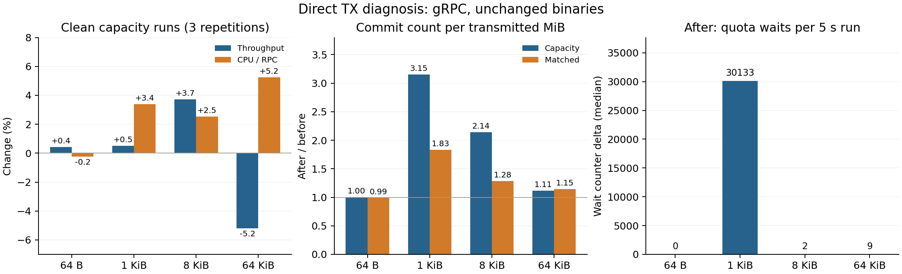

**Direct TX batching / CPU 진단 — 2026-09-06**

동작 변경 없이 보관된 before/after binary를 재배포해 비교했다. **batching 손실은 확인됐지만,
64 KiB 회귀를 quota 대기나 단순한 명령어 수 증가로 설명할 수는 없다.** arena batching은 여전히
검증할 가치가 있는 후보이며, 이 진단은 그것이 회귀 전체를 해결한다는 증명이 아니다.



**측정 범위와 해석**

총 114개 표본을 보존했다: clean 72 / profile 12 / trace 24 / PMU 6.

- gRPC: 64 B / 1 / 8 / 64 KiB, capacity와 matched 각각 clean 5초 × 3회.
- opaque TCP: 정상 비교가 가능했던 64 B / 1 KiB만 같은 clean 조건으로 측정했다.
  앞선 보고서의 8 / 64 KiB drain 실패를 이번에 해결하거나 재검증한 것은 아니다.
- profile: 크기당 별도 capacity 16초 실행 중 시작 구간을 지난 12초,
  8개 `dmesh-w0..7`에 `perf record -F 99 -e cycles --call-graph fp`.
- trace: 별도 12초 실행의 중간 8초에 Rust scalar/vectored write entry와 C commit entry를
  uprobe histogram으로 계측했다. capacity와 matched를 모두 수집했다.
- PMU: gRPC 64 KiB에 별도 12초 × 3회, 중간 8초 `perf stat`.
  이 추가 확인은 after → before 순서로 실행했다. 모든 PMU event의 running 비율은 100%였다.
- main matrix는 before → after 순서다. 같은 BlueField, N/K/A=32/8/8,
  client CPU 4–9 / server CPU 10–17을 프로세스 시작부터 적용했다. 재빌드·컴파일은 하지 않았다.
- 아래 CPU seconds는 8 worker의 `utime+stime` 합이다. 실제 `_SC_CLK_TCK=100`을 기록했다.
  clean CPU/RPC는 이전 보고서와 같이 scheduled RPC로 나누며 warmup/teardown과 계측 호출
  주변 시간이 포함된다. 시스템 전체 CPU나 순수 payload 처리 시간은 아니다.
- trace를 켜면 처리량과 스케줄링이 바뀐다. trace 실행의 처리량/p99는 clean 성능 결과에
  섞지 않았다. matched trace도 추가해 동일 입력량에서 batching 변화가 유지되는지 확인했다.
  histogram trigger를 event별로 순차 시작/정지하므로 write와 commit 사이 수십 건의 경계 차이는
  가능하다. nonempty commit 수를 사용하며, entry count는 destination ACK 수가 아니다.
- 3회 중앙값과 전체 min/max를 보존했다. 단일 profile의 작은 비중 차이를 통계적 유의성이나
  특정 함수의 정확한 비용 변화로 해석하지 않는다. wait counter는 횟수이며 대기 시간은 미측정이다.

실행 binary SHA256은 앞선 보고서와 일치한다.

```text
before 4273f0148b78346c83a2922db86d5a6a981fa8217fdd3cf148eb980faa76b62e
after  2200fc9207e01b7e07e3aa0d45f26d55fef6f9aee07fb4a61cdfd3169389422e
```

**gRPC의 처리량과 CPU**

| Payload | RPC/s before → after | 변화 | 총 CPU seconds | CPU µs/RPC | CPU/RPC 변화 |
|---|---|---|---|---|---|
| 64 B | 36,505 → 36,657 | +0.42% | 33.71 → 33.90 | 174.65 → 174.24 | -0.24% |
| 1 KiB | 35,145 → 35,324 | +0.51% | 33.68 → 35.04 | 181.23 → 187.36 | +3.39% |
| 8 KiB | 21,942 → 22,756 | +3.71% | 34.54 → 36.74 | 297.14 → 304.64 | +2.52% |
| 64 KiB | 13,378 → 12,682 | -5.20% | 40.92 → 40.85 | 577.61 → 607.91 | +5.25% |

64 KiB는 총 CPU 시간이 거의 그대로인데 처리량이 줄었다. 1 KiB는 처리량이 비슷한데
총 CPU 시간도 증가했다. 8 KiB는 처리량 이득과 RPC당 비용 증가가 함께 나타났다.
64 B의 작은 처리량 차이는 반복 표본 범위가 겹치므로 개선을 확정하지 않는다.

같은 입력 부하:

| Payload | RPC/s before → after | CPU/RPC 변화 | p99 µs before → after |
|---|---|---|---|
| 64 B | 19,998 → 19,999 | +0.21% | 2,022 → 2,040 |
| 1 KiB | 19,999 → 19,999 | +1.13% | 1,980 → 2,061 |
| 8 KiB | 9,999 → 9,999 | +1.56% | 2,250 → 2,294 |
| 64 KiB | 1,999 → 1,999 | +1.03% | 2,610 → 2,540 |

이는 “처리량이 늘어서 CPU도 늘었다”만으로 전부 설명할 수 없다는 증거다.
다만 낮은 부하의 작은 CPU 차이는 maintenance와 측정 경계의 영향도 포함한다.

**batching: write 수가 줄어도 commit 수는 늘 수 있다**

| Payload | capacity 평균 commit B | capacity commit/MiB 비율 | matched 평균 commit B | matched commit/MiB 비율 |
|---|---|---|---|---|
| 64 B | 320 → 319 | 1.002× | 157 → 159 | 0.989× |
| 1 KiB | 2,855 → 906 | 3.151× | 1,504 → 821 | 1.832× |
| 8 KiB | 6,999 → 3,269 | 2.141× | 4,194 → 3,268 | 1.283× |
| 64 KiB | 9,552 → 8,584 | 1.113× | 10,271 → 8,956 | 1.147× |

비율은 after/before다. 64 B는 거의 같지만 1 / 8 / 64 KiB에서는 같은 전송량당 commit이
늘었다. 1 KiB capacity trace의 scalar write entry는 before 1,099,882회,
after vectored write entry는 626,405회다. 그런데 commit은 189,802 → 585,065회다.
즉, vectored 지원으로 caller의 write 횟수를 줄인 효과와 Vec의 poll 사이 coalescing을
없앤 효과가 서로 다른 방향으로 나타난다.

64 KiB의 두 arm 모두 이번 steady-state trace에서 65,536 B commit은 0회였다.
before의 약 16 KiB DATA와 작은 제어 출력이 합쳐지는 정도가 달라졌으며,
“기존의 64 KiB commit이 사라졌다”만으로 회귀를 설명하는 것은 부적절하다.
앞선 128개 startup debugger 표본을 steady-state 분포로 확대하지 않는다.

**quota는 1 KiB에서 두드러진다**

| Payload | after capacity wait 중앙값/5초 | 3회 min–max | after matched wait 중앙값/5초 |
|---|---|---|---|
| 64 B | 0 | 0–0 | 0 |
| 1 KiB | 30,133 | 29,553–30,961 | 130 |
| 8 KiB | 2 | 2–2 | 0 |
| 64 KiB | 9 | 0–9 | 0 |

64 KiB capacity의 0–9회 대기로 5.2% 처리량 회귀를 설명하기는 어렵다.
1 KiB의 많은 wait/wake는 별도로 조사할 가치가 있다. before에는 같은 direct-writer
counter가 없으므로 before wait를 0으로 표시하지 않았다.

clean capacity에서 DMA local completion/RPC는 64 B 0.736→0.734,
1 KiB 0.747→0.748, 8 KiB 2.337→2.383, 64 KiB 17.376→17.408이다.
따라서 commit 증가율을 물리적 DMA completion 증가율로 바꾸어 해석하면 안 된다.

**CPU profile과 PMU가 말해 주는 범위**

아래는 전체 worker cycles 샘플 중 exclusive self 비중이다.
copy와 atomic helper는 모든 계층을 합친 값이며 TX adapter만의 비용이 아니다.

| Payload | memcpy/memmove 비중 | AArch64 atomic helper 비중 | DmeshIo write self 비중 |
|---|---|---|---|
| 64 B | 3.41% → 2.73% | 9.56% → 10.82% | 0.14% → 0.22% |
| 1 KiB | 3.78% → 3.40% | 9.18% → 10.36% | 0.09% → 0.16% |
| 8 KiB | 4.25% → 4.18% | 8.74% → 8.80% | 0.08% → 0.29% |
| 64 KiB | 6.73% → 5.99% | 10.32% → 10.06% | 0.13% → 0.40% |

64 KiB의 copy 비중은 6.73%→5.99%로 감소했다. write self는 0.13%→0.40%,
`h2::codec::framed_write::FramedWrite::flush`는 0.37%→1.04%였다.
이 수치는 복사 감소와 다른 처리 경로의 변화가 함께 있다는 근거지만,
mutex·Arc·quota·publication 각각의 ns 비용을 분해한 결과는 아니다.
인라인 코드와 helper 비용도 있으므로 self 비중만으로 전체 writer 비용을 계산하지 않는다.

64 KiB의 별도 PMU 비교:

| 지표 | before | after | 변화 |
|---|---|---|---|
| worker CPU cores | 7.727 | 7.733 | +0.07% |
| cycles/RPC (추정) | 1,239,976 | 1,302,964 | +5.08% |
| instructions/RPC (추정) | 566,028 | 562,294 | -0.66% |
| IPC | 0.4565 | 0.4315 | -5.46% |
| generic cache-misses/RPC (추정) | 11,294 | 10,228 | -9.44% |

PMU의 RPC당 값은 **전체 실행의 steady-rate 보고값 × 8초**로 window 내 RPC 수를
추정한 값이다. 정확히 같은 window의 RPC completion counter를 직접 읽은 값은 아니다.
raw counter, window 길이, 각 반복의 범위를 `pmu-samples.csv`와 `pmu-summary.csv`에 보존했다.

총 명령어 수/RPC가 늘지 않았는데 cycles/RPC가 증가했다. 따라서 단순히 추가 명령어
개수만으로 64 KiB 회귀를 설명할 수 없다. 그렇다고 관리 코드의 비용 증가를 배제하는 것도
아니다. 제거된 copy 명령어와 추가된 다른 명령어가 상쇄될 수 있고, instruction mix와
의존성·cache/coherence·branch 동작이 달라질 수 있다. generic cache-misses도 감소했으므로
“cache miss가 늘어서 느려졌다”는 단순 설명도 지지하지 않는다. 이 event를 별도 확인 없이
LLC miss로 부르지 않으며, frontend/backend stall 원인 분해는 이번 범위에 포함되지 않는다.

**작은 opaque TCP 비교**

| Payload | RPC/s before → after | 처리량 변화 | CPU/RPC 변화 | before RPC/s 범위 | after RPC/s 범위 |
|---|---|---|---|---|---|
| 64 B | 144,109 → 137,123 | -4.85% | +12.50% | 143,915–145,205 | 134,190–137,348 |
| 1 KiB | 136,185 → 127,428 | -6.43% | +9.03% | 130,357–136,410 | 126,780–130,092 |

이번 opaque 비교에서는 두 크기 모두 처리량이 하락해 이전 보고서의 작은 개선이 재현되지
않았다. capacity trace의 commit 크기는 거의 같았으므로 이 하락을 batching 손실로
설명할 근거도 없다. 각 arm의 client/server image ID는 이전 보고서의 opaque image와
일치한다. 일자·실행 순서에 따른 환경 영향까지 분리한 실험은 아니므로,
이번 시스템 비교의 하락을 보편적인 개선/회귀 폭으로 확대하지 않는다.
일시적인 큰 tail latency도 있었으며 해당 표본을 삭제하지 않았다.
측정의 정상 기준은 기존 보고서와 같이 `OK`, fail/drop/overflow/worker_fail=0이다.
native benchmark의 cutoff 시점 `pending`과 teardown 이후 residue는 구분한다.

**다음 변경의 우선순위**

1. arena에서 여러 write를 합치는 bounded coalescing을 먼저 별도 실험으로 검증한다.
   64 KiB가 찰 때까지 기다리기보다 기존 worker drain/flush 경계에서 작은 출력도 진행시켜야 한다.
   lease 유지·Retry custody·endpoint별 route·flush/FIN 계약을 함께 설계해야 한다.
2. 1 KiB의 quota wait/wake는 별도 변경으로 분리한다. 64 KiB 회귀를 고친다는 근거로
   1ms quota를 먼저 없애지는 않는다.
3. batching 변경 뒤 commit/MiB가 줄었는데도 64 KiB cycles/RPC가 유지되면,
   instruction mix와 frontend/backend stall, cache/coherence를 후속 분해한다.
   이번 profile만으로 어느 하나를 원인으로 확정하거나 개선 폭을 약속하지 않는다.
4. opaque의 write 경로 관리 비용은 batching과 별도로 조사한다. commit 형태가 그대로인
   경로까지 arena coalescing 하나로 개선된다고 가정하지 않는다.

**자료와 재현**

- `samples.csv`, `summary.csv`: clean/profile/trace/stat을 분리한 표본과 집계.
- `commit-histograms.csv`, `trace-summary.csv`: 길이별 histogram과 write/commit 수.
- `profile-symbols.csv`, `profile-summary.csv`: 전체 exclusive 심볼 비중과 제한된 분류.
- `pmu-samples.csv`, `pmu-summary.csv`: 별도 hardware counter 실험.
- `raw/*/`: reply, CPU ticks, metrics before/after, perf data/report, histogram, binary 식별.
- `diagnose.py`, `probe.py`, `summarize.py`, `plot.py`, `write_report.py`, `commands.txt`:
  수집·집계·그림·보고서 생성 절차. `campaign_tail.sh`는 PMU와 opaque 단계다.

uprobes와 histogram의 동작은 Linux의 [uprobe 문서](https://docs.kernel.org/trace/uprobetracer.html)와
[histogram 문서](https://docs.kernel.org/trace/histogram.html)를 확인했다.
첫 시범에서는 trigger를 truncate해서 continue가 실패했다. append로 수정한 뒤 수집했으며,
그 시범은 성능 표본에 포함하지 않았다. 초기 배포 시 worker 준비 대기도 보강했다.
이 수정들은 진단 harness에만 적용했고 production TX 구현은 변경하지 않았다.

원래 native/L4 배포 복원과 최종 검증을 완료했다. 근거는 [RESTORATION.md](RESTORATION.md)에 있다.
