# DPUmesh gRPC 정확성·성능·병목 보고 — 2026-09-02

한 node, 한 BlueField, `N/K/A=32/8/8`, Host client/server 각 9 core. 모든 frame
크기는 request와 response 각각의 logical frame이다(64 B/1 KiB/8 KiB, protobuf body
48/1,008/8,176 B). 절차와 명령은 [`EXPERIMENT.md`](EXPERIMENT.md), 원자료는
`*-raw.csv`, [`knee-followup-raw/`](knee-followup-raw/), [`lowload/`](lowload/),
파생값은 `derive.py`가 만드는 `derived-*.csv`다.

## 결론

1. **정확성 gate는 전부 통과했다.** §1.
2. **용량은 정의에 따라 둘이다.** 전달 기준(achieved ≥ 0.99·offered, 오류 0)으로
   64 B **90k**, 1 KiB **75k**, 8 KiB **29.75k** RPC/s. p99 ≤ 5 ms 기준으로는
   **80k / 70k / 20k**다. 전달 기준 점의 p99는 24 ms / 10 ms / 318 ms라서 지연
   목표가 있는 배포에는 두 번째 정의를 써야 한다. §2.
3. **저부하 DPU 비용의 정체는 요청당 이벤트 처리 고정비다.** worker 하나의 PMU를
   직접 재면 64 B 요청 하나가 100 RPS에서는 instructions 467k, cache miss 4.9k,
   IPC 0.30으로 **747 µs**, knee(worker당 6,250 RPS)에서는 173k, 1.7k, 0.54로
   **154 µs**다. 요청 하나는 runtime loop 패스 약 8회와 wake 1–2회로 처리되고,
   부하가 오르면 한 패스가 여러 요청을 처리해 고정비가 나뉜다. spin, 타이머 gating,
   세션 재구축, Host coalescer는 모두 측정으로 배제됐다. 따라서 40k RPS부터 8 core가
   차 보이는 것은 결함이 아니라 **이벤트당 비용이 큰 구현**이며, knee는 worker
   수가 정한다. §3.
4. **단일 요청의 지연 바닥은 0.94 ms(폐루프 1 in flight), 100 RPS open loop에서는
   1.6 ms다.** 그중 DPU worker on-CPU가 정방향 약 450 µs와 역방향 약 320 µs이고
   나머지가 Host 양쪽의 wake 체인이다. Host tail coalescer는 원인이 아니다(E2). 같은
   10k RPS에서 표준 Linkerd sidecar는 403 µs, DPUmesh는 617 µs다. §2, §3.
5. **비교는 코어당으로 읽어야 한다.** 같은 application의 closed loop에서 DPUmesh는
   direct-TCP의 0.39배(64 B), Linkerd sidecar의 4.3배다. 그러나 Linkerd는 sidecar당
   1 core(`LINKERD2_PROXY_CORES=1`)이고 DPUmesh는 ARM 8 core라서, proxy core당
   처리량은 13.3k 대 12.5k로 같다. 10k RPS에서 Host 1.36 core를 아끼는 대가로 ARM
   4.11 core를 쓴다. §6.
6. **payload가 커질수록 DPUmesh가 가장 크게 잃는다.** 64 B→8 KiB에서 direct는
   0.75배, Linkerd는 0.61배, DPUmesh는 0.32배로 떨어진다. ARM 비용은 payload byte당
   14.6 ns로 memcpy의 수십 배다. §4.
7. **과부하 거동은 포화가 아니라 손실이다.** peak 뒤 처리량 감소, RPC failure와
   drop, 단일 worker 정지, 11시간 배포의 열화가 있다. §5.
8. **worker 수는 용량을 결정한다.** A=4/6/8/12에서 40k/70k/80k/130k, worker당
   10.0–11.7k RPC/s다. §7.

## 1. 정확성

| gate | 결과 |
|---|---:|
| Host transport/ABI/fault/analyzer (`make test-hostfree`) | PASS |
| 실제 DPU lane·SG-DMA queue contract | PASS |
| release cHTTP2 adapter CTest | 4/4 |
| Clang ASAN+UBSAN cHTTP2 CTest | 4/4 |
| embedded Rust tests | 38/38 |
| 실제 DPU shutdown/slot reuse | opened=closed 22/22 |
| gRPC policy/routing surfaces | 19/19 ([`policy-stages.csv`](policy-stages.csv)) |
| 최종 Pod restart / live task | 0 / 0 |

원자료 [`correctness.txt`](correctness.txt), 판정 기준 [`design/GRPC.md`](../../../../design/GRPC.md#verification-contract).

## 2. 용량과 지연

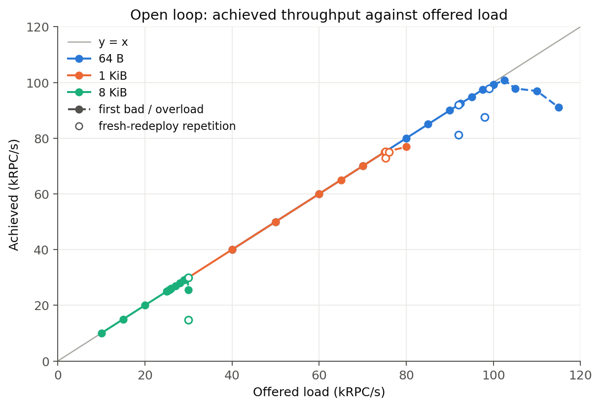

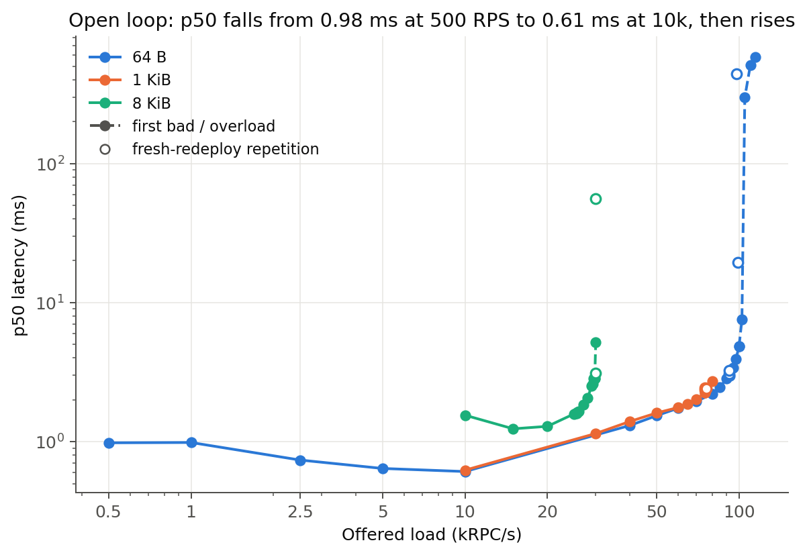

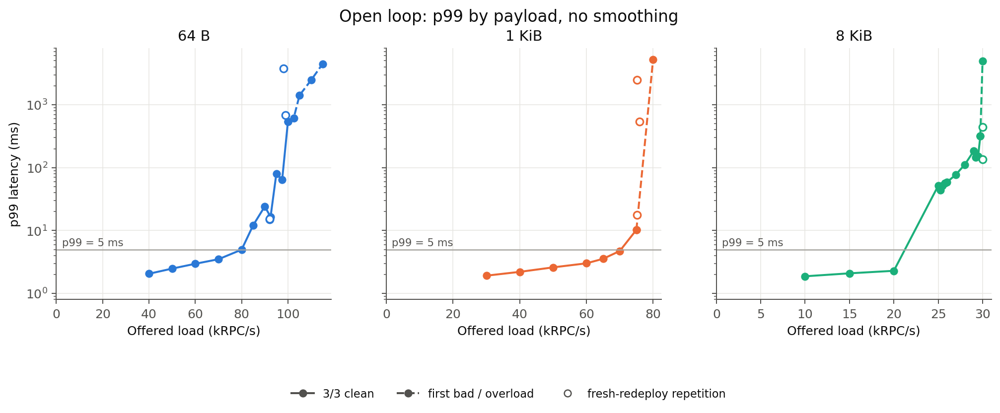

| frame | 전달 기준 용량 | 그 점의 p99 | p99 ≤ 5 ms 용량 | 그 점의 p99 | 10k RPS p50 |
|---:|---:|---:|---:|---:|---:|
| 64 B | 90k | 24.2 ms | 80k | 4.97 ms | 611 µs |
| 1 KiB | 75k | 10.3 ms | 70k | 4.73 ms | 625 µs |
| 8 KiB | 29.75k | 318 ms | 20k | 2.29 ms | 1,552 µs |

전달 기준은 한 배포에서 3/3 clean이고, 그보다 낮거나 같은 rate의 fresh 재배포
반복에 mixed/bad가 없는 가장 높은 offered rate다. 64 B는 한 campaign에서 100k까지
clean이었지만 fresh 재배포에서 92k mixed, 98/99k bad가 나와 90k만 인정한다
([`knee-followup-summary.csv`](knee-followup-summary.csv), [`derived-capacity.csv`](derived-capacity.csv)).

지연 바닥은 부하와 반대로 움직인다. 64 B p50은 500/1k/2.5k/5k/10k RPS에서
983/988/739/643/611 µs이고, 8 KiB p50은 10k 1,556 µs에서 15k 1,239 µs로 내려간
뒤 오른다. 바닥 자체를 재면 다음과 같다([`lowload/`](lowload/)).

| 조건 | p50 | 비고 |
|---|---:|---|
| closed loop, 총 1 in flight (thread 1) | 936 µs | 따뜻한 단일 요청 왕복 |
| closed loop, 총 2 / 4 in flight | 1,494 / 2,064 µs | worker 하나에 직렬, 요청당 약 550 µs |
| open loop, channel 1, 100 RPS | 1,611 µs | 요청 사이 10 ms 유휴 |
| open loop, channel 1, 1,000 RPS | 985 µs | 요청 사이 1 ms |
| Host `TX_TAIL_DELAY_NS` 500→50 µs 빌드, 100 RPS | 1,605 µs | 변화 없음; 10k RPS는 611→1,456 µs로 악화 |

같은 node의 DMA 왕복은 수십 µs이므로 이 바닥은 하드웨어가 아니라 양쪽 소프트웨어
경로다. 100 RPS에서 DPU worker가 요청 하나에 쓰는 on-CPU 시간은 정방향 약 450 µs와
역방향 약 320 µs이고(§3), 나머지 약 800 µs가 client와 server 쪽 Host의 wake 체인과
application이다. Host tail coalescer는 바닥에 관여하지 않으며 줄이면 중부하가 나빠진다.

## 3. 저부하 DPU 비용의 정체

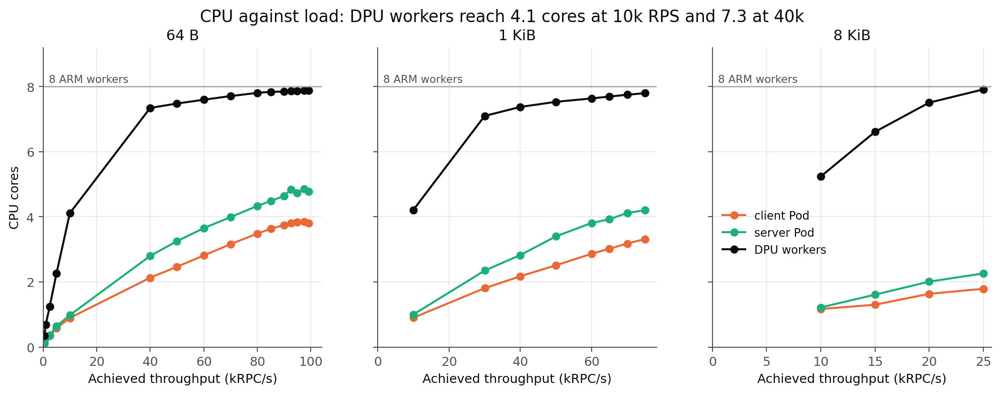

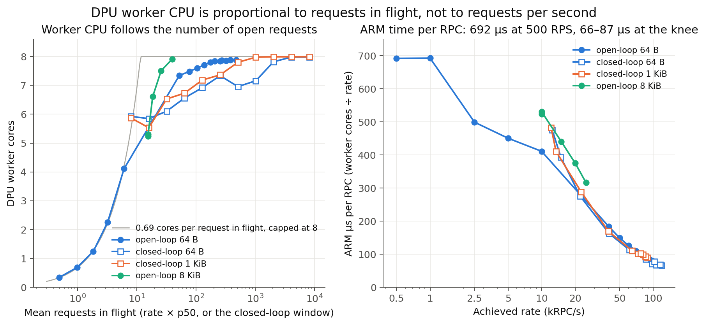

캠페인 데이터에서 worker core는 초당 요청 수가 아니라 **열려 있는 요청 수**에
비례한다(요청 하나가 in flight인 동안 0.69 core, 500 RPS부터 closed conc 8까지
0.67–0.74, [`derived-inflight-cpu.csv`](derived-inflight-cpu.csv)). 그 이유를 worker
하나에 channel 하나를 붙여 직접 쟀다.

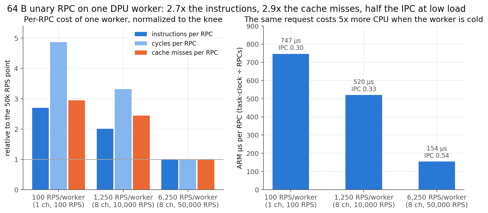

| worker당 RPS | 조건 | p50 | cycles/RPC | instr/RPC | cache miss/RPC | IPC | ARM µs/RPC | syscall/RPC | wake/RPC |
|---:|---|---:|---:|---:|---:|---:|---:|---:|---:|
| 100 | channel 1, 100 RPS | 1,611 µs | 1.56 M | 467 k | 4,926 | 0.30 | 747 | 47 | 1.2 |
| 1,250 | channel 8, 10k RPS | 617 µs | 1.07 M | 348 k | 4,080 | 0.33 | 520 | 46 | 1.9 |
| 6,250 | channel 8, 50k RPS | 1,565 µs | 0.32 M | 173 k | 1,672 | 0.54 | 154 | 8 | 0.1 |

`perf stat -t`로 channel을 든 worker thread만 잰 값이다(유휴 worker의 maintenance
tick은 뺐다, [`lowload/pmu-per-rpc.csv`](lowload/pmu-per-rpc.csv)). 요청 하나의 비용이
knee 대비 instructions 2.7배, cache miss 2.9배, IPC 절반이라서 cycles가 4.9배다.

무엇이 그 비용인지:

- **loop 패스가 요청당 약 8회다.** `DPUMESH_PERF_STATS=1` 카운터로 100–1,000 RPS의
  drain 패스는 요청당 7.4–8.1회이고 그중 절반은 아무것도 찾지 못한 Idle 패스다
  ([`lowload/drain-passes.txt`](lowload/drain-passes.txt)). 한 패스는 DOCA progress,
  engine pump/emit, ack release, 등록 수집, 모든 session의 양쪽 pump, hyper/H2
  connection poll, notification arm과 clear, `select` 재등록을 다 지나므로 세션이
  열린 worker의 유휴 tick 하나가 30–70 µs다.
- **syscall이 요청당 47회다.** `epoll_pwait` 29, `read` 12(그중 8은 EAGAIN),
  `write` 7이고 context switch는 1.2회다([`lowload/syscalls-500rps.txt`](lowload/syscalls-500rps.txt),
  [`lowload/wakes-500rps.txt`](lowload/wakes-500rps.txt)). 잠들지 않고 도는 spin이
  아니라, 깬 뒤 tokio 스케줄러가 매 yield마다 I/O driver를 도는 비용이다.
- **요청 하나는 두 덩어리의 연속 on-CPU다.** `sched_switch` 트레이스에서 100 RPS의
  요청은 정방향 약 450 µs 실행, 서버 쪽 공백 200–550 µs, 역방향 약 320 µs 실행으로
  나타나고 202개 요청의 중앙값이 on-CPU 686 µs, span 1,265 µs다
  ([`lowload/sched-100rps-clusters.txt`](lowload/sched-100rps-clusters.txt)). 이벤트를
  기다리며 도는 구간은 없다.
- **태스크 poll은 요청당 6회이고 그 하나하나가 비싸다.** 실행 중 바이너리에 uprobe를
  걸어 세면 요청당 hyper 서버 connection poll 2.0회, h2 클라이언트 connection poll
  4.0회, drain 21회다([`lowload/e5-probes-100rps.txt`](lowload/e5-probes-100rps.txt)).
  inclusive profile에서 태스크가 64%, loop가 30%이므로 poll 한 번이 cold 상태에서
  약 80 µs다. 과잉 poll이 아니라 poll 하나가 지나는 L7 스택의 폭이 비용이다.
- **배제된 가설.** 세션 없는 유휴는 0.043 core이고 유휴 worker의 tick은 8.7 µs다
  (spin 아님). DPU에는 cpufreq/cpuidle이 없어 클럭은 2.05–2.09 GHz로 일정하다(DVFS
  아님). session/stack 관련 메트릭은 5,000 요청 동안 0 증가다(세션 재구축 아님).
  Host tail 지연 500→50 µs는 100 RPS p50을 바꾸지 못했다(coalescer 아님).
  generator는 `nanosleep`으로 도착 시각을 지킨다(측정 artifact 아님).

`perf stat` 64 B 50k: 7.591 core, 321.6k cycles/RPC, 181.2k instructions/RPC,
IPC 0.56. exclusive profile은 `memcpy` 3.41%, atomic 3.35%+2.16%, syscall 2.11%,
HPACK encode 1.80%로 상위 13개 합이 20%다. 100 RPS에서 channel worker만 떠도 같은
모양이다. 비용은 한 함수가 아니라 이벤트마다 반복되는 긴 경로 전체에 있다.

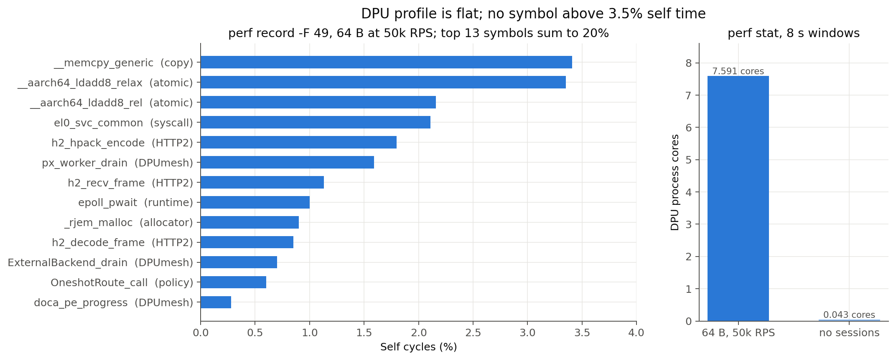

결론: 저부하 CPU와 지연 바닥은 같은 원인, 즉 **이벤트마다 cold 상태로 지나는
L7 스택의 폭**이다. loop 쪽(패스 수, syscall)은 전체의 30%라서 그것만 줄이면
수 % 단위이고(E5 1차: −2~6%), 나머지 64%는 요청당 6회의 connection poll과 linkerd
service 스택 자체다. 이를 줄이는 레버는 §8 E5에 적었다.

## 4. payload 스케일링

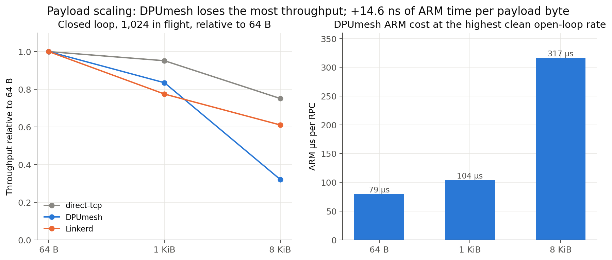

| frame | knee ARM µs/RPC | 64 B 대비 증가 | byte당 |
|---:|---:|---:|---:|
| 64 B | 79 | — | — |
| 1 KiB | 104 | +25 µs | 12.8 ns |
| 8 KiB | 317 | +237 µs | 14.6 ns |

8 KiB 29.75k RPC/s는 양방향 합 3.9 Gbit/s다. ARM 8 core가 그 대역폭에서 포화하는
것은 복사(byte당 0.1–0.3 ns)로 설명되지 않고, 전달 단위당 고정 비용(H2 frame,
DMA descriptor, flow-control window, 두 번째 copy)으로 설명된다
([`derived-knee-cost.csv`](derived-knee-cost.csv)).

## 5. 과부하와 재현성

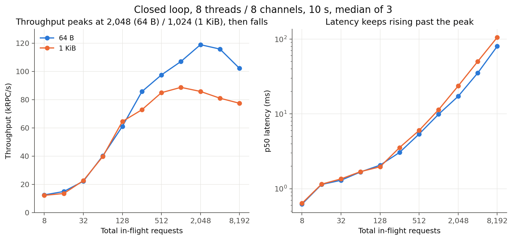

- closed loop 처리량은 peak 뒤 감소한다: 64 B 118.9k(2,048)→102.1k(8,192),
  1 KiB 88.7k(1,024)→77.4k(8,192). 포화한 서버는 평탄해야 한다.
- 과부하가 backpressure가 아니라 오류로 나타난다: 1 KiB 80k에서 408 drop,
  8 KiB 30k에서 7,765 failure와 credit loss 64, 8 KiB 총 2,048 in flight에서 반복마다
  767 failure([`saturation-rejected.csv`](saturation-rejected.csv)).
- fresh 배포의 64 B 92k 두 번째 반복에서 worker 5만 0.15 core로 멈추고 73,587
  schedule drop이 났다. 다른 7개 worker는 정상이었다.
- 11시간 된 배포는 80k에서 ratio 0.9878, p99 904 ms였고 재배포 후 같은 점이
  3/3 clean, p99 4.97 ms였다([`stability-observation.csv`](stability-observation.csv)).
- worker 8개에 channel 24개(3 session/worker)는 80k에서 43.7k만 전달하고 p50이
  5.5 s다. worker 12개에 channel 24개는 정상이다([`session-scaling-summary.csv`](session-scaling-summary.csv)).

## 6. 같은 application의 세 transport

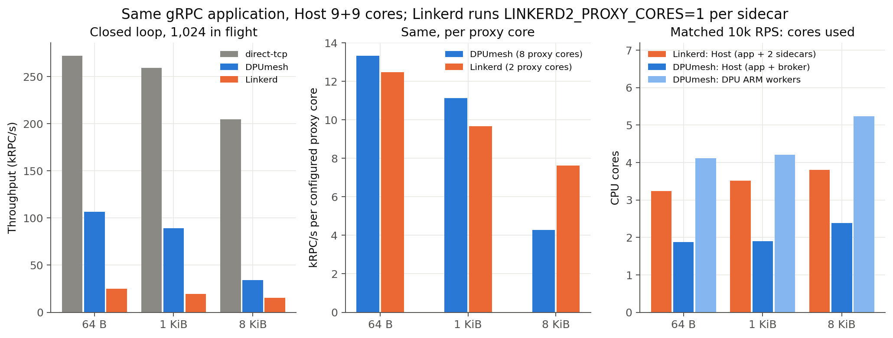

| frame | direct-TCP | DPUmesh (direct 대비) | Linkerd (direct 대비) | proxy core당 DPUmesh / Linkerd |
|---:|---:|---:|---:|---:|
| 64 B | 272.4k | 106.8k (0.39) | 25.0k (0.09) | 13.3k / 12.5k |
| 1 KiB | 259.2k | 89.1k (0.34) | 19.3k (0.07) | 11.1k / 9.7k |
| 8 KiB | 204.6k | 34.3k (0.17) | 15.2k (0.07) | 4.3k / 7.6k |

closed loop, 총 1,024 in flight, 10 s, 3회 중앙값. proxy core는 설정값이다(DPUmesh
ARM worker 8, Linkerd sidecar 1 core × 2). 코어당으로는 두 mesh가 같은 급이고
8 KiB에서는 Linkerd가 앞선다([`derived-comparison.csv`](derived-comparison.csv)).

| frame | Linkerd Host core | DPUmesh Host core | 절감 | ARM 소비 | p50 Linkerd / DPUmesh |
|---:|---:|---:|---:|---:|---:|
| 64 B | 3.24 | 1.87 | 1.36 | 4.11 | 403 / 611 µs |
| 1 KiB | 3.52 | 1.90 | 1.62 | 4.21 | 433 / 625 µs |
| 8 KiB | 3.80 | 2.38 | 1.42 | 5.24 | 514 / 1,552 µs |

achieved 10k RPS, Host는 application+broker 또는 application+sidecar의 recursive
Pod cgroup. Host 1 core를 아끼는 데 ARM 2.6–3.7 core가 들고 p50은 1.4–3.0배
느리다([`derived-exchange-10k.csv`](derived-exchange-10k.csv)). 10k RPS의 ARM 520 µs/RPC
중 knee 비용 154 µs를 넘는 부분이 §3의 이벤트당 고정비이므로, 그 고정비를 줄이면
교환비와 지연 역전이 함께 바뀐다.

## 7. worker 스케일링

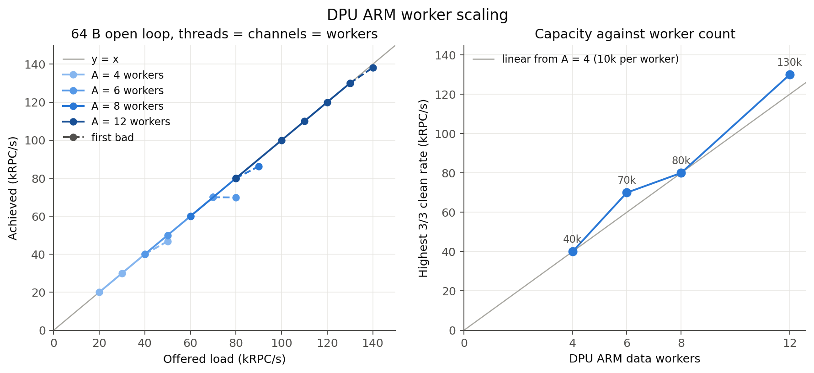

| workers | N/K/A | 최고 3/3 clean | first bad | worker당 | knee worker CPU |
|---:|---|---:|---:|---:|---:|
| 4 | 32/4/4 | 40k | 50k | 10.0k | 3.97/4 |
| 6 | 30/6/6 | 70k | 80k | 11.7k | 5.95/6 |
| 8 | 32/8/8 | 80k | 90k 반복 실패 | 10.0k | 7.79/8 |
| 12 | 24/12/12 | 130k | 140k | 10.8k | 11.37/12 |

`threads=channels=workers`로 worker당 session 1개. 130k에서 12 worker의 사용률은
97.4–98.9%로 균형이다. A=6의 첫 배포는 broker READY reset으로 실패했고 재배포에서
통과했다([`worker-scale-deploy-retry.txt`](worker-scale-deploy-retry.txt)).

## 8. 판정을 가른 실험과 남은 실험

조건과 통과 기준은 [`EXPERIMENT.md`](EXPERIMENT.md#e-사전-등록-실험)에 있다.

| ID | 질문 | 결과 |
|---|---|---|
| E1 | worker CPU가 열린 요청 수를 따르는 이유 | **측정 완료.** channel 1개 100 RPS에서 747 µs/RPC(≥ 400)이지만 spin이 아니라 이벤트당 고정비(§3) |
| E2 | 0.6–1 ms 지연 바닥의 위치 | **측정 완료, 기각.** `TX_TAIL_DELAY_NS` 50 µs 빌드에서 100 RPS p50 1,605 µs(불변), 10k RPS 1,456 µs(악화); 바닥은 DPU 이벤트 경로와 Host wake 체인 |
| E3 | 코어를 맞춘 비교 | 미측정: Linkerd sidecar 4 core와 direct-TCP 10k RPS p50 |
| E4 | 단일 worker 정지와 열화 | 미측정: fresh 배포 5회 × 90/92k와 24시간 80k probe |
| E5 | 이벤트당 고정비 절감 | **1차 측정 완료.** Rust drain을 C engine drain보다 먼저 두고(publish한 바이트를 같은 패스에서 DMA 제출), wake eventfd는 tick이 게시됐을 때만 읽게 한 빌드. worker CPU −2~6%(1ch 100/500/1k RPS 695→680, 641→616, 617→601 µs/RPC; 8ch 10k 411→406), syscall/RPC 47→32, 지연 불변(폐루프 936→930 µs), 64 B 90k 3/3 clean, `grpcshutdown`과 policy 19/19 통과([`lowload/e5-ab.csv`](lowload/e5-ab.csv), [`policy-route-20260902-184855/`](../policy-route-20260902-184855/)). 사전 목표(≤200 µs)에는 loop 정리로 도달 불가 |

E5 1차가 보여준 것은 loop 정리의 상한이 수 %라는 사실이다. 남은 레버는 요청당 6회의
connection poll을 줄이거나(h2 클라이언트 4회→2회), 이벤트 뒤 짧은 bounded spin으로
wake 체인과 cold 재진입을 피하거나, linkerd service 스택의 깊이를 줄이는 것이며,
셋 다 loop가 아니라 L7 스택 쪽 작업이다. 이 보고서의 병목 판정은 "knee는 worker
수가 정한다(§7)", 저부하 CPU와 지연은 "이벤트마다 cold로 지나는 L7 스택(§3)"이다.

## 재현

```sh
python3 bench/report/data/grpc-professor-20260902/derive.py   # derived-*.csv
python3 bench/report/data/grpc-professor-20260902/plot.py     # graphs/*.{svg,png}
bash bench/suite/grpc_correctness.sh all                       # §1
```

측정 arm별 배포·pin·sweep 명령은 [`EXPERIMENT.md`](EXPERIMENT.md)의 각 행에 있고,
§3의 저부하 진단 명령은 같은 문서의 E1/E2에 있다. 외적 범위는 단일 node, 한
BlueField, A=4/6/8/12이며 cross-node와 24시간 안정성은 측정하지 않았다.
