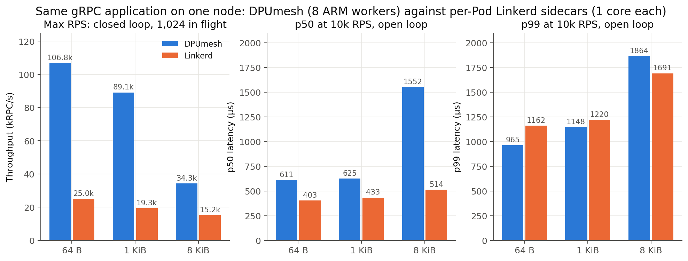

# DPUmesh gRPC 정확성·성능 — 2026-09-02

한 node, BlueField-3 하나, `N/K/A=32/8/8`, Host client/server Pod 각 9 core. 비교 대상은
같은 client/server binary를 per-Pod Linkerd sidecar(`edge-26.8.1`, 표준 설치값
`LINKERD2_PROXY_CORES=1`, mTLS 확인)로 돌린 것이다. frame 64 B / 1 KiB / 8 KiB는
request와 response 각각의 크기다. 절차는 [`EXPERIMENT.md`](EXPERIMENT.md), 원자료는
`*-raw.csv`, 표의 값은 `*-summary.csv`다.

## 결론

1. **정확성 gate 전부 통과.** 계약 테스트, sanitizer, 실제 DPU shutdown/재사용, gRPC
   정책·라우팅 19 stage. §1.
2. **최대 RPS는 per-Pod Linkerd의 4.3× / 4.6× / 2.2×** (64 B / 1 KiB / 8 KiB),
   RPC failure와 drop 0. §2.
3. **같은 10k RPS의 지연은 p50 +0.2 ms(64 B·1 KiB), p99는 Linkerd 이하.** 8 KiB만 p50이
   3배(1.55 ms 대 0.51 ms)이고 p99는 +10%다. §2.

## 1. 정확성

| gate | 결과 |
|---|---:|
| Host transport/ABI/fault 계약 테스트 (`make test-hostfree`) | PASS |
| 실제 DPU lane·SG-DMA queue 계약 | PASS |
| gRPC cHTTP2 adapter CTest, release | 4/4 |
| 같은 CTest, Clang ASAN+UBSAN | 4/4 |
| embedded Linkerd(Rust) adapter tests | 38/38 |
| 실제 DPU channel shutdown·slot 재사용 | opened=closed 22/22, 재사용 후 exchange 손실 0 |
| gRPC 정책·라우팅 (timeout, retry, method/header match, GRPCRoute, AuthorizationPolicy, circuit breaker) | 19/19 |
| 측정 종료 시 Pod restart / 잔여 session·task | 0 / 0 |

원자료 [`correctness.txt`](correctness.txt), stage별 판정 [`policy-stages.csv`](policy-stages.csv),
판정 기준 [`design/GRPC.md`](../../../../design/GRPC.md#verification-contract).

## 2. 성능



| | 64 B | 1 KiB | 8 KiB |
|---|---:|---:|---:|
| DPUmesh 최대 RPS | 106.8k | 89.1k | 34.3k |
| Linkerd 최대 RPS | 25.0k | 19.3k | 15.2k |
| p50 at 10k RPS, DPUmesh / Linkerd | 611 / 403 µs | 625 / 433 µs | 1,552 / 514 µs |
| p99 at 10k RPS, DPUmesh / Linkerd | 965 / 1,162 µs | 1,148 / 1,220 µs | 1,864 / 1,691 µs |

최대 RPS는 closed loop(8 thread × 8 channel, 총 1,024 in flight, 10 s) 3회 중앙값이고
두 arm 모두 failure 0이다([`mesh-closed-summary.csv`](mesh-closed-summary.csv)).
지연은 open loop 10k RPS 3회 중앙값, 두 arm 모두 achieved 10k·failure 0이다
([`mesh-cpu-summary.csv`](mesh-cpu-summary.csv)). DPUmesh는 ARM worker 8개, Linkerd는
sidecar당 1 core다.

## 재현

```sh
bash bench/suite/grpc_correctness.sh all                       # §1
python3 bench/report/data/grpc-professor-20260902/plot.py     # graphs/00_summary
```

측정 arm별 배포·pin·sweep 명령은 [`EXPERIMENT.md`](EXPERIMENT.md)의 C, P4, P5, R1, R2 행이다.
