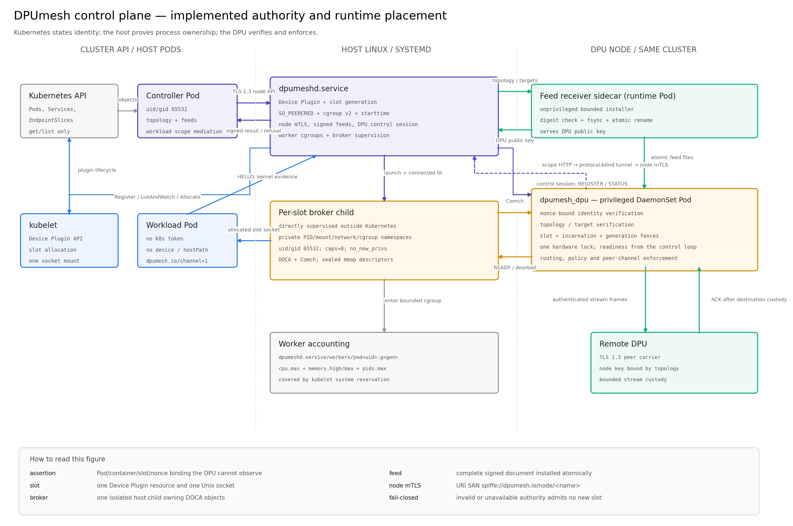

# DPUmesh Control Plane

The control plane answers one question: how the DPU learns who is calling and
where the call may go. Every mechanism here follows from one fact — the DPU is
a different machine across PCIe. It reads host memory the host exported and
nothing else, and DOCA Comch carries no peer credential the way `SO_PEERCRED`
does. Identity evidence is a fact the kernel knows, not a byte a process hands
over, so a DPU cannot by itself answer who is on the other end of a channel.

The data plane those admissions govern is [`DATA.md`](DATA.md); the
application's contract is [`API.md`](API.md). Only the middle hop of the data
path differs across a node boundary.

```text
   intra-node   host TX mmap → DPA → staging → SG-DMA         → host RX mmap
   inter-node   host TX mmap → DPA → staging → RDMA → staging → host RX mmap
```

The boundary is a layer split, not a special case. `struct dmesh_peer_transport`
is the seam: the transport below it supplies ordered reliable delivery within a
handle and a mutually authenticated key agreement, and this tree owns every
authenticated stream, routing, custody and lifetime rule above it — handle
namespaces, bounded parsing, the node-name-to-key binding check, custody across
the boundary, and the refusal accounting that answers for all of it. Chapters
2-0 and 4 define that upper half, which is built and driven end to end by
`tests/peer_channel_test.c` through a recording transport.

**Status.** Both halves are built. The lower one is a mutually authenticated
TLS 1.3 session over a byte carrier, and two carriers implement that inner seam:
TCP, which CI runs, and RDMA, which the mesh is meant to run. A deployment binds
one by naming it in `DPUMESH_PEER_TRANSPORT` (§5.5.1); with the variable unset
nothing binds, `px_peer_configure` is uncalled, and a remote destination is
refused at the first branch of `px_peer_stream_ready`, which is what a
single-node deployment still does.

What has not happened is a second node. The TCP carrier runs in the host
peer-wire test; its RDMA arm skips without a configured local RDMA address.
Neither carrier has connected two DPU nodes or carried a remote application
stream. Node-to-node confidentiality and authentication are
implemented and undemonstrated — read what follows as the design and the code,
not as a deployment's measured properties.

## How to read this

Six chapters in dependency order. Each needs the ones before it and nothing
after it.

```text
   1     Authority and distribution   who may state what, and how it arrives
   2-0   Node authentication          which DPU is on the other end of a channel
   2-1   Pod registration             which Pod is on the other end of a Comch connection
   2-2   Identity across a boundary   the two bindings joined by one signed lookup
   3     Authorization                whether an established identity may enter
   4     Resources and lifetime       what an authenticated peer may consume
   5     Operations and reference     naming, configuration, observability, parameters
```

Without 1 there is no key for 2-0 to verify; without 2-0 no channel 2-2 can
trust; without 2-1 and 2-2 no inputs for 3. Chapter 4 is what remains true after
all of them: a peer is authenticated, not trusted.

## Terms

| Term | Meaning |
|---|---|
| node agent | a root-owned DaemonSet on the host that reads Kubernetes objects and signs claims |
| assertion | the node-agent-signed statement of a Pod's identity and authorized Service that registration must present |
| feed | a file the DPU reads for authoritative data: node membership, Service targets, or the cluster topology |
| generation | one version of a feed, installed whole by atomic rename and numbered monotonically |
| topology generation | the cluster-scoped generation: one signed snapshot of every cluster-wide fact a DPU needs |
| controller | the cluster-scoped publisher, `controller/dpumesh_controller.py`; holds the issuing key |
| workload | the Linkerd identifier of the calling Pod, `{"ns":…,"pod":…}`, built from signed claims |
| gateway | the node agent's host-network TCP pass-through leg, which carries the DPU's control-plane connections without reading them |
| admission switch | a file that stops new protected sessions while established ones continue |
| node credential | one static keypair per DPU, generated on the DPU, used to authenticate to peers |
| peer channel | the authenticated, long-lived connection between one pair of DPUs |
| incarnation | the generation number of a peer channel; every handle and in-flight operation carries it |
| handle | one full-duplex cross-node stream, allocated by the destination DPU |
| protection class | whether the generation grades a Service protected or unprotected |

## Threat model

One DPU in the fleet is compromised. Every other component behaves.

| Party | Assumed | Consequence |
|---|---|---|
| workload Pod | hostile | states nothing about itself; the assertion names it |
| host kernel | honest | it is the source of attestation evidence |
| node agent | honest | it holds the only key that can assert for its node |
| **one DPU** | **hostile** | it must not be able to speak for another node's Pods |
| controller | honest | it holds the only key that can bind a Pod to a node |

A compromised DPU keeps its own Pods' memory, traffic and metrics. That is
irreducible — a sidecar and a `ztunnel` lose the same. What the design denies
it is reach beyond its node:

```text
                        sidecar   ztunnel   DPUmesh          DPUmesh
   one node compromised                     (peer believed)  (this design)
   ─────────────────────────────────────────────────────────────────────
   its own Pods           lost      lost      lost             lost    ← irreducible
   other nodes' Pods      safe      safe      LOST             safe
   other nodes' traffic    n/a      safe      LOST if the      safe
                                              key is shared           (pairwise keys)
```

Three requirements follow, marked ⟨T⟩ where they appear:

- identity claims about another node's Pods are refused;
- inter-DPU keys are pairwise, so one compromised DPU decrypts only its own
  conversations;
- a peer consumes bounded resources at a destination **and a stalled peer holds
  bounded resources at a source**.

One consequence governs the choice of primitive: **anything cluster-scoped that
a DPU verifies is verified with a key the DPU cannot use to sign.** Node-scoped
feeds may stay symmetric — a DPU that forges its own membership harms only its
own node, which the model concedes.

## Three scopes, one component each

| Scope | Component | Holds | Can create identity |
|---|---|---|---|
| cluster | `dpumesh-controller` | issuing key; the topology | yes |
| node, host | node agent | that node's private key | for its own node only |
| node, DPU | `dpumesh_dpu` | public keys; its node credential | no |

The node agent is a component of the design and not deployment tooling, for one
reason: the DPU cannot read `SO_PEERCRED`, a peer cgroup or `/proc/<pid>/stat`,
and those are the only evidence binding a connection to a Pod. Every
shared-proxy mesh keeps a host-resident half for the same reason. What the split
buys: the proxy runs on a CPU the workload cannot schedule on, so keys never
enter host memory and counters are not falsifiable. The per-Pod broker (§2-1.9)
is the same principle applied to the device: DOCA ownership stays in a host
process the tenant cannot reach, and the workload container holds no device.

Where a mesh proxy sits on one axis decides both consequences:

```text
   near the workload  ◀─────────────────────────────────▶  far from the workload
   identity: free                                          identity: established
   isolation: weak                                         isolation: strong

   ┌──────────────┐    ┌──────────────┐    ┌──────────────┐    ┌──────────────┐
   │   Linkerd    │    │Istio ambient │    │  on-node     │    │   DPUmesh    │
   │Istio sidecar │    │   ztunnel    │    │  host proxy  │    │              │
   └──────────────┘    └──────────────┘    └──────────────┘    └──────────────┘
    in the Pod          host process        host process,       a different
                        per node            per node            machine, PCIe

    sees the Pod:       sees the Pod:       sees the Pod:       sees the Pod:
    it IS the Pod       yes, same kernel    yes, same kernel    no
```

The rightmost column is the only one that has to split, and the only one whose
proxy the tenant cannot reach.

```text
  ┌───────────────── Kubernetes cluster ──────────────────┐
  │  linkerd-identity   linkerd-destination   dpumesh-    │
  │                     / policy              controller  │
  └──────────────────────────┬────────────────────────────┘
                             │  signed generation
                             │  node credentials published in node=
         ┌───────────────────┴───────────────────┐
         ▼                                       ▼
  ┌──── NODE A ─────────┐               ┌──── NODE B ─────────┐
  │ HOST (x86)          │               │ HOST                │
  │  ┌─────┐   ┌─────┐  │               │  ┌─────┐            │
  │  │Pod P│   │ Pod │  │               │  │Pod Q│            │
  │  └──┬──┘   └──┬──┘  │               │  └──┬──┘            │
  │     │ AF_UNIX │     │               │     │               │
  │  ┌──▼─────────▼───┐ │               │  ┌──▼─────────────┐ │
  │  │ node agent     │ │               │  │ node agent     │ │
  │  │  SO_PEERCRED   │ │               │  │                │ │
  │  │  cgroup        │ │               │  │                │ │
  │  │  node priv key │ │               │  │                │ │
  │  └──┬─────────┬───┘ │               │  └──┬─────────────┘ │
  │     │ spawn   │     │               │     │ spawn         │
  │  ┌──▼─────────▼───┐ │               │  ┌──▼─────────────┐ │
  │  │ per-Pod brokers│ │               │  │ broker         │ │
  │  │ device · Comch │ │               │  │                │ │
  │  └──┬─────────┬───┘ │               │  └──┬─────────────┘ │
  │ ════╪═ PCIe ══╪════ │               │ ════╪═ PCIe ═══════ │
  │  ┌──▼─────────▼───┐ │               │  ┌──▼─────────────┐ │
  │  │ DPU (ARM)      │ │               │  │ DPU            │ │
  │  │  public keys   │ │               │  │                │ │
  │  │  node credent. │ │               │  │                │ │
  │  └────────┬───────┘ │               │  └────────┬───────┘ │
  └───────────┼─────────┘               └───────────┼─────────┘
              └── RDMA · mutually authenticated ────┘
                  pairwise keys · one channel per node pair
```



[PDF](figures/control_plane.pdf)

Five keys exist; a Pod holds none of them.

| Key | Algorithm | Private half | What the DPU holds |
|---|---|---|---|
| controller issuing key | Ed25519 | the controller, one per cluster | public keys only, `DPUMESH_CONTROLLER_KEY_DIR` |
| node agent registration key | Ed25519 | that node's agent | public key only, from the generation |
| feed key | HMAC-SHA256, **symmetric** | node agent | the same secret, `DPUMESH_FEED_KEY_DIR` |
| node credential | Ed25519 | **the DPU itself**, generated at first boot | its own; peers' public halves from the generation |
| Linkerd identity | ECDSA P-256 | the DPU | its own key on disk, the certificate in memory |

---

# 1. Authority and distribution

## 1.1 The controller

The controller publishes the generation and mediates the workload lookups the
upstream API cannot scope. It performs no attestation — it has no host-local
evidence and never asks for it. It runs as a Pod, reads the Kubernetes API, and
never speaks to a DPU: a DPU has no route into the cluster CIDRs, so its node
agent relays, the channel every other control message already takes.

It exists rather than letting each node agent derive the topology, which would
need cluster-wide Pod read on every node, a different snapshot per agent, and
one API reader per node. The agent reads Pods with
`fieldSelector=spec.nodeName=<its node>` under a namespaced `Role`, and
`workload_attest.sh` asserts it cannot list Pods cluster-wide.

One replica by default, because the system is fail-static. Replicas with leader
election sign in turn where freshness matters more; this does not reduce copies
of the signing key, since a Kubernetes Secret is readable by every replica.

## 1.2 The generation

One UTF-8 text document, one record per line, `\n` endings, no spaces around
separators; comments start with `#` and are permitted only before `version=`. A
DPU adopts it whole or not at all, verified with a key it holds no signing half
of. It answers what nothing node-local can know: which Service a name refers to,
which node a Pod is on, and whether a Service is graded protected.

```text
version=<u64 decimal, strictly increasing across publications>
node=<node-name>,<rdma-ip>:<rdma-port>,<agent-key-id>,<agent-pub-hex64>,<dpu-static-pub-hex64>
pod=<pod-uid>,<node-name>,<namespace>,<service-account>,<pod-ipv4>
service=<namespace>/<name>,<cluster-ipv4>:<port>
endpoint=<namespace>/<name>,<pod-uid>
protected=<namespace>/<name>
signature=<key-id>,<hex128>
```

| Line | Answers | Read by |
|---|---|---|
| `node=` | RDMA address, agent public key, DPU static public key | 2-0, 2-1 |
| `pod=` | which node a Pod UID is on; its namespace, ServiceAccount, IP | 2-2, 3 |
| `service=` | ClusterIP and port | resolution, 3 |
| `endpoint=` | ready backends | reach, 3 |
| `protected=` | protection class | 3 |

Field syntax, enforced before anything is adopted:

| Field | Rule |
|---|---|
| `node-name` | DNS subdomain, ≤ 253 |
| `pod-uid` | lowercase RFC 4122 text form, exactly 36 chars |
| `namespace` | DNS label, ≤ 63 |
| `name` (Service) | DNS label, ≤ 63 — never named without its namespace |
| `service-account` | DNS subdomain, ≤ 253 |
| `pod-ipv4`, `cluster-ipv4` | dotted quad; the Pod IP is what makes destination-side `networks` authorization decidable |
| `agent/dpu key hex` | exactly 64 hex chars — the agent's Ed25519 signing key, the DPU's static handshake key |
| `key-id` | `[A-Za-z0-9._-]+`, ≤ 31, no `/`, no leading `.` |
| `hex128` | exactly 128 hex chars (64-byte Ed25519 signature) |

- `version=` is the first non-comment line, `signature=` the last; everything
  between may appear in any order.
- An unknown line kind, a duplicate `pod=` for one UID, an `endpoint=` or
  `protected=` naming a Service or Pod UID no other line defines, or any syntax
  violation refuses the whole document.
- `DMESH_GEN_POD_MAX`, `DMESH_GEN_NODE_MAX`, `DMESH_GEN_SERVICE_MAX`, `DMESH_GEN_ENDPOINT_MAX` and
  `DMESH_TOPOLOGY_MAX_BYTES` are refused rather than truncated at both ends: the
  publisher refuses to publish an over-bound generation so the last good one
  stands and the failure is loud at the source, and the consumer refuses to
  adopt one.
- An unchanged cluster publishes nothing, so a new version always says something
  new. A rotated signing key republishes even an unchanged cluster: the held
  document must never outlive the key that signed it.
- The next version is `max(now, held + 1)`, and `held` is read back from the
  installed file at startup, so a clock step backwards cannot present a rollback
  and a restart continues the sequence.

## 1.3 The node-scoped feeds

Two more feeds carry authority. Identity material is not one of them: the
delivery hop installs it unsigned as a directory bundle, and the certificate
the control plane issues against it is what authenticates it.

| Feed | Published by | Scope | Signed with | Carries |
|---|---|---|---|---|
| node membership | node agent | node | feed keyring, HMAC-SHA256 | the `(Pod UID, Service)` pairs this node may hold |
| Service targets | node agent, derived from the held topology | node | feed keyring, HMAC-SHA256 | each Service's ClusterIP and ready endpoints, with the Pod UID of each |
| topology generation | controller | cluster | `DPUMESH_CONTROLLER_KEY_DIR`, Ed25519 | *The generation* above |

The symmetric key still buys everything below a hostile DPU: a non-root host
process, a truncated or corrupted file, a stale or unsigned copy. A feed that
does not verify does not revoke — the direction that matters, since revocation
is the operation that ends a Pod. Membership revocation does not enable at all
without a feed keyring.

The feed keyring is disjoint from the registration keyring, so a leaked key is
accepted for only one wire role and the two roles rotate independently. The
deployed node-agent process necessarily holds both node-scoped keys: compromising
that trusted process compromises both roles for its node, as the threat model
already concedes. Key selection is filename-driven, so a key file in the wrong
directory is a signing-capability leak; provisioning refuses to place two
keyrings in one directory.

The Service target snapshot is derived from the held generation rather than an
independent Kubernetes read, so the two cannot disagree. It places every address
it names — session key, ClusterIP and ready endpoints — in its Service, and a
session refuses to dial an address the generation places in another one. Every
selected address other than the session's own must resolve through the Pod UID
the snapshot pairs with it, so a Linkerd endpoint the generation no longer names
is declined rather than assumed to be the session's.

## 1.4 The envelope

Every generation of every feed is installed by atomic rename and ends with a
signature envelope naming the key that signed it:

```text
signature=<key-id>,<hex HMAC-SHA256 over every preceding byte>
```

The topology generation uses the same shape with Ed25519 and the controller
keyring; `dmesh_gen_verify` applies the same marker scan and key-id parsing as
`dmesh_feed_verify`. In all three, **only the signed prefix is parsed**: the
verifier returns the prefix length and the parser never sees past it, so
appended bytes are refused rather than ignored. A key id naming a file outside
its keyring directory is rejected.

Key files are 32 raw bytes or 64 hex digits, regular, opened `O_NOFOLLOW`,
owned by the effective uid, mode 0600 or 0400, in a 0700 directory.

## 1.5 Adoption

The DPU polls the topology file once a second. Nothing about that poll is
allowed to become a decision.

```text
   stat        size ≤ TOPOLOGY_MAX_BYTES?
   stamp       inode, mtime and length all match, AND the file has been
               installed longer than the timestamp granularity? → skip the read
   verify      Ed25519 over the signed prefix
   parse       into a staging table; interning is staged with it
   version     strictly older than what is held? → rollback, refused
   swap        release-store the new tables; park the displaced one
```

- **The stamp is an optimization, never a decision.** The DPU filesystem reuses
  the freed inode across a rename and stamps coarse timestamps, so unchanged is
  believed only once inode, mtime and length match *and* the file has settled
  past that granularity.
- **Interning is staged with the tables.** Interning assigns a node-local
  compact id to a Service name, which is a side effect; a document that is
  subsequently refused must not leave it behind. Adoption is all-or-nothing
  including its side effects.
- **Only a fully parsed generation is stamped**, so a rejected document is
  re-read until the publisher installs a newer one.
- The swap is a release store and the displaced generation is parked rather than
  freed: workers read the table locklessly and adoptions are at least a poll
  interval apart.
- A document that was read, verified and parsed and says what the held one says
  is counted (`unchanged`), unlike a file never touched — that distinction is
  what shows an operator the delivery pipeline is alive.

Adoption propagates to exactly three places:

```c
px_protection_refresh(objs);        /* protection class cache; chapter 3 */
dmesh_scope_refresh(objs);          /* mediated workload scope; chapter 3 */
px_peer_generation_changed(objs);   /* rebind or reset peer channels; chapter 2-0 */
```

## 1.6 What a rejected generation does: nothing

A missing, malformed, oversized, unsigned or rolled-back generation changes
nothing — it never revokes membership, withdraws a target or admits an
unverified registration. Outcomes are counted as
`dmesh_control_events_total{kind="topology",reason}` with reasons `adopted`,
`unchanged`, `rollback`, `unsigned`, `bad-key-id`, `bad-sig`, `malformed`,
`overflow`, `unreadable`. This is the fail-static rule every later chapter leans
on: a stuck publisher shows up as a stale generation, not as an outage.

## 1.7 Bootstrap and rotation

A DPU must hold the controller's public key before it can verify anything, so
that key cannot arrive in a generation. It is deployment-time material in
`DPUMESH_CONTROLLER_KEY_DIR`, loaded with the checks `dmesh_grant_load_key`
applies, and a DPU that cannot load one refuses to start.

The directory holds an overlap set of at most `DMESH_CONTROLLER_KEYS_MAX` public keys
and the envelope names which one signed. Adding a key is a file drop, retiring
one a delete; a generation naming a key id the set does not hold is refused and
counted. An empty directory and an over-full one both refuse startup on the
consumer side, exactly as the registration keyring does, and the three key
directories stay disjoint for the reason *The node-scoped feeds* gives.

## 1.8 Resolution — the consumer side

Names live outside, handles inside: the workload asks, its broker relays the
round trip (§2-1.9), and the DPU answers from the held generation. The answer
carries the DPU-interned compact id — a node-local transport identifier, never
workload identity. No registry file exists anywhere.

```text
Host Pod            per-Pod broker                     DPU
  │── RESOLVE ────▶│──── RESOLVE(name | ip:port) ────▶│  answered from the adopted,
  │◀─ RESOLVE_ACK ─│◀─── RESOLVE_ACK(interned id) ────│  Ed25519-verified generation
```

The native API resolves `"name"` (the Pod's own namespace) or `"name.namespace"`
in `dmesh_create_qp`. The preload facade resolves the IPv4 destination passed to
`connect`; a ClusterIP answers `meshed` only when its Service has a live
registered backend here (the generation names unmeshed Services too),
`status = not-meshed` makes leaving the mesh an explicit, logged kernel-TCP
decision, and `status = no-generation` falls back the same way while a
registration fails closed. Answers are cached per key for one generation
interval (`src/core/dmesh_resolve.c`) and re-resolved after that or on a connection
error, so the cache is never staler than the generation.

## 1.9 When the controller is unavailable

**Nothing that is running stops.**

```text
   controller down
        ├─ established streams            unaffected
        ├─ new streams, existing Pods     unaffected
        ├─ new streams, intra-node        unaffected (registration is node-local)
        ├─ a Pod that starts afterwards   registers and serves intra-node; no
        │                                 generation places it, so peers refuse
        │                                 it — cross-node only
        ├─ mediated policy lookups        stall for Pods not yet in the held
        │                                 generation — new-Pod cross-node only
        └─ revocation via the generation  stops (node-local membership
                                          revocation continues — it is the
                                          agent's feed, not the controller's)
```

The last row is why the membership feed is the agent's: revocation is the
safety-critical operation, and it survives losing the cluster-scoped component.

---

# 2-0. Node authentication

Which DPU is on the other end of a channel. Settled on every channel, before
any Pod identity is discussed.

## 2-0.1 The node credential

One static Ed25519 keypair per DPU, generated on the DPU at first boot into a
0400 file that never leaves it (`dmesh_peer_node_key_load`). It is a signing
key: it signs the certificate the DPU presents and the handshake transcript
under it, which is what proves possession. The traffic key is the session's own,
agreed fresh on every connection and never derived from this one. First boot
writes the private half with `O_CREAT|O_EXCL|O_NOFOLLOW`; later boots read it
back only if the file is regular, owned by the effective uid, has no group or
other bits, and is exactly 32 bytes. The public half goes to a separate readable
file; the agent reports it to the controller, which publishes it in that node's
`node=` line.

```text
   DPU A                                                          DPU B
   Ed25519 private ─generated here, never leaves──               Ed25519 private
        │ public half only                                             │
        ▼                                                              ▼
   node agent A ─────┐                                    ┌───── node agent B
                     ▼                                    ▼
                 controller: node=A,…,<A pub>   node=B,…,<B pub>
                                    │ signed generation
             ┌──────────────────────┴──────────────────────┐
             ▼                                             ▼
     DPU A: "B's key is this"                     DPU B: "A's key is this"
```

A DPU authenticates a peer with a key it obtained from the generation, not from
the peer. An all-zero static key is the placeholder a node carries until its DPU
has generated a credential; it binds nothing, so it is not a key.

## 2-0.2 One rule on top of a stock handshake

The channel runs TLS 1.3, mutually authenticated: each end presents a
self-signed certificate carrying its node static key, no certificate authority
is trusted, and resumption is off, so every connection performs a fresh key
agreement. One rule is added:

> the peer's static public key must equal the one the held generation binds to
> the peer's claimed node name. A name the generation does not bind, or a key
> that differs, refuses the channel ⟨T⟩.

The two halves are separate refusal reasons because they are different
operational events: `node-unbound` is a name the generation does not carry,
`node-key` a name it carries with a different key. The binding lookup happens
before a channel may exist at all, on outbound open and accepted inbound
connection alike, so an unbound name never reaches the handshake.

Keys are pairwise ⟨T⟩: a fleet-shared key would let one compromised DPU read
every conversation in the cluster. No per-workload key exists on this wire.

## 2-0.3 Incarnation

The incarnation advances on every entry to `AUTHENTICATING` and travels as the
first thing the initiator writes into the completed session, ahead of any frame:

```text
   dpumesh-peer-v1\n<local node>\n<peer node>\n<incarnation>\n
```

The handshake settles the peer's key and this prologue settles a name against
it, so the pair authenticates the protocol version, both node names and the
incarnation the connection's handles will carry. A session key is never reused,
so a prologue cannot be replayed into another connection. Every frame carries it
and it is matched on every path, because an asynchronous completion outlives the
state that named it — the same arithmetic `dma_generation` applies to a Pod
slot.

## 2-0.4 Simultaneous open

Simultaneous opens converge on the connection initiated by the
lexicographically smaller node name, which both ends compute independently, so
no negotiation is needed. A pending handshake is never replaced by a new open —
callers poll. A reopen while one is pending supersedes its transport connection,
which is closed rather than overwritten.

## 2-0.5 Rebinding on adoption

`dmesh_peer_table_rebind` re-checks every live channel on every adoption and
resets one whose peer the generation dropped or re-keyed. This is where node
eviction takes effect: when the controller drops a node, every DPU refuses it at
once and consistently. It is the counterpart of 2-2's rule that an individual
refusal never tears a channel down.

## 2-0.6 Lifetime

A channel opens on the first stream that needs the node at its far end, because
opening to every node in advance would be quadratic. The cost is that the first
stream to a node pays for authentication and key agreement.

```text
                    open() on the first stream needing this node
                                     │
   CLOSED ──────────────────────────▶│
     ▲                               ▼
     │                        AUTHENTICATING ── incarnation += 1 on entry
     │                          │        │
     │                     fail │        │ node credentials verified both ways,
     │                          │        │ pairwise key agreed ⟨T⟩
     │                          ▼        ▼
     │◀───────────────────────  OPEN
     │
     │   idle > CHANNEL_IDLE (only with no streams and nothing in flight),
     │   the generation drops or re-keys the peer, or the transport faults.
     │   Teardown is synchronous: the reset poisons every stream and releases
     │   every pinned extent before it returns, so there is no draining state.
```

The LRU that reclaims a slot when all `DMESH_CHANNEL_MAX` are in use applies the same
rule: a channel holding handles or in-flight bytes is skipped, so a new
connection never displaces live traffic — it is refused instead.

## 2-0.7 Channels and queue pairs

To keep a completion on its owner the channel is one queue pair per (node pair,
destination worker), and authentication runs on each one: a worker holds its own
credential context and settles the peer's key itself, so the pairwise key is per
(node pair, worker) and none crosses a worker boundary. `DMESH_CHANNEL_MAX × A`
is therefore the number to check against RDMA resource limits, not
`DMESH_CHANNEL_MAX` alone. `GENERATION_INTERVAL` and `DMESH_CHANNEL_IDLE_NS`
interact: a channel evicted and reopened between two generations pays setup
twice.

## 2-0.8 What this layer establishes, and what it does not

```text
  establishes   the far end holds the private key the generation binds to that name
                checked once per channel, amortized over every stream
                traffic is encrypted under a key only this pair holds
                it lapses the moment the generation drops or re-keys the peer

  does not      that the node is honest              ← "authenticated ≠ trusted"
  establish     that the Pods it names are real      ← chapter 2-2
                that it consumes resources politely  ← chapter 4
```

---

# 2-1. Pod registration

Which Pod is on the other end of a Comch connection — the binding only the node
agent can make, and the reason the node agent exists.

## 2-1.1 Attestation

`$DPUMESH_SERVICE` names the Service provided by the process. An unset or
unknown value creates a client-only channel.

The registering process — the flow's left column — is the Pod's broker
(§2-1.9), which the agent has already attested and launched by the time this
flow begins.

```text
registering process      trusted node agent                    DPU
  │                               │                              │
  │◀──────────────────────── REG_CHALLENGE(nonce) ───────────────│
  │── nonce + requested service ─▶│                              │
  │                               │── SO_PEERCRED/cgroup ─┐      │
  │                               │◀─ K8s Pod/Service ────┘      │
  │◀─ signed immutable claims ────│                              │
  │───────────────────────── WORKLOAD_ASSERT ───────────────────▶│
  │───────────────────── POD_REGISTER(service name) ────────────▶│
  │◀──────────────────────── POD_ASSIGNED(pod_id, stripes) ──────│
  │───────────────────────── MMAP_EXPORT × regions ─────────────▶│
  │◀──────────────────────── POD_INIT_RESULT(READY) ─────────────│
```

The registering process says two things: a Service name, and the nonce the DPU
just gave it. Mappings are exported only after identity is settled, so a failed
verification leaves the DPU holding nothing.

The DPU creates a fresh 32-byte nonce per Comch connection. The root-owned agent
identifies the peer of its root-owned `AF_UNIX SOCK_SEQPACKET` socket with
`SO_PEERCRED` — the kernel names the caller, not the request data — then:

- reads `/proc/<pid>/stat` for the process start time, reads
  `/proc/<pid>/cgroup`, and reads the start time again. `SO_PEERCRED` names the
  pid at connect time; a pid recycled into another Pod between those reads would
  otherwise be attested under the wrong identity, and the start time is a
  boot-relative tick that necessarily differs across a recycle. Fields are
  counted from the last `)`, because `comm` may contain spaces and parentheses;
- resolves the cgroup to the authoritative Pod, read under the node-scoped field
  selector;
- verifies that the Pod labels select the requested Service; an empty selector
  is refused, since it would match anything;
- waits briefly for `status.podIP` if the apiserver has not observed it. A Pod
  registers the moment its process starts, which can precede that; the IP is a
  signed claim, so the race is waited out rather than refused;
- returns a canonical Ed25519-signed assertion.

A broker's assert request is recognized by the agent's supervision registry
instead — the pid, start time, Pod UID and Service recorded at its launch,
re-checked against the live cgroup — and is refused any Service outside that
registry claim.

The registering process relays the assertion; it cannot change a claim.

## 2-1.2 The assertion

`struct dmesh_workload_assert_msg` is 1134 bytes and carries key id, issue and
expiry, assertion id, nonce, node, Pod UID, namespace, Pod name, ServiceAccount,
Service name and Pod IP; the issuer is implied by `(node, key id)`.

```text
   offset  size  field                    where the value comes from
   ─────────────────────────────────────────────────────────────────────
        0     1  type
        1     1  version = 2
        2     2  flags · reserved         must be zero
        4     8  issued_at                the agent's clock
       12     8  expires_at               issued + TTL, at most ASSERT_LIFETIME
       20    16  assert_id                the replay ring's key
       36    32  nonce                    the DPU's per-connection challenge
       68    32  key_id                   selects the agent public key
      100   254  node_name                the agent's own node
      354    64  pod_uid                  from the peer cgroup
      418    64  namespace                the Kubernetes Pod object
      482   254  pod_name                 the Kubernetes Pod object
      736   254  service_account          the Kubernetes Pod object
      990    64  service_name             label-authorized Service
     1054    16  pod_ip                   status.podIP
   ─────────────────────────────────────────────────────────────────────
     0 ‥ 1069  ◀── the Ed25519 signature covers all of it
     1070    64  sig
```

Numeric fields are explicit little-endian, text is NUL-terminated and
zero-padded, and the signature covers `[0, offsetof(sig))`. One changed byte
anywhere invalidates it.

## 2-1.3 The checks

The order the DPU checks it in, and the reason each failure reports as
`dmesh_control_events_total{kind="assert",reason}`. The key lookup happens in
the caller, before the message-body checks.

| # | Check | reason |
|---|---|---|
| 0 | `key_id` names a public key published for **this node's agent** | `bad-key-id` |
| 1 | canonical form: nothing after each NUL, padding intact, DNS fields well formed, `pod_ip` a dotted quad, `flags`/`reserved` zero, `assert_id`/`nonce` not all-zero | `noncanonical` |
| 2 | `version == 2` | `bad-version` |
| 3 | `node_name` equals this DPU's own node (`DPUMESH_NODE_NAME`) ⟨T⟩ | `wrong-node` |
| 4 | `issued_at ≤ now + ASSERT_CLOCK_SKEW`, `expires_at > now`, lifetime ≤ `DMESH_ASSERT_MAX_LIFETIME_SEC`; the skew grace is one-sided, on `issued_at` only | `bad-time` |
| 5 | `nonce` equals the challenge this connection issued (constant-time compare) | `bad-nonce` |
| 6 | signature verifies over `[0, offsetof(sig))` | `bad-sig` |
| 7 | `assert_id` not in the consumed ring (`DMESH_REGISTRATION_REPLAY_SLOTS`, evicting) | `replay` |

Everything arithmetic comes before the asymmetric verification, so a Pod that
floods the channel with garbage does not spend the DPU's cycles on Ed25519. The
skew grace is one-sided because the agent's clock may lead the DPU's; grace on
expiry would let an assertion outlive the lifetime it declares.

**Check 3 and the `POD_REGISTER` name gate (§2-1.6) are what a registration
cannot talk its way around**: the Pod relays the assertion, and the assertion
names both the node and the Service. Verification happens once per Comch
connection; nothing on the data path verifies assertions.

For check 0 the held generation is authoritative for this node's agent key, and
the installed registration keyring is the bring-up fallback for a DPU that has
adopted no generation yet. The lookup is scoped to this DPU's own node name, so
an assertion signed for another node's agent finds no key at all.

## 2-1.4 Replay

```text
   nonce             fresh per Comch connection.  An assertion cannot move to
                     another connection, survive a reconnect, or survive a DPU
                     restart.  This is the hard bound.
   consumed ring     ASSERT_REPLAY_SLOTS ids, evicting.  The per-connection
                     nonce is what makes eviction safe.
   consumed flag     an assertion used by one registration is not reusable.
```

The ring needs no lock: the Comch control PE is its only caller.

## 2-1.5 What the registration retains

A successful verification builds the Linkerd workload JSON from the signed
namespace and Pod name and keeps the signed Pod UID, namespace, ServiceAccount,
Pod IP and Service with the registration.

```text
   pod->workload          {"ns":…,"pod":…}     source_workload for outbound discovery
   pod->pod_uid           signed
   pod->namespace_name    signed  ┐
   pod->service_account   signed  ├─ the inbound verdict's inputs (chapter 3)
   pod->pod_ip            signed  ┘
   pod->granted_service   signed
```

These are retained because intra-node the placement step of 2-2 is satisfied by
the live registration instead of the generation: **within a node, the
registration is what the generation is across one.** One admission path serves
both. A re-tenanted slot clears all of it — the new tenant states its own.

A Pod cannot state a workload or a Service of its own: the assertion is the only
thing that names either, and a registration without one is refused. The Pod
enters backend selection after `POD_INIT_RESULT(READY)`.

## 2-1.6 The second gate: `POD_REGISTER`

```text
   POD_REGISTER(service_name)
      ├─ the slot is still quiescing                      → refused
      ├─ already registered, same connection and Service  → the existing id (idempotent)
      ├─ already registered, different Service            → conflicting replay, refused
      ├─ no verified assertion, or one already consumed   → refused
      ├─ service_name ≠ the asserted Service         ⟨T⟩  → refused
      ├─ no interned id for <namespace>/<name>            → fails closed, refused
      └─ pod_id and service_id assigned                   → POD_ASSIGNED
```

The Service name is authoritative for identity, so it must equal the one the
connection's assertion named. The compact id is the DPU's own interning of the
generation: serving an identity requires the generation that defines it, so a
Service no generation defines cannot be registered. A client-only registration
needs no id. The idempotent path lets a host that lost `POD_ASSIGNED` or
`POD_INIT_RESULT` recover by repeating the request.

## 2-1.7 Membership and revocation

The node agent publishes the `(Pod UID, Service)` pairs this node may hold:

```text
member=<pod-uid>,<service-name>
member=<pod-uid>,-              ← the Pod is on this node with no Service
```

Names, not node-local numbers, cross this feed. The same label rule decides an
assertion and a membership entry, so deleting a Pod or changing its labels
withdraws its pair. Every live Pod also contributes the bare form, which is what
a Pod registering without Service membership holds.

The Comch control thread adopts each newer generation and closes the exact
registration whose pair has left it, through the same teardown a disconnect
uses. **Withdrawal takes two consecutive generations**
(`DMESH_MEMBERSHIP_ABSENCES_TO_REVOKE`): a generation whose snapshot predates a
registration omits it without meaning it, so one absence is not authority to
tear a Pod down.

## 2-1.8 Quiescence

Unregister, revocation and Comch disconnect share one path, and the order in it
is the content.

```text
   begin       stop every producer first (clear the producer and egress masks)
               clear dma_ready and registered, drop the pod_id → slot mapping
               keep every imported handle published until both barriers pass
               ↑ revocation begins while the Pod's Comch connection is still
                 live, so the first gate runs against a Pod that is still mapped

   gate 1      every EU acknowledges RING_DEL              "dpa-ring-del"
   gate 2      the workers that own destination lanes drain them and run one
               further progress pass, so DOCA has released the buffer
               references its completion callbacks hold    "proxy-reclaim"
   gate 3      imported mappings destroyed                 "mapping-destroy"
               → POD_QUIESCED
```

Each ARM worker first closes the connection and L7 state it owns; the gates run
only after every producer has joined that barrier. An acknowledgement the DPU
channel has no posted receive for is held as a fence and retried whenever that
EU releases its execution unit, and the control thread resends `RING_DEL` to
unacknowledged EUs every 10 ms.

A quiescence that has not passed every gate within `DMESH_CLEANUP_STALL_NS` is
reported with the gate holding it, and again every interval it remains there —
one line cannot show whether the gate moved. The report names the expected and
acknowledged EU masks, each worker's completion-queue occupancy and deferred
receive count, and each expected EU's posted receives, because the DPA drops a
ring acknowledgement when the channel has no posted receive and receives are
withheld while a worker's completion queue is above its backpressure mark. Until
it passes, the slot and its imported mappings are held.

## 2-1.9 The per-Pod broker

The device is the boundary attestation cannot police: a workload that owns
`/dev/infiniband` owns DMA. Every DOCA object — device, progress engine,
Comch connection, and the memory registered for DMA — therefore lives in one
trusted host process per Pod. The workload container runs unprivileged, with no device mount; the
data path this leaves it is DATA.md's *Host memory and rings*.

Launch is the attestation path run once more. The workload connects to the
agent socket and sends a HELLO naming its Service. The agent attests the
caller exactly as §2-1.1, then starts the broker under the host service
manager, so a broker survives an agent rollout and no container shim adopts
it. The launch hands the broker two descriptors: the Pod connection itself,
and an fd naming a dedicated child cgroup inside the Pod slice — the broker
is charged to the Pod it serves while sitting outside every workload
container. The broker executable and the project DSO run from a root-private,
content-addressed host directory, never from the agent image.

Confinement runs in two stages, one on each side of the device setup,
because opening the device reads what the confined process must no longer
reach. Before the HELLO the broker joins the Pod cgroup and enters private
mount, cgroup, network and PID namespaces holding a private tmpfs; the agent
releases it only after recording its PID and start time. It reads the HELLO
as root: a fixed 76-byte record the agent has already validated with
`MSG_PEEK` on the same socket, carrying the Service name registration needs.
With the name it opens the device, which enumerates `/sys/class/infiniband`
and loads the provider library, and runs §2-1.1 as the registering process:
the Comch connection, the assertion, `POD_REGISTER`, and the ring, TX and RX
registrations. Everything the broker needs from the filesystem — the
device's sysfs and provider library, the agent socket — is consumed here.
The broker then discards what it no longer needs: it pivots into the empty
tmpfs root, drops to an unprivileged uid with an empty capability set, and
installs a seccomp filter that denies exec. What answers READY is a process
that can progress a PE and write one eventfd.

On READY the broker passes the workload its attach set over the socket: the ring
and TX/RX memfds, sealed against shrink, growth and resealing, and one
unsealed pod-global doorbell eventfd. Data never crosses this socket again;
it carries only RESOLVE round trips, which the broker relays to the DPU, and
a terminal TRANSPORT_DOWN. The DPU sees only pod-global rings, `arm_epoch`
and `REV_DOORBELL`; nothing about the workload's EQs or threads reaches the
device.

What the assertion proves carries less weight. The primary reason a Comch peer
is believed is the launch itself: the kernel checks device access at `open()`,
and with the device node confined to infrastructure, every peer the DPU can
have is an agent-launched broker. The nonce's cryptographic channel binding
(§2-1.4) is the second line of defense. It costs one signature per Pod
lifetime and nothing on the data path, and the premise it backs is a host
configuration the DPU cannot see: on a shared-HCA node — where storage or ML
Pods legitimately mount `/dev/infiniband` — a Pod holding the device can open
Comch itself, and there the agent's label check on the assertion is what
refuses an arbitrary Service claim.

One broker owns one Pod identity. The agent serializes concurrent HELLOs per
Pod UID, backs a failed launch off exponentially, records each broker in a
root-private state file, and re-adopts recorded brokers when it restarts —
the pod↔broker socket does not depend on the agent's listener. A dead broker
takes its registered mappings with it, so the workload's recovery unit is the
process: the library raises SIGTERM on TRANSPORT_DOWN and Kubernetes restarts
the container into a fresh HELLO.

---

# 2-2. Identity across a node boundary

A destination must establish the source workload's identity without trusting the
source's node.

## 2-2.1 Two bindings

Neither component can produce the other's:

| Binding | Established by | Evidence | Scope |
|---|---|---|---|
| Comch channel ↔ Pod UID | node agent | `SO_PEERCRED`, peer cgroup, `/proc/<pid>/stat` | node; never leaves it |
| Pod UID ↔ node, namespace, ServiceAccount, Pod IP | controller | Kubernetes objects | cluster; travels in the generation |

```text
   binding 1 — node scope                binding 2 — cluster scope
   ══════════════════════                ═════════════════════════
   "this channel is Pod P"               "Pod P is on node A, is ns/sa, has IP x"

   evidence   host kernel                evidence   Kubernetes objects
   by         node agent                 by         controller
   read by    its own DPU, only          read by    every DPU
   travels    never leaves the node      travels    the signed generation
              └──────────────────────────────────────────────────────────┐
   The local binding does not have to be verifiable off-node. A destination
   needs binding 2, and binding 2 is already a signed table it holds. ◀────┘
```

The source uses binding 1 to know which Pod it carries and writes that UID into
the stream open; the destination uses binding 2 to decide whether that Pod is
the source node's to speak for. The only peer-supplied values that matter are a
UID string and a port.

## 2-2.2 The check

The channel is authenticated once (2-0), long-lived, and carries every stream
between the two nodes.

```text
  Pod P (node A)      DPU A                      DPU B           Pod Q (node B)
      │                 │                          │                    │
      │ ──── DMA ─────▶ │ OPEN(src=P, dst=Q, port) │                    │
      │                 ├─────────────────────────▶│                    │
      │                 │  on the authenticated pair channel            │
      │                 │◀──── HANDLE h ───────────┤                    │
      │                 │ ──── RDMA (h, bytes) ───▶│ ──── SG-DMA ─────▶ │
```

`STREAM_OPEN` carries `src_pod_uid`, `dst_pod_uid`, `src_service_key`,
`dst_port`, a source-local correlation token and `src_generation`. The
destination checks it in two stages.

In the channel layer (`dmesh_peer_stream_open`):

```text
   1  the channel is OPEN and the incarnation matches      incarnation / state
   2  canonical text, reserved zero, port non-zero         malformed
   3  the peer's open-rate token bucket allows it     ⟨T⟩  open-rate
   4  the peer holds fewer than PEER_STREAMS_MAX      ⟨T⟩  streams
   5  the generation places src_pod_uid on this channel's node ⟨T⟩  not-on-peer
   6  dst_pod_uid names a live local registration          no-pod
```

In the proxy layer (`px_peer_destination_opened`), before any byte is accepted:

```text
   7  the destination Pod is data-ready and has an interned Service
   8  the generation places src_pod_uid in the Service src_service_key claims
   9  dst_port is the port the destination's Service publishes
  10  the controller's mediated scope allows this destination Pod
  11  the inbound verdict, from generation-owned identity     (chapter 3)
  12  the protection classes of caller and callee             (chapter 3)
```

Step 5 is the identity check and the whole reason the generation is signed by a
key no DPU holds:

```c
if (!table->ops->pod_on_node(table->ops_ctx, open->src_pod_uid, channel->node_name))
        return peer_refuse(table, channel, DMESH_PEER_REFUSE_NOT_ON_PEER);
```

— a lookup and a string compare against the adopted table. Step 8 is what makes
step 12 meaningful: a source that claims a Service must be an endpoint of it in
the generation before its protection class is believed.

**The identity check is a lookup in a signed table ⟨T⟩.** No asymmetric
operation happens on the connection path: the generation is verified once on
adoption and the DPU pair once when the channel opens, and both amortize over
every stream between the two nodes. A node may claim any Pod the cluster says is
on it — its own Pods, whose memory it already holds — and nothing else.

```text
   node A   public front end only. Internet-facing. The easiest to compromise.
   node C   a Pod whose ServiceAccount is admin-sa
   node B   the payments service.  Its policy: "admin-sa only"

   believing the peer                     checking the generation
   ──────────────────────                 ───────────────────────
   A: "I am admin-sa"  ──▶ B              A: "I am admin-sa"  ──▶ B
   B: admitted                    ✓       B: the generation says
                                             admin-sa is on node C
                                          B: refused              ✗
```

`src_generation` is not an input to the identity check. It is carried so a
destination could notice it is behind and adopt sooner; no consumer reads it
yet, and the field is part of the wire ABI so adding one does not change the
frame.

## 2-2.3 Why a table and not a credential

| | Destination holds | Per-stream cost | One compromised DPU obtains |
|---|---|---|---|
| believe the peer | nothing | none | every identity in the cluster |
| peer forwards a controller-signed assertion | a cache | one verification per source Pod | that node's Pods |
| **hold the signed topology** | the cluster's Pod table | a lookup | that node's Pods |

Rows two and three deny the same thing and differ only in whether the
destination spends memory or cycles. A DPU is memory-rich and cycle-poor
relative to what it protects — a connection costs tens of ARM core-µs to build
and tear down, an asymmetric verification is the same order of magnitude, and a
`pod=` line is under two hundred bytes, so ten thousand meshed Pods are a couple
of megabytes. If a cluster grows a Pod table a DPU should not hold, the
forwarded assertion is the migration: same bound, cost back in computation.

Row two is also what every certificate-based mesh does, with the signed
statement travelling per connection instead of held at rest. The same cluster
authority signs the same binding either way; only where the signature is spent
differs.

## 2-2.4 Intra-node: the same check, degenerate

Source and destination are on this DPU, so steps 5 and 8 are satisfied by the
live registration rather than by the generation, which is why 2-1.5 retains
`namespace_name`, `service_account` and `pod_ip` on `pod_state`. Steps 7 and
9–12 are unchanged, so one admission path serves both cases.

## 2-2.5 Freshness

| Window | Size | Applies to |
|---|---|---|
| generation publication | `GENERATION_INTERVAL` + adoption lag | how stale a *placement* can be, both directions |
| local membership withdrawal | 2 × generation cadence | how long a deleted Pod's *local registration* survives |
| assertion lifetime | `DMESH_ASSERT_MAX_LIFETIME_SEC` | how long a relayed assertion stays usable; the nonce is the hard bound |
| clock skew | `DMESH_ASSERT_CLOCK_SKEW_SEC`, one-sided | agent↔DPU clock spread |

For a hostile node the operative bound is the first row: it can claim a Pod that
left it until every destination adopts the generation that moved it. An honest
node stops originating the moment the local registration ends — the Comch
connection drops and the sweep closes its streams — so the other three never
extend an honest node's claim cross-node. A recreated Pod carries a new UID, so
no window lets an old identity inherit a new placement.

## 2-2.6 A peer whose claims are refused

```text
   (a) the destination's generation is behind
       Pod P moved C → A; the destination has not adopted that generation yet.
   (b) the source's generation is behind
       Pod P left A; the source has not noticed yet.       (a) and (b): both honest.
   (c) the source is hostile
       It claims an identity it never held.
```

A single refusal cannot distinguish them, and both skew cases have an honest
explanation, so tearing the channel down would turn ordinary skew into an
outage. The question is better asked as what a refusal *consumes*: a lookup and
a reply, so what needs bounding is the rate.

A destination bounds and reports; the controller evicts. Per-peer limits cap
what any peer can hold and the open-rate bucket caps what a flood of refusals
costs, so a peer refused often becomes slow rather than disconnected and the
honest Pods on that node keep their streams. Removing a node is a cluster-wide
decision and belongs to the component holding cluster-wide authority: dropping
it from the generation makes every DPU refuse it at once, through 2-0's rebind.
This is the division the tree already uses for a misbehaving Pod — `px_poison`
ends the connection, and the membership generation removes the Pod. Refusals and
poison are counted per worker and surfaced as
`dmesh_control_events_total{kind="peer",reason}` and in the worker stat line.

---

# 3. Authorization

Identity says who; this chapter says whether. [`DATA.md`](DATA.md) owns the
inbound verdict's per-protocol rules; what is control-plane is where its inputs
come from, who evaluates it, and what decides when there is no answer.

## 3.1 The asymmetric split

A session crossing two nodes builds one proxy, not two. The destination needs a
verdict, not a proxy:

| | Source DPU | Destination DPU |
|---|---|---|
| discovery, balancing, retries, protocol | full outbound stack, per session | — |
| authorization | — | policy evaluation |
| cost scaling | per session | **per destination Pod and port** |

`Inbound::build_policies(workload, …)` binds one watch set to one workload
string, so the adapter calls it once per registered destination Pod rather than
once per process; streams share the watch and pay only `connection_verdict`,
which the connection caches per destination so a session alternating backends
does not re-enter the policy layer per unit. A
cross-node L7 stream costs one outbound session plus a lookup. A full stack on
both sides would double the measured session cost.

Sidecarless workload templates opt into that index with the Linkerd
control-plane label while marking DMA ports as skipped inbound ports, which
keeps policy discovery enabled without claiming a proxy listener inside each
Pod. The DPU destination context includes its real Kubernetes `nodeName`, so
stock endpoint discovery can apply locality without an empty-node lookup.

## 3.2 Watch lifetime

A watch is held for as long as its destination Pod is served, not asked for per
stream. The store evicts an idle watch and respawns it holding the configured
default, so a verdict taken against a respawned watch is taken against this
proxy's configuration — an enforcement point that only asks while streams arrive
lapses to the default exactly when a Service falls quiet, which is when a caller
its policy refuses would find it open.

```text
   dmesh_l7_workloads(worker) → [(workload, ip:port), …]   what this worker serves
                    │
                    ▼  reconcile(), on the maintenance pass
      start a watch for a destination that has none   (before its first caller)
      drop a watch whose destination is gone          (a held watch never expires)
```

Registration and its end happen on the control thread and each worker's stores
are its own, so workers reconcile against that list rather than being told;
`l7_inbound_forget` ends the watches for a workload whose registration ended.

Each port's watch latches on its first answer. Until the policy controller has
answered there is no verdict — deciding on the configured default would decide
with something the cluster never said about that port. Once an answer lands it
governs, whether it names a `Server` or is the cluster's own default, and it is
never withdrawn. A verdict asked re-entrantly from inside the data path answers
"no verdict" rather than inventing one.

## 3.3 Where the verdict's inputs come from

The stock evaluation matches an `AuthorizationPolicy`'s `networks` clause before
its identity clause, and an empty match denies. Two inputs decide it and a Pod
supplies neither:

```text
   client address    client_addr = pod_ip:src_port, the source Pod's real
                     cluster IP — intra-node from the signed assertion retained
                     on pod_state, cross-node from the generation's pod= line.
                     A zero source port reads as one, because zero is not a
                     socket address.  A synthetic address would make every
                     realistic policy unevaluable, so nothing may stand in.

   client identity   <service-account>.<namespace>.serviceaccount.identity.<trust-domain>
                     built from the same two signed sources, and presented as a
                     TLS *state* rather than a string, because that is the only
                     shape Authentication::TlsAuthenticated matches — the same
                     substitution DmeshIo makes for the byte stream.
```

Neither is ever peer- or Pod-supplied, and neither is the DPU's own
control-plane certificate: that is proof of the DPU, not of the originating Pod.
The watch is named by the destination — its workload names the policy, its
address and the port its Service publishes name the watch. The client's own port
names nothing the policy controller has heard of.

## 3.4 Protection classes

The `protected=` lines grade a Service. Every registration stays
assertion-verified either way, so what the generation grades is the interaction
rules, not whether a Pod is attested. The grading cannot be inferred from Pod
input, or a Pod would opt itself out.

`px_protection_refresh` caches the grading per interned Service on adoption, so
a data worker's decision is a byte read, and `px_parse_l7`'s two fail-closed
decisions ask the Service rather than the process. `dmesh_inbound_admits` states
three rules as one decision:

```c
if (verdict >= 0)   return verdict;              /* a served verdict decides alone */
if (strict)         return 0;                    /* protected callee, no answer */
if (caller_strict) { *mixed = 1; return 0; }     /* protected caller, unprotected callee */
return 1;                                        /* an ungraded Service carries the stream */
```

An ungraded Service carries the stream so that enabling enforcement cannot
refuse traffic no policy ever named; a protected caller reaching an unprotected
callee is refused and counted `mixed-callee-unprotected` unless the callee's own
policy admitted it. `DPUMESH_L7_FAIL_CLOSED` is the default only for a
Service no generation grades — the deployment with no controller — and the
deployment script pins it to `1` and refuses any other value.

## 3.5 Scope of the control-plane credential ⟨T⟩

The DPU authenticates to Linkerd's destination and policy services with one
credential per node and names the workload it asks about as a plain string, so
the upstream API cannot express "only the Pods this node serves" — a compromised
DPU could otherwise read every workload's outbound policy.

Where the API cannot express the restriction, the controller mediates:
`GET /workload-scope?pod_uid=…` answers only for Pods the generation places on
the asking node. **What binds the question to its asker is not anything the DPU
says** — it travels its own agent's relay, and the controller resolves the node
from the source address against the addresses Kubernetes records for it. This is
the one place the relay is more than a courier.

`doca/control_scope.{c,h}` asks once per registration on the control thread and
again on every adoption; a data worker reads `pod_state.scope_state` and asks
about nothing the controller has not allowed, counted as `inbound.out-of-scope`.
An unanswered question withdraws nothing and opens nothing: the Pod is
`UNKNOWN`, there is no verdict, and the protection class decides. An unset
`DPUMESH_CONTROLLER_SCOPE_URL` puts every Pod in that state.

## 3.6 Reach

The backend set comes from the generation: `endpoint=` joined with `pod=` for
placement, split into a local set and a remote set
(`dmesh_topology_remote_endpoints`, `dmesh_service_has_remote`).
`px_resolve_backend` prefers local, because local endpoints are a DMA away, and
falls to `PX_DST_REMOTE` — the third outcome `px_unit_prepare` distinguishes
from "host not ready", so a Service healthy elsewhere is reported as remote-only
rather than poisoned as a Service with no replicas. Having no local replica
costs latency, never the connection.

The local half stays registration-derived rather than generation-derived: a Pod
that registered between a generation's snapshot and its publication is absent
from that one generation without having stopped serving, and the fail-static
table already promises it keeps serving intra-node.

## 3.7 The Linkerd control plane

The Linkerd static library creates destination, identity and policy clients from
`LINKERD2_PROXY_*` environment variables. Deployment requires the stock Linkerd
control plane, its three management-link gateway addresses, provisioned identity
material and a signed Service target feed. Missing configuration fails
preflight; no mock control-plane path exists. The `mock-identity`,
`mock-policy` and `mock-destination` sources belong to the upstream
`linkerd-app-integration` test crate and are neither linked nor deployed.

The application can request only a Service name; it cannot assert Pod UID,
namespace, labels, ServiceAccount, node or Linkerd workload. The gateway is
byte-transparent, so it cannot mint or terminate mesh identity.

### Identity

1. The node agent obtains a projected ServiceAccount token with the
   Linkerd identity audience, the trust roots, and a key and CSR whose DNS SAN
   is `<service-account>.<namespace>.serviceaccount.identity.<trust-domain>`.
2. The embedded proxy sends `Identity.Certify(token, identity, CSR)` to
   `linkerd-identity` over the configured control connection.
3. The returned leaf and intermediate certificates are installed in the proxy's
   in-memory credential watch; destination and policy clients use it for mTLS.
4. The stock certify loop refreshes at 70% of certificate lifetime, bounded by
   the configured minimum and maximum. `TokenSource` reloads the token file on
   every certify request, so token rotation does not restart `dpumesh_dpu`.
5. Startup is not ready until the first certificate is installed. Trust roots,
   the private key and the CSR are read while parsing startup configuration, so
   replacing them is a controlled restart.

Control-service TLS names are distinct from the DPU proxy identity:

| Connection | Default TLS identity |
|---|---|
| Identity | `linkerd-identity.linkerd.serviceaccount.identity.linkerd.cluster.local` |
| Destination | `linkerd-destination.linkerd.serviceaccount.identity.linkerd.cluster.local` |
| Policy | `linkerd-destination.linkerd.serviceaccount.identity.linkerd.cluster.local` |

Because the DPU reaches neither ClusterIPs nor Pod IPs on the current hardware,
`LINKERD_*_ADDR` names a node-local TCP pass-through on the Host/DPU management
link, carried by the node agent. TLS remains end-to-end between the embedded
proxy and the Linkerd service; the gateway neither terminates identity nor
interprets gRPC. The agent runs on the host network and opens its upstream
connections to the Service and Pod CIDRs, so the target Pod's Linkerd inbound
proxy still terminates mTLS. Kubernetes API `port-forward` is not suitable: it
bypasses that inbound proxy and reaches the control application as plaintext
gRPC.

### Outbound policy

Each client session builds its own outbound stack and policy watch.
`OutboundPolicies.Watch` carries:

```text
source_workload = the exact workload value granted during Pod registration
target          = the real Kubernetes Service ClusterIP:port
```

For current Linkerd installations the workload is the injector-compatible JSON
object, for example `{"ns":"test-bench","pod":"bench-dpumesh-abc"}`. It is
neither the DPUmesh Service name nor the DPU proxy's certificate identity.

The embedded runtime is outbound-only. Its loopback admin and ephemeral inbound
listeners use a fixed local default and open no `GetPort` watches for
nonexistent DPU ports, which does not disable per-session outbound policy
watches.

An invalid or unroutable policy fails the protected L7 session. A control-plane
disconnect retains only state Linkerd's watches already hold; a new lookup that
cannot obtain policy fails and is never converted to an unobserved TCP dial. A
declined protected session ends rather than being forwarded as plain L4.

### Destination

The destination presented to Linkerd is the Service's real ClusterIP and port.
The adapter keeps its synthetic `10.96.0.<interned-id>:9092` address only as an
internal backend key; the target feed names Services by `namespace/name` and the
adapter resolves each to the DPU-interned id.

Destination and profile streams may update policy metadata while a session is
live. DPUmesh remains the authority for the set of node-local registered Pods.
The feed snapshots the ClusterIP and ready endpoint IPs, each address paired
with a port from the subset that published it and with the Pod UID the
generation places there. That UID is what makes an endpoint Linkerd selects
checkable against a live local registration; [`DATA.md`](DATA.md) states what
the adapter does with each outcome, and none of them is ever replaced by a TCP
dial. Within a Service, DPUmesh retains backend selection: the resolution
enforces that the selected endpoint is live and node-local, and Linkerd's own
endpoint weighting inside a Service is not claimed.

### Policy boundary

Linkerd's stock `OutboundPolicies.Get/Watch` response contains protocol and
route configuration. It does not expose the inbound `AuthorizationPolicy`
allow/deny decision, which a sidecar's inbound half enforces against the
authenticated peer identity. There is no Linkerd inbound proxy in the DPUmesh
byte path, so the DPU is that enforcement point instead:

- `InboundServerPolicies.WatchPort` is discovered per registered destination Pod
  and port, and the verdict is the stock evaluation reached through the fork's
  `connection_verdict`;
- the inputs are the node-agent-signed Pod IP and ServiceAccount, so the verdict
  never rests on the shared `dpumesh-dpu` certificate;
- `source_workload` remains trustworthy input to stock outbound discovery;
- a DPU asks about a Pod only where the controller's mediated lookup places that
  Pod on its own node.

## 3.8 What is counted

Admissions are counted like refusals, and for the same reason: the destination
emits the inbound family at connection level, and a verdict that admitted is as
much a fact about this enforcement point as one that refused. Without it a
healthy run is indistinguishable from an enforcement point that never ran.

```text
   dmesh_control_events_total{kind="inbound",reason=…}
      admitted · denied · no-policy · no-port · out-of-scope
      mixed-callee-unprotected
```

---

# 4. Resources and lifetime across the boundary

Identity is settled and policy has admitted. A peer DPU is still authenticated,
not trusted: everything it sends is input — stream opens, lengths, handles, and
the rate of all of them — so every rule here is a bound or a check, and every
refusal is counted by reason.

`doca/peer_channel.{c,h}` carries the state machine, disjoint full-duplex handle
namespaces, the five control messages plus DATA, bounded parsing and both sides'
bounds; `doca/dpu_proxy.c` carries the hooks it binds to.
`tests/peer_channel_test.c` drives the module end to end through a recording
transport that stands in for a carrier.

## 4.1 Custody across the boundary

[`DATA.md`](DATA.md) states the intra-node rules — L4 end-to-end, L7 hop-by-hop
in three bounded stages. The boundary changes one release point in each.

```text
 L4, intra-node                            what the boundary changes
 ──────────────────────────────────────    ─────────────────────────
 px_build_range      claim staging
 DOCA DMA success    batch → PX_BATCH_DONE
 px_lane_retire      DONE → emit list
 px_engine_emit      px_piece_release      ◀── deferred: a remote piece is
 px_custody_sub      unfreed hits 0            parked until its STREAM_ACK
 px_drain_ack_releases → px_rev_append_ack
 host tx_reclaim_ack the sender's slots return

 L7, intra-node                            what the boundary changes
 ──────────────────────────────────────    ─────────────────────────
 Pod TX → staging    released when the     ◀── unchanged
                     stack consumed it
 inside the session  stack progress        ◀── unchanged
 arena chunk → RX    released on the DMA   ◀── released on STREAM_ACK
                     batch completing
```

**L4 keeps the end-to-end loop, stretched by one round trip.** Pieces whose
destination is remote park in a per-peer un-ACKed slot pool
(`DMESH_PEER_TX_SLOTS`), and `STREAM_ACK { incarnation, handle, seq_first,
seq_count }` retires the named run — only then does `px_custody_sub` run and the
sender's `TX_ACK` follow. A destination sends `STREAM_ACK` when bytes have
landed in the destination Pod's host RX mapping, staging up to
`DMESH_STREAM_ACK_BATCH` acknowledgements before flushing.

**L7 keeps its hop-by-hop composition; the wire hop joins it.** The Pod-side
release (`dmesh_l7_release` on stack consumption) is untouched; an egress arena
chunk whose destination is remote retires on `STREAM_ACK`.

```text
   Pod P ──DMA──▶ staging A ──RDMA──▶ staging B ──SG-DMA──▶ Pod Q
                                                              │
        TX_ACK to P ◀─── STREAM_ACK ◀───────────────────── landed
        (L4: staging piece · L7: arena chunk retired by the ACK)
```

Releasing at the source would credit bytes nobody received. Errored transfers
follow the intra-node rule: a fault releases custody, poisons the streams it
carried, and is counted — never silently retried per stream.

A QP's window is `TX_BLOCKS_PER_CONN × TX_BLOCK_SIZE` at the defaults, with two
qualifications. Both constants are seeds — the live values are clamped to the TX
mapping's geometry and blocks come from a shared per-process pool, so the window
is a ceiling, not a reservation. And the credit round trip is fabric RTT plus
destination SG-DMA completion plus `STREAM_ACK` batching: against a 125 KB
bandwidth-delay product at 100 Gb/s × 10 µs the window covers it ~33×, at
400 Gb/s × 20 µs the product is 1 MB and the margin is 4×. One stream fills the
pipe either way, but the margin thins as fabrics get faster. The window is what
makes end-to-end credit affordable; a smaller one would have forced weaker
semantics.

The transport carries no flow control of its own, and neither does the DPA or
the SG-DMA engine inside a node. Forward-ring credits, arrival custody and lane
credits do that work and continue to.

## 4.2 What a peer may consume ⟨T⟩

At the **destination** a peer is admitted against `DMESH_PEER_STREAMS_MAX`
concurrent streams, `DMESH_PEER_STAGING_MAX` staging bytes,
`DMESH_PEER_TX_SLOTS` pending landing completions and `DMESH_PEER_OPEN_RATE`
opens per second (a token bucket), and is refused beyond them rather than
letting one node's traffic displace another's. Staging is charged per `DATA`
arrival, and a delivery the node holds keeps its charge and defers its
acknowledgement until `dmesh_peer_delivered` reports the bytes in the
destination Pod's mapping — which is what makes the staging bound real. A
receive slot per accepted extent bounds the number of one-byte extents a hostile
peer can leave pending independently of the byte bound.

At the **source** a stalled peer is bounded too: `DMESH_PEER_TX_INFLIGHT_MAX`
caps the un-ACKed bytes (L4 pieces plus L7 arena chunks) one peer may hold, and
beyond it streams to that peer stall via the existing `px_stall` path. Without
it, un-ACKed L7 chunks of one dead peer would drain the shared egress arena
every other L7 connection allocates from.

## 4.3 What the transport must provide

| Property | Why |
|---|---|
| ordered delivery within one handle | [`DATA.md`](DATA.md) preserves per-connection order end to end |
| reliable delivery, or a visible fault | custody cannot release on a silent loss |
| completion reported to the source | `STREAM_ACK` is what returns the sender's capacity |
| reordering across handles permitted | independent streams must not head-of-line each other |
| a fault surfaces as channel loss | per-stream recovery is not attempted |

The unit that crosses is a staging extent — the same contiguous run the SG-DMA
engine sources from, at most `PX_ARRIVAL_COALESCE_MAX`. Nothing is re-segmented
at the boundary. Control messages are all setup or teardown; the data path
carries only a handle and bytes.

| Message | Direction | Fields |
|---|---|---|
| `STREAM_OPEN` | source → destination | `incarnation`, `source_token`, `src_pod_uid[64]`, `src_service_key[128]`, `dst_pod_uid[64]`, `dst_port`, `src_generation` |
| `STREAM_OPEN_ACK` | destination → source | `incarnation`, `source_token`, `handle`, `status` |
| `STREAM_FIN` | either | `incarnation`, `handle` |
| `STREAM_ACK` | receiver → sender | `incarnation`, `handle`, `seq_first`, `seq_count` |
| `POD_GONE` | source → destination | `incarnation`, `pod_uid[64]` |
| `DATA` | either | `incarnation`, `handle`, `seq`, bytes |

`STREAM_ACK` names a run of consecutive sequences, the encoding
`dmesh_tx_ack_entry` already uses on the reverse ring: one acknowledgement per
released extent rather than one per transport unit.

## 4.4 Handles

The destination DPU allocates the handle, because it owns that namespace. The
space is per peer, so nothing cluster-wide has to allocate it.

```c
/* One per (peer, handle). Self-contained by value, as px_unit is, so it
 * survives the teardown of anything that named it. */
struct dmesh_peer_handle {
    uint32_t incarnation;      /* the channel incarnation that issued it */
    uint32_t wire_handle;      /* owner bit plus allocator-local index */
    int32_t  dst_pod_idx;      /* destination slot; validated against pod generation */
    uint32_t dst_pod_generation;
    uint16_t dst_port;
    uint16_t up_port;          /* the intra-node upstream this stream feeds */
    char     src_pod_uid[64];  /* the key POD_GONE and peer loss sweep on */
    uint8_t  in_use, reserved[3];
    uint32_t staging_bytes;
    uint32_t rx_seq;
    uint8_t  rx_seq_valid, rx_fin, tx_fin;
};
```

Two generations guard it: the channel incarnation rejects a handle from a
previous connection to the same peer, and the pod generation rejects one whose
destination slot has been re-tenanted — the pair `px_batch` already carries, for
the same reason. The channel incarnation is matched on **every** path; the Pod
generation pair is matched on the error, retry and rearm paths, and the success
path checks `pod_data_ready`.

A stream is full-duplex with one handle, because a `dmesh_qp_t` is one
full-duplex byte stream. The owner bit gives the two nodes disjoint wire
namespaces even when each independently allocates index 1, and which node owns
the high half is deterministic from the authenticated node names. Each side owns
its streams on its own worker by its own rule: at the source the Pod's port
decides (`dmesh_worker_for_port`), at the destination the DPU that allocates the
handle encodes its own worker in it. The two are independent because the two
DPUs have independent worker sets.

One connection also carries one cross-node destination, because it holds one
pin. A protocol-aware stream picks a backend per request and may therefore ask
for a second remote endpoint; that ask is refused by name and counted
`peer.second-remote-destination` rather than delivered to the first, since a
destination silently wrong is worse than one refused. Reaching two needs a pin
per destination, and this is the single place that would change.

| Event | Within a node | Across nodes |
|---|---|---|
| normal close | FIN fan-out (`px_try_fin`), then the upstream is freed | stream FIN; the destination releases the handle |
| source Pod gone | a worker sweeps the upstream table | **the source DPU says so on the channel**; the destination releases that Pod's handles |
| peer gone | the Pod's Comch connection drops | the destination releases every handle whose source is that node |

The middle row is the one new mechanism: within a node a sweep suffices because
the DPU sees the Pod leave; across nodes a destination cannot, so the source has
to say. If the source crashes before sending `POD_GONE`, the handles survive
until the channel faults or idles out — bounded by `DMESH_PEER_STREAMS_MAX`,
which is why that bound is per peer rather than global.

A policy change does not disturb an established handle. Admission changes within
one watch update and nothing is admitted while a rule denies, which is a
statement about new streams; caching the verdict per (connection, destination)
is that rule.

## 4.5 Losing a channel

Losing a channel ends the streams on it. Each DPU tells its own Pods by the path
it already uses when a peer Pod disappears — `px_conn_peer_disconnected`
delivers EOF to the survivor and removes the connection. Streams are not
migrated across a reconnection: the transport's contract is that a connection
can fail and the application retries, so preserving session state buys nothing.

---

# 5. Operations and reference

## 5.1 Naming and identifier spaces

Names on the outside, handles on the inside, each allocated by whoever owns it.

| Value | Scope | Assigned by | Where it travels |
|---|---|---|---|
| Service name `namespace/name` | cluster | Kubernetes | control plane |
| Pod UID | cluster | Kubernetes | control plane, stream setup |
| node name, RDMA address | cluster | Kubernetes, controller | generation |
| interned service id | node | that node's DPU | node-local wire |
| `pod_id` | node | that node's DPU | node-local wire |
| stream handle | node pair | the destination DPU | inter-DPU wire |

Service identifiers are namespace-qualified everywhere, because a Kubernetes
Service is namespace-scoped and a bare name is ambiguous by construction. The
public API accepts `"name"` — resolved in the calling Pod's own namespace — or
`"name.namespace"`, the DNS convention applications already use.

A Pod on another node has no `pod_id`, because that space is node-local by
construction, and it does not need one: the DPU ignores what a host names as the
destination of a reply and routes it from conntrack. `dmesh_qp_t.remote_pod` is
advisory and reports `DMESH_POD_REMOTE` for such a peer. A pod id was never
workload identity; it is a transport identifier for one node's slot table.

### Wire representations

| Identifier | Representation |
|---|---|
| pod id | nonnegative `int8_t` on the wire |
| service id | nonnegative `int8_t` on the wire |
| port | `uint16_t` |
| sequence | per-connection `uint16_t` |
| internal routing fields | `int32_t` |

`POD_REGISTER` is a fixed 72-byte message carrying the requested Service name
beside the pod id, where `-1` asks the DPU to assign one. The v2 assertion is a
1134-byte canonical message whose numeric fields are explicit little-endian
bytes, whose text is NUL-terminated and zero-padded, and whose final 64 bytes
are an Ed25519 signature over every preceding byte. Forward and reverse
descriptors use fixed-width fields and compile-time layout assertions. Host and
DPU endpoints are little-endian.

## 5.2 gRPC authority

A gRPC client target is the DPUmesh Service name supplied to each connection
attempt. HTTP/2 `:authority`, TLS SNI and certificate identity remain gRPC
values. `GRPC_ARG_DEFAULT_AUTHORITY` is preserved; otherwise the target is used.

The C++ integration creates a targeted QP for each EventEngine `Connect`. The
server receives QPs through the experimental `PassiveListener` endpoint
injection API. Protobuf messages, stubs and handlers are unchanged.

## 5.3 Control channels

| Input | State supplied |
|---|---|
| DOCA Comch | pod registration, resolution, mappings, readiness, teardown, doorbells |
| signed feeds | node membership; Service targets and ready endpoints; the topology generation |
| root-only files | the registration, feed and controller keyrings; the DPU's own node credential; the admission switch |
| delivered files | Linkerd identity material, authenticated by the certificate issued against it |

Resolution answers follow the topology generation, so nothing reloads out of
band. Dynamic instances of an existing Service join and leave through Comch
registration.

## 5.4 Encryption and observability

Node-local traffic is plaintext because it crosses PCIe and DPU memory and never
a wire. Across the boundary, encryption applies to the DPU-pair channel rather
than to each stream, so its negotiation cost amortizes exactly as the
authentication does and the identity it presents is the node credential. One
channel carries every workload between two nodes and per-workload separation is
enforced by the per-Pod mapping at both ends instead of by the wire — a weaker
wire property, chosen because under this threat model a compromised node holds
all its resident workloads' keys in either design. The key material lives only
on the DPU, which is the one mesh property here a sidecar cannot match.

Every byte crosses the DPU, so the workload cannot alter what is recorded, and
what is recordable differs by locality:

```text
   intra-node   the L7 layer parses where the bytes move
                → both the client-side and the server-side metric families,
                  from one machine, with no in-Pod component

   cross-node   the source DPU runs the only parser
                → source: the full outbound family
                → destination: the inbound family at connection level only
                  (bytes, streams, verdicts, identities) — no server-side HTTP
                  metrics, because it deliberately has no parser
```

The double-counting rule is a sidecar mesh's: a stream recorded by both is the
client-side and the server-side view of one request.

## 5.5 Configuration

Three mechanisms, each matched to who consumes it. Data-plane processes read
environment: `dpumesh_dpu` once per node; every workload process, whose
environment the admission webhook writes; and the per-Pod broker, whose
environment the node agent supplies at launch (§2-1.9). Control-plane daemons
take flags, because each is deployed from a manifest and a manifest is where
flags live.
Key material and feeds are root-only files (§5.3), placed by bootstrap and by
the agent's delivery loop, never by the processes that read them.

The chain of custody is the point: the operator configures the daemons, the
webhook configures the workloads, and an application author states at most two
facts — the Service the process serves and the port it would have listened on.
Nothing an application can set widens its access, because everything that
grants access arrives signed, through the files and the attestation socket.

`bench/bench.sh deploy` is this section mechanized for a two-machine rig:
`bench/workload_attest.sh` provisions §5.5.4, `bench/dpumesh_controller.sh`
provisions and deploys the §5.5.3 daemons, and the DPU launcher exports the
§5.5.1 environment. The harness is the worked example of this section, not a
second definition of it.

### 5.5.1 The DPU process

`dpumesh_dpu` runs once per node. The PCI functions arrive on its command line
(`-p` device, `-r` representor, `-l` log level); everything else is environment.

Two variables have no default, and the process refuses to start rather than
guess, because a wrong guess is an identity error:

| Name | What it decides |
|---|---|
| `DPUMESH_NODE_NAME` | the Kubernetes node this DPU serves; a grant minted for another node is refused (§2-1.3) |
| `DPUMESH_REGISTRATION_KEY_DIR` | the keyring workload assertions are verified against |

The rest default, and an unset feed disables that feed rather than the
process — what then happens at runtime is §1.9 and §3.5:

| Name | Default | What it decides |
|---|---|---|
| `DPUMESH_FEED_KEY_DIR` | unset | the feed keyring; the membership feed refuses to configure without it |
| `DPUMESH_CONTROLLER_KEY_DIR` | unset | the controller's public keys; the topology feed refuses to configure without it |
| `DPUMESH_NODE_KEY_FILE` | unset | the node credential (§2-0.1); without it this node has no peer identity |
| `DPUMESH_NODE_KEY_PUBLIC_FILE` | unset | where the credential's public half is republished for the agent to report |
| `DPUMESH_MEMBERSHIP_FILE` | unset | the membership feed; unset means no revocation input |
| `DPUMESH_TOPOLOGY_FILE` | unset | the topology generation; unset means no cluster facts |
| `DPUMESH_ADMISSION_FILE` | unset | the admission switch; an unreadable switch means open (§5.6) |
| `DPUMESH_CONTROLLER_SCOPE_URL` | unset | the mediated scope lookup; unset leaves every Pod `UNKNOWN` (§3.5) |
| `DPUMESH_IDENTITY_TRUST_DOMAIN` | `linkerd.cluster.local` | the trust domain source identities are spelled in (§3.3) |

Geometry is DATA.md's `N/K/A`, clamped rather than refused:

| Name | Default | Bounds |
|---|---|---|
| `DPUMESH_DPA_THREADS` | device-detected | `N`, 1–32 |
| `DPUMESH_RINGS_PER_POD` | 2 | `K`, 1–16; host and DPU must agree, and the webhook's `--rings-per-pod` is how the host's side arrives |
| `DPUMESH_ARM_WORKERS` | 1 | `A`, at most 16, lowered to the nearest divisor of `K`; reserve a CPU for the control/main thread in production |
| `DPUMESH_DPA_WAKE_US` | 0 (off) | periodic DPA wake, µs |

The benchmark deployment has one higher-level hot-service knob:
`DPUMESH_THROUGHPUT_WORKERS=W`. It derives `A=K=W`, the largest multiple of W
not above N=32, and `DPUMESH_L7_LINKERD_WORKER=all`, then passes the resolved
values to the DPU, webhook and workload agent together. This prevents a Host K
from disagreeing with the DPU geometry. It does not replace N/K/A for density
deployments, where K>A is intentional. The measured presets are W=4/6/8/12;
W=16 is refused because the current main-thread affinity would share worker 0.
Validation fixtures resolve the same W, or read effective K/A from the live DPU
startup banner.

The inter-node carrier — what a stream to a Pod on another node crosses. Unset
leaves the node without one, and remote destinations are refused:

| Name | Default | What it decides |
|---|---|---|
| `DPUMESH_PEER_TRANSPORT` | unset | the carrier: `rdma`, or `tcp` for a fabric that is not up yet |
| `DPUMESH_PEER_BIND` | `0.0.0.0` | the local address the carrier binds; `rdma` refuses the wildcard, because the device its queue pairs come from is the one this address resolves to |
| `DPUMESH_PEER_PORT` | 47900 | the first port; ARM worker `w` takes this plus `w`, and reaches the peer's worker `w` on the same offset from the port the generation binds for that node |
| `DPUMESH_PEER_HANDSHAKE_TIMEOUT_MS` | 5000 | how long an inbound connection may stay unauthenticated before it is dropped |

Every worker gets a carrier or none does: a node whose workers are only partly
reachable would carry the streams that landed on one worker and refuse the ones
that landed on another, for the same pair of Pods.

The L7 layer:

| Name | Default | What it decides |
|---|---|---|
| `DPUMESH_L7_SVC` | empty | Services on the protocol-aware path, `namespace/name`, comma- or space-separated |
| `DPUMESH_L7_OPAQUE_SVC` | empty | Services on the opaque path; a Service named in both lists is a configuration error, not a precedence rule |
| `DPUMESH_L7_LINKERD_WORKER` | 0 | which ARM worker hosts the Linkerd runtime: a worker index, or `all` |
| `DPUMESH_L7_FAIL_CLOSED` | off | refuse rather than bypass when the proxy cannot answer; a deployment sets `1`, the off default exists for comparison arms |
| `DPUMESH_L7_SERVICE_TARGETS_FILE` | unset | the Service-target feed; the embedded runtime requires it |

The embedded proxy itself takes its stock `LINKERD2_PROXY_*` environment —
control-plane addresses, identity directory and token, trust anchors — exactly
as §3.7 lays out; the harness writes the complete working set into one file
(`/tmp/dpumesh-l7.env`, from `bench/bench.sh`).

For allocator profiling only, the harness accepts
`DPUMESH_DPU_LD_PRELOAD=<absolute-DPU-path>` and writes that value as the DPU
process's `LD_PRELOAD`. It is empty by default and is not a deployment contract;
it exists so the same binary and traffic can make a controlled allocator A/B.

### 5.5.2 The workload process

A meshed Pod's environment is written by the webhook, not by its author:

| Name | Injected value | Meaning |
|---|---|---|
| `DPUMESH_RINGS_PER_POD` | webhook `--rings-per-pod` | the node's `K` |
| `DPUMESH_ATTEST_SOCKET` | webhook `--attest-socket` | the node agent's socket, default `/run/dpumesh/attest.sock` |
| `DPUMESH_SERVICE` | the `dpumesh.io/service` annotation or `dpumesh-service` label | the Service this Pod provides; absent for a pure client |
| `LD_PRELOAD` | the mounted shim | absent under `dpumesh.io/preload: disabled` |

Completion draining tunes in the workload's environment; the defaults are
the deployed stance:

| Name | Default | What it decides |
|---|---|---|
| `DPUMESH_DRAIN_NAP_US` | 10 | the polled regime's minimum sleep, µs; `0` disables polling — every wake is then a doorbell |
| `DPUMESH_DRAIN_NAP_CAP_US` | 100 | the backoff cap; past it a drain shard publishes `arm_epoch` and blocks |
| `DPUMESH_DRAIN_SHARDS` | `L` | the shard ceiling; shards also never exceed registered EQs or allowed cores |

The author states at most two facts, in the container spec or on the process:

| Name | Meaning |
|---|---|
| `DPUMESH_SERVICE` | only outside a cluster, where no webhook writes it |
| `DPUMESH_PORT` | the port a shim server would have listened on; unset means the process is not a server |

Two more exist for diagnosis and comparison only, and the webhook never sets
them: `DMESH_PRELOAD_DEBUG` turns on the shim's stderr diagnostics, and
`DPUMESH_TCP_FALLBACK=1` restores the kernel-TCP bypass for a measurement arm
(API.md §7).

### 5.5.3 The control-plane daemons

`controller/dpumesh_controller.py`, one per cluster:

| Flag | Default | What it decides |
|---|---|---|
| `--key-dir` | required | the generation signing keys |
| `--nodes-file` | required | the operator's statement of nodes and their RDMA addresses |
| `--output` | `/run/dpumesh/topology.v1` | where the signed generation lands for delivery |
| `--interval` | 5 s | `GENERATION_INTERVAL` (§5.7) |
| `--listen`, `--listen-port` | `0.0.0.0:8080` | where node agents fetch |
| `--protected` | none | `namespace/name` Services in the stricter class (§3.4) |
| `--api-server`, `--api-token-file`, `--api-ca-file` | in-cluster serviceaccount | how the Kubernetes API is read |

`controller/dpumesh_webhook.py`, the mutating admission webhook — README's
*Making a workload meshed* is its author-facing half:

| Flag | Default | What it decides |
|---|---|---|
| `--rings-per-pod` | unset | the `K` it injects; must equal the node's |
| `--attest-dir`, `--attest-socket` | `/run/dpumesh`, `…/attest.sock` | the agent socket it mounts and names |
| `--library-dir`, `--library-soname`, `--preload-soname`, `--library-mount-dir` | `/opt/dpumesh/lib`, `libdpumesh.so.5`, `libdmesh_preload.so`, `/usr/local/lib` | what is mounted into the Pod, and where |
| `--preload-var` | `LD_PRELOAD` | the variable the shim rides in on |
| `--listen-port`, `--tls-cert`, `--tls-key` | 8443 | the webhook endpoint |
| `--linkerd-namespace` | `linkerd` | the control-plane label it applies with the skip-ports marker |
| `--no-node-requirement` | off | admit Pods with no `dpumesh.io/dpu=true` node — a test-only stance |
| `--publish-ca-bundle`, `--service-dns`, `--api-server`, `--token-file`, `--ca-file` | in-cluster | registering its own `MutatingWebhookConfiguration` |

`bench/workload_attest_agent.py`, the node agent, one per node:

| Flag | Default | What it decides |
|---|---|---|
| `--socket`, `--socket-mode` | `/run/dpumesh/attest.sock`, `0666` | where workloads present themselves |
| `--key-dir` | required | the assertion signing keyring; the DPU's `DPUMESH_REGISTRATION_KEY_DIR` verifies it |
| `--feed-key-dir` | required | the feed keyring, disjoint from the assertion keyring |
| `--node-name`, `--namespace` | `$NODE_NAME`, `$POD_NAMESPACE` | the node and namespace it asserts for |
| `--ttl` | 60 s | the lifetime written into assertions, under §5.7's 300 s ceiling |
| `--controller-url` | unset | where generations are fetched |
| `--dpu-feed-host`, `--dpu-feed-port`, `--delivery-interval` | `192.168.100.2:4788`, 2 s | the delivery hop to the DPU's feed receiver |
| `--membership-interval` | 10 s | how often membership is republished |
| `--nodes-file`, `--node-rdma-addr` | unset | the peer address published for this node: the operator's node records, or one address for a single node |
| `--identity-*` | serviceaccount `dpumesh-dpu`, audience `identity.l5d.io`, 3600 s | the token the embedded proxy certifies with (§3.7) |
| `--broker-bin` | unset | the per-Pod broker executable (§2-1.9); a mesh-serving node requires it — without it no workload can register |
| `--broker-lib`, `--broker-runtime-dir` | `/usr/local/lib/libdpumesh.so.5`, `/var/lib/dpumesh/broker-runtime` | what is staged into the content-addressed host runtime |
| `--host-cgroup-root` | `/host-cgroup` | the writable host cgroup mount Pod-charged broker cgroups are created under |
| `--broker-state-dir` | `/run/dpumesh/brokers` | root-private supervision records; what re-adoption reads |

The broker's own environment — `DPUMESH_PCI_ADDR` naming the host-side DOCA
function, and `DPUMESH_RINGS_PER_POD` — is the agent's, passed at launch; no
workload ever holds a PCI address.

### 5.5.4 Files

§5.3 names the classes; these are the paths. All are root-owned except the
socket and what the feed receiver installs, and none is written by the process
that reads it:

| Path | Machine | Placed by |
|---|---|---|
| `/etc/dpumesh/registration.keys/` | host and DPU | bootstrap; the agent's signing half on the host, the DPU's verifying half on the DPU, `0700`/`0400` |
| `/etc/dpumesh/feed.keys/` | host and DPU | bootstrap; the symmetric feed secret (§1.3), disjoint files from the registration keyring |
| `/etc/dpumesh/controller.keys/` → `controller.pub.keys/` | host → DPU | bootstrap; the private half stays with the controller, the DPU holds public keys only |
| `/etc/dpumesh/node-static.key`, `.pub` | DPU | generated on the DPU at first boot; the private half never leaves it |
| `/etc/dpumesh/{membership.v1, topology.v1, service-targets.v1, linkerd-identity/}` | DPU | the feed receiver, an unprivileged unit the node agent delivers into |
| `/etc/dpumesh/admission` | DPU | the operator, root-owned (`bench/bench.sh admission open\|drain`, §5.6) |
| `/run/dpumesh/attest.sock` | host | the node agent |
| `/run/dpumesh/brokers/` | host | the node agent; one root-private record per live broker (§2-1.9) |
| `/var/lib/dpumesh/broker-runtime/` | host | the node agent; the content-addressed broker executable and DSO |

## 5.6 Operations

- `bench/linkerd_identity.sh status` reports systemd health, JWT issue and
  expiry timestamps, seconds remaining and consecutive token-renewal errors
  without printing the token.
- Alert before `control_identity_cert_expiration_timestamp_seconds - time()`
  reaches the drain and restart budget. Also alert when the renewal unit is not
  active, `token_seconds_remaining` approaches zero, or
  `control_identity_cert_refreshes_total{result="error"}` increases.
- Trust-root, private-key or CSR replacement runs as `bench/bench.sh
  rotate-identity`: drain protected admission, wait for the DPU to observe the
  switch and for `dmesh_sessions_active` to reach zero under a deadline,
  atomically replace the root-only material, restart, wait for `/ready`, restore
  Pod placement, then reopen admission. A drain that does not reach zero reopens
  admission and aborts rather than cutting sessions. Token-only replacement does
  not restart the proxy.
- `bench/bench.sh admission open|drain` sets the switch on its own. The DPU
  polls the file, so it needs no restart, and an unreadable switch means open: a
  lost file must never stop admission.
- Alert on `dmesh_control_events_total{kind="membership"}` with any reason other
  than `ok`. The consumer refuses to revoke on a feed it cannot trust, so a stuck
  publisher shows up as a stale generation rather than as an outage.
- Registration, membership, revocation and admission outcomes are exported as
  `dmesh_control_events_total{kind,reason}` and refused sessions as
  `dmesh_sessions_declined_total{reason}`. Both are process-global, so every
  worker's admin endpoint reports the same values.
- The node agent DaemonSet — which carries the gateway routes — is rebuilt under
  one image tag, so deployment restarts it explicitly. An apply alone leaves the
  previous binary running behind a successful rollout status.

## 5.7 Parameters

The ones marked ∎ change a security property; the rest change only cost.

| Name | Value | What it decides |
|---|---|---|
| `GENERATION_INTERVAL` | 5 s | ∎ how long a hostile node can claim a Pod that left it |
| `DMESH_ASSERT_MAX_LIFETIME_SEC` | 300 s | ∎ how long a relayed assertion stays usable |
| `DMESH_ASSERT_CLOCK_SKEW_SEC` | 30 s | ∎ tolerated agent→DPU clock spread, one-sided on `issued_at` |
| `DMESH_REGISTRATION_REPLAY_SLOTS` | 4096 | ∎ consumed assertion ids retained; the nonce is the hard bound |
| `DMESH_CHANNEL_IDLE_NS` | 60 s | when an idle peer channel is evicted |
| `DMESH_CHANNEL_MAX` | 256 | peer channels one DPU keeps open, LRU beyond it |
| `DMESH_PEER_STREAMS_MAX` | 4096 | ⟨T⟩ concurrent streams one peer may hold at a destination |
| `DMESH_PEER_STAGING_MAX` | 16 MiB | ⟨T⟩ staging bytes one peer may hold at a destination |
| `DMESH_PEER_OPEN_RATE` | 1000/s | ⟨T⟩ stream opens accepted from one peer |
| `DMESH_PEER_TX_INFLIGHT_MAX` | 16 MiB | ⟨T⟩ un-ACKed bytes one peer may pin at a **source** |
| `DMESH_PEER_TX_SLOTS` | 8192 | ⟨T⟩ un-ACKed extents one source may have in flight to one peer |
| `DMESH_GEN_POD_MAX` | 65536 | meshed Pods a generation may name, refused rather than truncated |
| `DMESH_GEN_NODE_MAX` | 1024 | nodes a generation may name |
| `DMESH_GEN_SERVICE_MAX` | 4096 | Services a generation may name |
| `DMESH_GEN_ENDPOINT_MAX` | 65536 | endpoints a generation may name |
| `DMESH_TOPOLOGY_MAX_BYTES` | 16 MiB | generation byte bound; the 256 KiB membership bound is one node's |
| `DMESH_CONTROLLER_KEYS_MAX` | 4 | controller public keys held for rotation overlap |
| `DMESH_REGISTRATION_MAX_KEYS` | 4 | node agent public keys held for rotation overlap |
| queue pairs per node pair | A | one per destination worker; no constant names it, it is the worker count |
| `DMESH_STREAM_ACK_BATCH` | 64 | delivery acknowledgements staged before one is sent |

## 5.8 Decisions taken

| Question | Decision | Refused alternative |
|---|---|---|
| Is a compromised DPU in the threat model? | yes | believing a peer's claim, which gives one compromised node every identity in the cluster |
| Cluster-scope signing primitive? | Ed25519; the DPU holds public keys only, node-local feeds stay HMAC | one symmetric primitive for both, which lets any DPU forge cluster topology |
| Is the node agent deployment tooling? | no — it is the only component that can read the kernel evidence binding a connection to a Pod | a projected ServiceAccount token relayed by the Pod, which is a bearer credential a hostile Pod can obtain from another Pod |
| Where does custody release across nodes? | at the destination Pod's memory — L4 pieces and L7 arena chunks both retire on `STREAM_ACK`; the L7 Pod-side release stays on stack consumption | one custody semantics for both modes, which the intra-node tree contradicts; or releasing at the source, which credits bytes nobody received |
| Source address for authorization? | the signed Pod IP, from the assertion and the generation | a synthetic address range, which no realistic `networks` clause admits and nothing signs |
| When is an inbound policy watch started? | when its destination Pod registers | on the stream that needs it, which decides against a respawned watch's configured default exactly when a Service falls quiet |
| HTTP-typed server policy at the destination? | connection verdict from the union of route authorizations, over-admission stated | refusing HTTP-typed ports, which breaks stock policies; or a second parser |
| Does a stream have one handle or two? | one, full-duplex | two, which splits a `dmesh_qp_t` the API defines as one stream |
| Which worker owns a cross-node stream? | each side by its own rule; one queue pair per (pair, destination worker) | one queue pair per node pair with a cross-worker handoff on every completion |
| Where does the L7 stack run? | outbound at the source, a policy verdict at the destination | a full stack on both sides, which doubles the measured session cost |
| Who issues node credentials? | the controller publishes them; the DPU's static keypair never leaves the DPU | `linkerd-identity`, which is a fork to maintain |
| Peer-channel handshake? | a stock protocol plus one binding rule against the generation | a bespoke handshake |
| Peer refused repeatedly? | bounded and reported; the controller evicts | tearing the channel down, which turns ordinary skew into an outage |
| ClusterIP for the POSIX facade? | answered by the DPU from the generation; leaving the mesh is logged | a file in the Pod image, which fails open silently |

## 5.9 Current bounds

**Node scope**
- Service names resolve through the controller's topology generation;
- backend membership is node-local, and only node-agent-signed Pod and Service
  membership is admitted;
- service and pod identifiers occupy the signed one-byte wire space;
- deployment requires Linkerd destination, identity and policy services, gateway
  addresses, TLS service names, a signed per-service discovery feed and DPU
  identity material;
- declined L7 sessions are refused fail-closed, and the deployment script does
  not deploy a configuration that would forward them at L4 instead; the worker
  placement and session isolation those sessions run under are
  [`DATA.md`](DATA.md)'s bounds.

**Cluster scope and the node boundary**
- Each ARM worker instantiates a peer table, and `px_peer_configure` binds the
  transport to it when `DPUMESH_PEER_TRANSPORT` names a carrier. Every worker
  gets one or none: partial coverage would carry the streams that landed on one
  worker and refuse the ones that landed on another, for the same pair of Pods.
  Accepted lower connections enter through `px_peer_accept`; the authenticated
  upper state owns them thereafter.
- Linkerd-selected remote endpoints retain their exact topology Pod UID. The
  source opens that Pod on its node's channel, DATA lands through destination
  SG-DMA, and `STREAM_ACK` releases source custody only after `REV_DONE` was
  published.
- A connection carries one cross-node destination; a second remote endpoint on
  the same stream is refused and counted, never delivered to the first.
- Encryption and mutual key agreement are the lower transport's; topology key
  binding, stream identity and policy admission are this layer's.
- `src_generation` is carried in `STREAM_OPEN` and no consumer reads it; a
  destination that is behind recovers on its own poll rather than on the hint.
- Route-level HTTP authorization at the destination is out of scope: the
  connection verdict needs no parser, and a route-level one needs a second L7
  stack — the cost the source/destination split exists to avoid.
- Per-workload certificates on the wire are out of scope. The topological check
  gives the same blast radius under node compromise; per-workload keys become
  necessary only when peer nodes are not trusted to speak for their own Pods,
  which is a multi-tenant concern.
- Sharing one DPU across tenants, and replacing Linkerd as the source of policy,
  are out of scope.

## 5.10 Hardware validation

**Node scope.** Initial Identity failure, token rotation and fresh
certification; gateway and control-service loss and recovery; Linkerd control
Pod replacement; registration key overlap and prune; and mock-free traffic with
no fallback, drops or reorder. Target withdrawal refuses protected sessions and
restore recovers them with the L4 fallback counter at zero. Generations stay
monotonic across a clock step backwards and across concurrent publishers, an
unsigned generation is counted and refused, and a membership feed that
disappears revokes nothing. Removing a live Pod's Service label revokes that one
registration and leaves every other registration and its traffic untouched.

**Cluster scope.** Every feed the DPU consumes arrives through the node agent
alone and is adopted; the DPU generates its node credential and the controller
publishes its public half in the generation's `node=` line; the mediated lookup
answers for a Pod the generation places here and refuses one it names nowhere;
registrations record their protection class; and the destination-side verdict
runs once per destination a session reaches, against a policy the controller
served, with sessions opened equal to closed and none left active.
