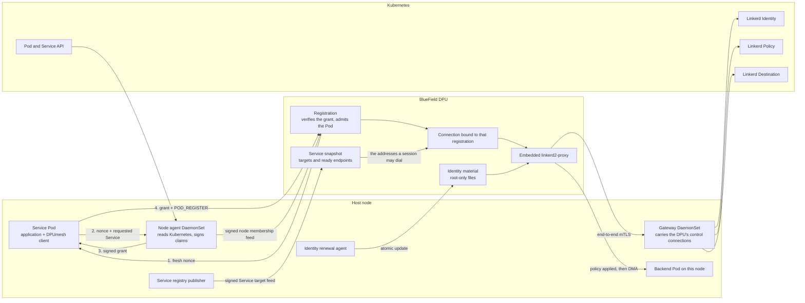

# DPUmesh Naming, Identity, and Control Plane

DPUmesh maps application Service names to compact transport identifiers, admits
Pods through the Host↔DPU registration protocol, and drives the embedded Linkerd
consumer from the stock Kubernetes control plane. All three answer one question:
how the DPU learns who is calling and where the call may go.

## Terms

| Term | Meaning |
|---|---|
| node agent | a root-owned DaemonSet on the host that reads Kubernetes objects and signs claims |
| grant | the signed statement of a Pod's identity and authorized Service that registration must present |
| feed | a file the DPU reads for authoritative data: Service targets, or node membership |
| generation | one version of a feed, installed whole by atomic rename and numbered monotonically |
| workload | the Linkerd identifier of the calling Pod, `{"ns":…,"pod":…}`, built from signed claims |
| gateway | a host-network DaemonSet that carries the DPU's control-plane connections, without reading them |
| admission switch | a file that stops new protected sessions while established ones continue |

## Registry

The registry contains one mapping per configured Service:

```text
ClusterIP:port    service-name        service-id
10.96.23.17:9091  echo-dpumesh       13
0.0.0.0:0         echo-grpc-dpumesh  20
```

The native API resolves `service-name` in `dmesh_create_qp`. The preload facade
resolves the IPv4 destination passed to `connect` and uses kernel TCP when the
destination is absent. Both use `src/dmesh_resolve.c`.

The registry path is `$DPUMESH_CONFIG`, default `/etc/dpumesh/registry`. It is
loaded once per process. `0.0.0.0:0` defines a name-only entry.

## Trusted registration

`$DPUMESH_SERVICE` names the Service provided by the process. An unset or
unknown value creates a client-only channel.

```text
Host Pod                 trusted node agent                    DPU
  │                               │                              │
  │◀──────────────────────── REG_CHALLENGE(nonce) ───────────────│
  │── nonce + requested service ─▶│                              │
  │                               │── SO_PEERCRED/cgroup ─┐      │
  │                               │◀─ K8s Pod/Service ────┘      │
  │◀─ signed immutable claims ────│                              │
  │───────────────────────── WORKLOAD_GRANT ────────────────────▶│
  │───────────────────────── POD_REGISTER(service_id) ──────────▶│
  │◀──────────────────────── POD_ASSIGNED(pod_id, stripes) ──────│
  │───────────────────────── MMAP_EXPORT × regions ─────────────▶│
  │◀──────────────────────── POD_INIT_RESULT(READY) ─────────────│
```

The DPU creates a fresh 32-byte nonce for each Comch connection. The root-owned
node agent identifies the Unix-socket peer with `SO_PEERCRED`, re-checks the
peer's process start time
around the cgroup read so a recycled pid cannot be attested as another Pod,
resolves the cgroup to the authoritative Kubernetes Pod, verifies that the Pod
labels select the requested Service, and returns a canonical HMAC-SHA256 grant.
It carries issuer, key id, issue and expiry, grant id, nonce, Pod UID,
namespace, Pod name, ServiceAccount, node and Service id. The application relays
the grant; it cannot change a claim.

The DPU selects the key by the signed key id, verifies and consumes the grant
once, rejects a Service other than the granted one, constructs the Linkerd
workload JSON from the signed namespace and Pod, and keeps the signed Pod UID
with the registration. A grant cannot move to another connection or survive
reconnect or DPU restart, because the nonce is different.

A Pod cannot state a workload or a Service of its own: the grant is the only
thing that names either, and a registration without one is refused. The Pod
enters backend selection after `POD_INIT_RESULT(READY)`.

Unregister, revocation or Comch disconnect removes the Pod from selection. Each
ARM worker first closes the connection and L7 state it owns. After every producer
has joined that barrier, the workers that own destination lanes drain them and
run one further progress pass, so DOCA has released the buffer references its
completion callbacks hold. Only then does the control thread destroy imported
mappings and return `POD_QUIESCED`.

Revocation begins this while the Pod's Comch connection is still live, so the
first gate — every EU acknowledging `RING_DEL` — runs against a Pod that is
still mapped. An acknowledgement the DPU channel has no posted receive for is
held as a fence and retried whenever that EU releases its execution unit, and
the control thread resends `RING_DEL` to unacknowledged EUs every 10 ms. A
quiescence that has not passed every gate within five seconds is reported with
the gate holding it, and reported again every five seconds it remains there;
until it passes, the slot and its imported mappings are held.

## Authoritative feeds

Two versioned feeds carry authority to the DPU: the Service target snapshot the
adapter presents to Linkerd, and the node membership the verifier revokes
against. They share one contract. Identity material is not one of them — it is
root-only files installed atomically, and what authenticates it is the
certificate the control plane issues against them.

The target snapshot places every address it names — session key, ClusterIP and
ready endpoints — in its Service, and a session refuses to dial an address the
held generation places in another one. Linkerd resolves endpoints from a live
control-plane watch while the snapshot arrives as a file, so an address no
generation places yet belongs to the session that selected it.

A generation is installed by atomic rename and ends with the envelope

```text
signature=<key-id>,<hex HMAC-SHA256 over every preceding byte>
```

The key comes from the same root-only keyring that verifies grants, so rotating
that keyring rotates feed signing. Only the signed prefix is parsed: bytes
appended after the envelope are refused rather than ignored, and a key id naming
a file outside the keyring directory is rejected.

A generation is adopted only if it is strictly newer than the one held and
completely parsed. A missing, malformed, oversized, unsigned or rolled-back
generation changes nothing — it never revokes membership, withdraws a target or
admits an unverified registration. Publishers derive each generation from the
last one they wrote rather than from the wall clock alone, so a clock step
backwards cannot present a rollback, and concurrent publishers are serialized so
the newest generation is the one installed last.

Consumers skip re-reading an unchanged generation, but that is an optimization
and never a decision. The DPU filesystem reuses the freed inode across a rename
and stamps coarse timestamps, so a generation is trusted to be unchanged only
once its inode, modification time and length all match *and* it has been
installed longer than that granularity.

## Membership and revocation

The node agent publishes the `(Pod UID, Service)` pairs this node may hold. The
same label rule decides a grant and a membership entry, so deleting a Pod or
changing its labels withdraws its pair. Every live Pod also contributes a bare
`-1` pair, which is what a Pod registering without Service membership holds.

The Comch control thread adopts each newer generation and closes the exact
registration whose pair has left it, through the same teardown a disconnect uses.
Withdrawal takes two consecutive generations: a generation whose snapshot
predates a registration omits it without meaning it, so one absence is not
authority to tear a Pod down.

## Linkerd control plane

The Linkerd static library creates destination, identity and policy clients from
`LINKERD2_PROXY_*` environment variables. Deployment requires the stock Linkerd
control plane, its three management-link gateway addresses, provisioned identity
material and a signed Service target feed. Missing configuration fails
preflight; no mock control-plane path exists. The remaining `mock-identity`,
`mock-policy` and `mock-destination` sources belong to the upstream
`linkerd-app-integration` test crate and are neither linked nor deployed.



The application can request only a compact Service id; it cannot assert Pod UID,
namespace, labels, ServiceAccount, node or Linkerd workload. The gateway is
byte-transparent, so it cannot mint or terminate mesh identity.

### Identity

1. A DPU identity agent obtains a projected ServiceAccount token with the
   Linkerd identity audience, the Linkerd trust roots, and a key and CSR whose
   DNS SAN is
   `<service-account>.<namespace>.serviceaccount.identity.<trust-domain>`.
2. The embedded proxy sends `Identity.Certify(token, identity, CSR)` to
   `linkerd-identity` over the configured control connection.
3. The returned leaf and intermediate certificates are installed in the proxy's
   in-memory credential watch. Destination and policy clients use that watch for
   mTLS.
4. The stock certify loop refreshes at 70% of certificate lifetime, bounded by
   the configured minimum and maximum. `TokenSource` reloads the token file on
   every certify request, so token rotation does not restart `dpumesh_dpu`.
5. Startup is not ready until the first certificate is installed. Trust roots,
   the private key and the CSR are read while parsing startup configuration, so
   replacing them is a controlled restart.

Control-service TLS names are distinct from the DPU proxy identity:

| Connection | Default TLS identity |
|---|---|
| Identity | `linkerd-identity.linkerd.serviceaccount.identity.linkerd.cluster.local` |
| Destination | `linkerd-destination.linkerd.serviceaccount.identity.linkerd.cluster.local` |
| Policy | `linkerd-destination.linkerd.serviceaccount.identity.linkerd.cluster.local` |

The DPU does not participate in the Kubernetes Service or Pod CIDRs, and on the
current hardware neither ClusterIPs nor Pod IPs are reachable from it.
`LINKERD_*_ADDR` therefore names a node-local TCP pass-through on the Host/DPU
management link. TLS remains end-to-end between the embedded proxy and the
Linkerd service; the gateway neither terminates identity nor interprets gRPC.
The host-network DaemonSet opens its upstream connections to the Service and Pod
CIDRs, so the target Pod's Linkerd inbound proxy still terminates mTLS.
Kubernetes API `port-forward` is not suitable, because it bypasses that inbound
proxy and reaches the control application as plaintext gRPC.

### Outbound policy

Each client session builds its own outbound stack and policy watch.
`OutboundPolicies.Watch` carries:

```text
source_workload = the exact workload value granted during Pod registration
target          = the real Kubernetes Service ClusterIP:port
```

For current Linkerd installations the workload is the injector-compatible JSON
object, for example `{"ns":"test-bench","pod":"bench-dpumesh-abc"}`. It is
neither the DPUmesh Service name nor the DPU proxy's certificate identity.

The embedded runtime is outbound-only. Its loopback admin and ephemeral inbound
listeners use a fixed local default and open no `GetPort` watches for
nonexistent DPU ports, which does not disable the per-session outbound policy
watches.

An invalid or unroutable policy fails the protected L7 session. A control-plane
disconnect retains only state Linkerd's watches already hold; a new lookup that
cannot obtain policy fails and is never converted to an unobserved TCP dial.
Trusted registration protects every Service, so the deployment script sets
`DPUMESH_L7_FAIL_CLOSED=1` and refuses to deploy with any other value: a
declined protected session ends rather than being forwarded as plain L4.

### Destination

The destination presented to Linkerd is the Service's real ClusterIP and port.
The adapter keeps its synthetic `10.96.0.<service-id>:9092` address only as an
internal DPUmesh registry key, and the registry agent publishes the mapping as a
signed versioned feed.

Destination and profile streams may update policy metadata while a session is
live. DPUmesh remains the authority for the set of node-local registered Pods.
The feed snapshots the Service ClusterIP and ready endpoint IPs, each address
paired with a port from the subset that published it. A selected address outside
that snapshot is rejected as `TargetMismatch` and counted; it is never replaced
by a TCP dial. Within the same Service, DPUmesh retains backend selection —
exact Linkerd endpoint weighting would require a Pod-UID-to-DPU-pod-id
translation contract and is not claimed.

### Policy boundary

Linkerd's stock `OutboundPolicies.Get/Watch` response contains protocol and
route configuration. It does not expose the inbound `AuthorizationPolicy`
allow/deny decision, which the destination's inbound proxy normally enforces
against the authenticated peer identity. The node-local DPUmesh backend path has
no Linkerd inbound proxy in that byte path, and every outbound stack
authenticates to the control plane with the shared `dpumesh-dpu` certificate.
Consequently:

- trusted registration and the authoritative same-Service snapshot are the
  admission boundary implemented here;
- `source_workload` is trustworthy input to stock outbound discovery, but the
  shared DPU certificate is not proof of the originating Pod to a destination;
- a Linkerd `AuthorizationPolicy` allow→deny→allow gate would require a
  per-workload identity lifecycle and an inbound enforcement point. It must not
  be simulated by a local mock or reported as an outbound API feature.

The Linkerd consumer handles opaque and protocol-aware payload modes. Its
decision-mode entry point returns a decline, which DPUmesh counts.

## Routing

A public QP names a Service. Backend pod and upstream port remain internal.

In L4 mode, the first data selects one ready backend and the connection remains
pinned. A Service assigned to an L7 payload mode is presented to the L7 adapter,
which publishes output through DPUmesh. `DMESH_L7_BACKEND_ANY` selects a backend
with the DPUmesh per-Service round-robin cursor.

The backend set contains ready Pods registered on the same DPUmesh node.

## gRPC authority

A gRPC client target is the DPUmesh Service name supplied to each connection
attempt. HTTP/2 `:authority`, TLS SNI and certificate identity remain gRPC
values. `GRPC_ARG_DEFAULT_AUTHORITY` is preserved; otherwise the target is used.

The C++ integration creates a targeted QP for each EventEngine `Connect`. The
server receives QPs through the experimental `PassiveListener` endpoint
injection API. Protobuf messages, stubs and handlers are unchanged.

## Identifier spaces

| Identifier | Representation |
|---|---|
| pod id | nonnegative `int8_t` on the wire |
| service id | nonnegative `int8_t` on the wire |
| port | `uint16_t` |
| sequence | per-connection `uint16_t` |
| internal routing fields | `int32_t` |

`POD_REGISTER` is a fixed 12-byte message. The v1 grant is a 1090-byte canonical
message whose numeric fields are explicit little-endian bytes and whose text is
NUL-terminated and zero-padded. Forward and reverse descriptors use fixed-width
fields and compile-time layout assertions. Host and DPU endpoints are
little-endian.

## Control channels

| Input | State supplied |
|---|---|
| static Host registry | name, socket destination, service id |
| DOCA Comch | pod registration, mappings, readiness, teardown, doorbells |
| signed feeds | Service targets and ready endpoints, node membership |
| root-only files | Linkerd identity material, the admission switch |

The static registry does not reload. Dynamic instances of an existing Service
join and leave through Comch registration.

## Node boundary

The data plane is node-local. A backend is reachable through the Comch
attachment and imported Host mappings registered on the same DPU. DPUmesh
creates no DPU-to-DPU links and registers no mappings from another node.

## Thread placement

| Thread | Work |
|---|---|
| Host application | API calls and QP operations |
| Host progress | reverse-ring drain and event-queue readiness |
| Host tail timer | deadlines of retained partial sends |
| ARM main | registration, revocation, teardown and the messages that wake the host |
| ARM data worker × A | DPA completions, routing, DMA and reverse publication |
| DPA EU × N | forward-ring drain and completion metadata |

In a Linkerd build, each ARM data-worker thread hosts a Tokio `current_thread`
runtime and persistent driver. Linkerd session state belongs to the configured
worker, or to every worker under `DPUMESH_L7_LINKERD_WORKER=all`. The ARM main
thread remains the owner of the control connection and of the messages that wake
the host.

## Operations

- `bench/linkerd_identity.sh status` reports systemd health, JWT issue and
  expiry timestamps, seconds remaining and consecutive token-renewal errors
  without printing the token.
- Alert before `control_identity_cert_expiration_timestamp_seconds - time()`
  reaches the drain and restart budget. Also alert when the renewal unit is not
  active, `token_seconds_remaining` approaches zero, or
  `control_identity_cert_refreshes_total{result="error"}` increases.
- Trust-root, private-key or CSR replacement runs as `bench/bench.sh
  rotate-identity`: drain protected admission, wait for the DPU to observe the
  switch and for `dmesh_sessions_active` to reach zero under a deadline,
  atomically replace the root-only material, restart, wait for `/ready`, restore
  Pod placement, then reopen admission. A drain that does not reach zero reopens
  admission and aborts rather than cutting sessions. Token-only replacement does
  not restart the proxy.
- `bench/bench.sh admission open|drain` sets the switch on its own. The DPU
  polls the file, so it needs no restart, and an unreadable switch means open: a
  lost file must never stop admission.
- Alert on `dmesh_control_events_total{kind="membership"}` with any reason other
  than `ok`. The consumer refuses to revoke on a feed it cannot trust, so a stuck
  publisher shows up as a stale generation rather than as an outage.
- Registration, membership, revocation and admission outcomes are exported as
  `dmesh_control_events_total{kind,reason}` and refused sessions as
  `dmesh_sessions_declined_total{reason}`. Both are process-global, so every
  worker's admin endpoint reports the same values.
- The node agent and gateway DaemonSets are rebuilt under one image tag, so
  deployment restarts them explicitly. An apply alone leaves the previous binary
  running behind a successful rollout status.

Hardware validation covers initial Identity failure, token rotation and fresh
certification, gateway and control-service loss and recovery, Linkerd control Pod
replacement, registration key overlap and prune, and mock-free traffic with no
fallback, drops or reorder. Target withdrawal refuses protected sessions and
restore recovers them with the L4 fallback counter at zero. Generations stay
monotonic across a clock step backwards and across concurrent publishers, an
unsigned generation is counted and refused, and a membership feed that
disappears revokes nothing. Removing a live Pod's Service label revokes that one
registration and leaves every other registration and its traffic untouched.

## Current bounds

- configured Service names come from one static registry;
- backend membership is node-local, and only node-agent-signed Pod and Service
  membership is admitted;
- service and pod identifiers occupy the signed one-byte wire space;
- deployment requires Linkerd destination, identity and policy services, gateway
  addresses, TLS service names, a signed per-service discovery feed and DPU
  identity material;
- Linkerd sessions run on one selected ARM worker, or on every worker when
  `DPUMESH_L7_LINKERD_WORKER=all`;
- concurrent sessions to one service address are isolated, each owning its own
  outbound stack and backend channel;
- declined L7 sessions are refused fail-closed, and the deployment script does
  not deploy a configuration that would forward them at L4 instead.
