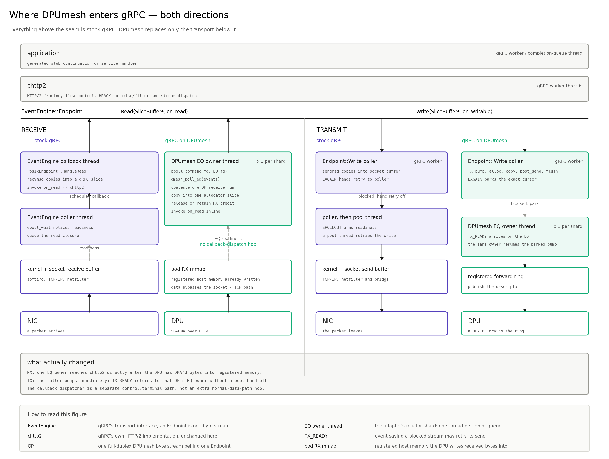
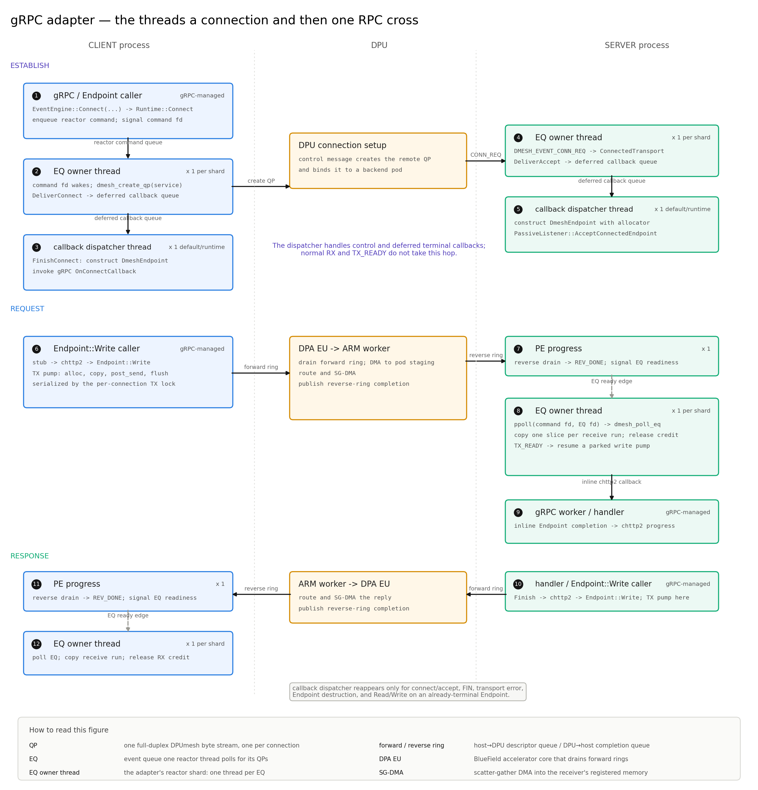

# DPUmesh gRPC Integration

This document defines the gRPC C++ adapter: how it maps chttp2 onto the native
transport, how an application bootstraps against it, and what its tests hold.
The native transport contract lives in [`API.md`](API.md).

The source contract is gRPC v1.80.0, C++17, and `libdpumesh.so.5`. The endpoint
injection APIs are experimental. Generated messages, stubs, services, RPC
semantics, metadata, deadlines, HTTP/2, credentials and TLS are unchanged;
DPUmesh is a byte-stream transport, not an RPC wrapper or an HTTP/2 parser.

## Model

gRPC chttp2 consumes an EventEngine byte-stream Endpoint, not necessarily a
POSIX socket. DPUmesh therefore supplies an Endpoint backed by one native QP and
injects accepted Endpoints through `PassiveListener`.

```text
generated stub / handler
        │ protobuf + gRPC semantics
        ▼
      chttp2
        │ ordered bytes
        ▼
 DmeshEndpoint ─ DmeshReactor ─ public C API / native EQ+QP
                                      │ shared rings and mappings
                                      ▼
                       DPA ─ ARM worker / embedded Linkerd
```

The adapter uses only the public native C API. Everything above the Endpoint is
stock gRPC; only what is below it changes:

- `DmeshEndpoint` is the adapter seam. It translates EventEngine byte-stream
  reads and writes; it does not parse HTTP/2 or implement RPC policy.
- `libdpumesh` is the workload-side transport. It produces forward-ring
  descriptors and interprets reverse-ring completions in the workload process.
- The per-Pod broker owns the DOCA device, progress engine and control
  connection. It hands sealed ring/mapping descriptors to the workload and
  relays an idle doorbell, but request and response bytes do not copy through
  it.
- The DPU-hosted Linkerd stack is where HTTP/2 and gRPC-aware routing and policy
  run. Its per-request cost is therefore a mesh cost, not C++ adapter work.

The broker split is invisible to the public C API but material to accounting:
Host CPU for this path means the complete Pod cgroup (application plus broker),
while DPU CPU means the ARM data-path process. [`DATA.md`](DATA.md) specifies
the rings and steady-state path; [`CONTROL.md`](CONTROL.md) §2-1.9 specifies
broker launch, isolation and ownership.



[PDF](figures/grpc_vs_stock.pdf)

## Using it

Only bootstrap differs. Create one runtime per process and share it across every
channel and the server attachment; a second runtime registers the process a
second time, and the native library does not reject that.

**Client.** The channel target is a Service name rather than an address.

```cpp
auto runtime = dpumesh::grpc::DmeshRuntime::Create(
    dpumesh::grpc::MakeNativeDmeshApiOps());

grpc::ChannelArguments args;
args.SetString(GRPC_ARG_DEFAULT_AUTHORITY, "api.example.com");  // optional
args.SetInt(GRPC_ARG_INITIAL_RECONNECT_BACKOFF_MS, 100);

auto channel = dpumesh::grpc::CreateDmeshChannel(
    *runtime, "echo-dpumesh", grpc::SslCredentials(ssl_options), args);

auto stub = Echo::NewStub(*channel);
grpc::ClientContext context;
context.set_deadline(deadline);
context.set_wait_for_ready(true);
grpc::Status status = stub->Call(&context, request, &response);
```

`CreateDmeshChannel` takes the parameters of `grpc::CreateCustomChannel` after a
runtime handle and returns `absl::StatusOr`. Channel creation is lazy, and gRPC
owns reconnect backoff, deadlines and RPC retry policy. An absent
`GRPC_ARG_DEFAULT_AUTHORITY` defaults to the target; an explicit value is
preserved. The target is not an IP address or a gRPC resolver URI. DPUmesh owns
the channel's EventEngine argument and preserves the rest.

**Server.** The service implementation is unchanged; native connections enter
gRPC through `PassiveListener`.

```cpp
grpc::ServerBuilder builder;
builder.RegisterService(&service);

std::unique_ptr<grpc::experimental::PassiveListener> listener;
builder.experimental().AddPassiveListener(server_credentials, listener);
std::unique_ptr<grpc::Server> server = builder.BuildAndStart();

auto attachment = dpumesh::grpc::AttachDmeshGrpcServer(
    *runtime, listener.get());
```

Optional arguments supply a per-connection memory-allocator factory (default:
unquota'd malloc slices) and an accept-error callback. Shutdown stops traffic,
calls `Detach()`, shuts down the gRPC server, destroys the server and listener,
then destroys the runtime.

**Build and test.** Link `grpc_dpumesh`.

```sh
make lib
cmake -S integrations/grpc -B build/grpc \
  -DDPUMESH_GRPC_SOURCE_DIR=/path/to/grpc-v1.80.0 \
  -DDPUMESH_GRPC_ENABLE_SANITIZERS=ON \
  -DBUILD_TESTING=ON
cmake --build build/grpc -j2
ASAN_OPTIONS=detect_leaks=0 \
  ctest --test-dir build/grpc --output-on-failure
```

ThreadSanitizer needs a separate build with `-DDPUMESH_GRPC_ENABLE_TSAN=ON`; it
instruments the vendored gRPC source too, which is why the two sanitizer
configurations are exclusive.

## Endpoint injection

gRPC exposes two seams for a non-socket transport, and the adapter uses a
different one on each side.

**Client.** `CreateDmeshChannel` constructs a `DmeshClientEventEngine`, installs
it as `GRPC_ARG_EVENT_ENGINE` through `grpc_event_engine_arg_vtable()`, and
calls `grpc::CreateCustomChannel` with the synthetic target `ipv4:127.0.0.1:1`.
The channel argument holds a shared pointer to the engine. The configured
Service name stays in the engine; the authority reaches chttp2 as
`GRPC_ARG_DEFAULT_AUTHORITY`. A caller-supplied `GRPC_ARG_EVENT_ENGINE` is
rejected.

The returned `shared_ptr<::grpc::Channel>` aliases an owner that also holds the
engine, which makes releasing its last public reference a definite point in
native terms. `grpc::Channel` has no shutdown call and gRPC retires an abandoned
Endpoint on its own asynchronous schedule; a QP left live for that interval
holds a proxy session no call can reach. The owner therefore stops the engine
admitting connects and retires every QP it still has out.

A one-shot lease shared between an Endpoint's transport and the engine makes
that safe from either side: whichever ends first retires the QP exactly once,
and a connect completing after cancellation, deadline or release — with no
Endpoint to own its QP — retires it too. A client retirement is
`dmesh_abort_qp`, not the graceful close: gRPC destroys an Endpoint when it has
abandoned that HTTP/2 connection, so the unsent tail belongs to a stream nothing
will read. The server side has no lease, because an accepted QP is owned by the
Endpoint injected with it and closes gracefully.

`DmeshClientEventEngine` implements `Connect` and delegates `Run`, `RunAfter`,
`Cancel`, `CreateListener`, and `GetDNSResolver` to the process default engine.
`Connect` ignores the resolved address, calls `DmeshRuntime::Connect` with the
Service name, and completes gRPC's `OnConnectCallback` with a `DmeshEndpoint`
over the returned QP. The connect deadline is a `RunAfter` timer on the
delegate; the timer and the connect callback both hold a weak reference to the
engine.

**Server.** No EventEngine is replaced. `AttachDmeshGrpcServer` installs a
runtime accept callback; each `DMESH_EVENT_CONN_REQ` is wrapped as a
`DmeshEndpoint` with an allocator from the caller's factory and submitted
through `PassiveListener::AcceptConnectedEndpoint`. `Detach()` clears the accept
callback and returns after in-flight injections finish. Every reactor can
consume the channel-wide native accept queue, and the EQ that receives the event
becomes the permanent owner of that QP. No native listen-port call and no
application-level HTTP/2 parser is introduced.

## Threads

The threads one connection and then one RPC cross:



[PDF](figures/grpc_threads.pdf)

| Thread | Owner | Count | Waits on | Runs |
|---|---|---|---|---|
| Endpoint caller | gRPC or the application | gRPC/application managed | — | `Endpoint::Read` and the initial `Endpoint::Write` pump |
| gRPC default engine pool | gRPC | gRPC | its own poller | deadlines, DNS, and every delegated `Run`/`RunAfter` |
| EQ owner thread | `DmeshReactor` | one per shard | `ppoll` on two fds | `dmesh_poll_eq`, QP lifecycle, receive delivery and TX-ready write resumption |
| callback dispatcher thread | `DmeshRuntime` | one per runtime by default | condition variable | connect/accept delivery and deliberately deferred Endpoint callbacks |
| native drain shard | `libdpumesh` | one per live EQ, bounded by landing stripes and CPU affinity | reverse rings or broker doorbell | completion interpretation and EQ readiness; an awake EQ owner may assist inline |
| per-Pod broker | node agent | one process per meshed Pod | DOCA PE and control channel | DOCA ownership, registration/control and idle doorbell relay; no payload copy |

`EQ owner thread` and `callback dispatcher thread` are names local to this
adapter, not gRPC thread-role names. `DmeshReactor` is an EQ poller and is
unrelated to gRPC C++ callback-API classes such as `ServerUnaryReactor`. The
adapter's `Executor` is likewise its own small queueing interface; it is not a
gRPC `EventEngine` or a gRPC-owned executor. A caller may replace the default
single-thread `ThreadExecutor`, in which case there need not be exactly one
executor OS thread.

`DmeshEndpoint` and `DmeshClientEventEngine` own no thread. Native drain shards
interpret already-published reverse entries without making DOCA calls. Under
load an EQ owner assists that drain inline; at idle the broker converts a DPU
doorbell batch into one Pod-global eventfd edge. The DPU-side workers and the
adaptive poll/doorbell policy are specified in [`DATA.md`](DATA.md).

An accepted Write is posted on the caller's thread and, if native capacity
stops it, resumed from an event the EQ owner thread delivers. A receive is
copied and handed to chttp2 on the EQ owner thread.

The callback executor receives work from several threads:

- a `DmeshRuntime::Connect` caller can enqueue an immediate validation or
  shutdown failure, while an EQ owner thread enqueues the eventual native connect
  result;
- an EQ owner thread enqueues each accepted transport for server injection;
- an EQ owner thread enqueues pending Endpoint callbacks failed by peer EOF or a
  transport error, and an Endpoint destructor can enqueue cancellation from
  whichever thread destroys it;
- an `Endpoint::Read` or `Endpoint::Write` caller enqueues a terminal failure
  already present when that call begins; failure to attach a driver during
  shutdown is also bounced through the executor.

On the default implementation all such tasks from every shard and endpoint of
one runtime share one FIFO and execute serially. The worker can call into
gRPC's connect callback, passive listener or chttp2 Endpoint completion. Those
callbacks may in turn call the Endpoint again, so the worker can indirectly
pump a write or enqueue a reactor command, but it never polls an EQ or owns QP
lifecycle.

## Ownership

| Object | Owner | Constraint |
|---|---|---|
| native channel | `DmeshRuntime` | destroyed after all reactors |
| native EQ | one `DmeshReactor` | exactly one polling thread |
| native QP lifecycle | EQ owner thread | destroyed under the connection's transmit lock |
| native QP transmit | the thread that pumps the write | serialized by the connection's transmit lock |
| RX batch run | reactor/Endpoint handoff | one slice per run, copied before credit release; credit held above the queue mark |
| pending write | Endpoint state | one cursor, completed exactly once |
| client channel | the application | one aliasing owner; its release retires that channel's QPs |
| callback executor | `DmeshRuntime` and its endpoints | shared ownership; default = one worker thread |
| runtime | application, channel and server attachment | shared; outlives what gRPC still holds |

A pending read completed by received bytes and a parked write resumed by
TX_READY run their completions on the EQ owner thread that delivered the event.
A write accepted completely by its initial pump returns `true` to its caller
and does not invoke its callback. Peer EOF, transport error and Endpoint
destruction instead enqueue affected pending callbacks on the callback
executor. A future read or write that encounters an already-terminal Endpoint
also enqueues its callback so it does not run inside that Endpoint call. The
executor claims its whole queue per wake, and a completion is queued as a
callback beside the status it completes with. An endpoint holds a shared
reference to the executor, so it is not destroyed while the endpoint can still
schedule on it; a `ThreadExecutor` released by a task on its own worker
detaches that worker.
The same lifetime rule applies after the application's last public Channel
reference is released: gRPC may retain and destroy its internal Endpoint later.
Passing an owning `shared_ptr<Executor>` is therefore the normal customization
path. `UnownedExecutor` is only for fixtures or integrations that can guarantee
the referenced executor outlives that deferred Endpoint teardown; keeping it
alive merely until `Channel::reset()` returns is insufficient.
`DmeshRuntime::Create` returns a shared pointer, and the client EventEngine and
the server attachment each hold one, so the reactors and their threads outlive
every channel and listener gRPC has not yet released.

Transmit is serialized by a per-connection lock. One post — reserve, fill and
submit — holds it, as does the native close-time flush, and the reactor takes
the same lock before destroying that connection's QP. Lock order is Endpoint
state then transmit lock; the transmit lock is never held across a driver call.
Cross-thread work enters a reactor through its command queue; only an
empty→non-empty queue transition writes the command eventfd. One loop iteration
consumes a bounded number of poll batches and then returns to that queue without
blocking, so a saturated EQ still yields to commands and to the stop request. A
QP marked for close is freed only after the entire current EQ batch.

## Write state machine

One EventEngine Write may contain many slices and may exceed one native post.
The Endpoint retains `(slice_index, slice_offset)` and advances it only over
bytes a post has taken.

```text
cursor bytes, capped at dmesh_post_max
  → dmesh_alloc (one reservation spanning consecutive slices)
  → copy each slice fragment into it
  → dmesh_post_send (commit + complete-unit submission)
  → next post
  → logical Write completes; native batching remains in force
```

The pump runs on the thread that entered it — the caller of `Write` or the EQ
owner thread delivering TX-ready — and holds the connection's transmit lock
from `dmesh_alloc` through `dmesh_post_send`, matching the one live reservation
a QP holds. One post spans every remaining byte of the logical Write that fits,
so an HTTP/2 frame header and its payload cost one native post. Physical units
and the trailing tail's deadline stay with the native core, as `API.md` §4
defines them. After the last post, the logical Write completes without forcing
a physical flush. A pump run takes a bounded number of posts and re-enters on
the same thread for the remainder. If the bounded native window fills before
the logical Write ends, it parks the cursor and resumes only after native
capacity reclamation identifies that QP as ready. A `Write` the pump finishes
before returning reports success by returning true and withholds the callback;
otherwise the callback runs after the final post is accepted.

`dmesh_alloc(EAGAIN)` automatically arms a one-shot `DMESH_EVENT_TX_READY`
event on the QP's EQ. The Endpoint retains the exact cursor and marks the write
parked; the reactor returns to its two-fd event loop — one command eventfd and
one native EQ eventfd, not waiting at all while a poll budget is outstanding and
otherwise bounded by `dmesh_eq_next_deadline_ns()` — and owns no batching state,
timerfd, or pending-write scan. On TX-ready it
forwards the hint to the named connection's Endpoint, which resumes its parked
write and drops a stale hint.

The Endpoint fails a parked write when peer EOF arrives, and a post that blocks
after the FIN flag is set fails instead of parking. Every accepted EventEngine
Write completes even when the peer vanishes mid-transfer.

Transmit batching has no gRPC-specific option: `PostSend` transfers ownership to
libdpumesh, and completing one EventEngine Write does not call the native
`dmesh_flush`. A native idle tail publishes immediately; on a busy stream the
newest partial tail coalesces until it fills, allocation pressure releases it,
or its bounded 500 us deadline expires. This matters because chttp2 may present
headers, DATA and trailers as separate logical writes; physically flushing each
one would defeat the native coalescer without strengthening gRPC's ownership
contract. Close still flushes the ordered tail before FIN.

## Read state machine

Native RX memory cannot be retained by gRPC after credit return. One
`dmesh_poll_eq` batch returns a connection's receives consecutively, and the
reactor consumes that run as a unit: it allocates one exact-size gRPC slice for
the run's total length, copies each event into it, hands the Endpoint one slice,
then calls `dmesh_release_rx_buffer` for every event. One slice, one Endpoint
lock acquisition and one queue entry cost one per run. A run ends at any other
event for that QP, so terminal events stay ordered against the byte stream. A
pending read consumes queued slices; otherwise the slice remains in the Endpoint
queue.

Above the Endpoint's high-water mark the reactor keeps the receive credit
instead of returning it, and the DPU lands no further bytes for that connection
until a read drains the queue and the Endpoint asks its reactor to release what
it holds. Retention is capped per connection, the credits belonging to a landing
ring shared across the shard; past that cap the credit returns with the copy,
`Stats::receive_credit_hold_dropped` advances and the connection is failed
closed, so a non-cooperating peer cannot grow the slice queue. Receive
backpressure therefore has no tunable, and there is no busy poll, retry timer,
connection scan, or per-RPC wrapper dispatch.

Peer FIN ends the read half. Transport failure or Endpoint destruction completes
both pending directions once with an error. Each Endpoint QP is one byte stream;
HTTP/2 framing and multiplexing remain entirely inside chttp2.

## Runtime configuration

Each `DmeshRuntime` opens one native channel. Channel creation connects to the
Pod's root-owned broker, which performs the attested DPU registration and hands
back the sealed ring/TX/RX descriptors plus the Pod-global doorbell eventfd.
The workload maps those objects and starts the native drain side; the runtime
still sees the same public `dmesh_create_channel()` contract. `$DPUMESH_SERVICE`
names the server identity, or is absent for a client-only process.

`DmeshRuntime::Options::reactor_count` sets the number of EQ reactor shards over
that one channel. Each shard is one EQ and one polling thread, which also runs
normal receive and TX-ready Endpoint progress for its connections. Outbound
connections are assigned round-robin; an inbound connection belongs to whichever
shard received its `DMESH_EVENT_CONN_REQ`.

One further adapter-owned thread per runtime is the default callback executor
shared by every shard and Endpoint. It delivers connect/accept results and
deferred Endpoint callbacks, including immediate terminal failures and pending
operations failed by EOF, transport error or destruction; normal receive and
TX-ready completions do not take this hop. `DmeshRuntime::Create` accepts a
`std::shared_ptr<Executor>` that replaces it, and endpoints share ownership of
the executor they schedule on. A non-owning adapter is subject to the deferred
gRPC Endpoint lifetime rule in the Ownership section.

`DmeshRuntime::stats()` sums each shard's `DmeshReactor::Stats`. Both counters
report a bound being reached rather than an error:
`receive_credit_hold_dropped` rises when a stalled connection exceeds its
credit-retention cap and is failed closed, and `eq_drain_budget_exhausted` rises
when a shard is saturated.

## Connection lifecycle

The registry maps configured Service names to service ids. Registered backend
instances form a separate live set, so instances may join or leave without
changing client channels or registry rows.

Each HTTP/2 connection remains pinned to one backend. Backend loss terminates
that stream; a later gRPC connection creates a QP and selects from the current
live set. In-flight RPCs retain normal gRPC deadline, retry, idempotency and
`wait_for_ready` semantics. New Service names require registry updates.

`GetPeerAddress` and `GetLocalAddress` report loopback addresses carrying the
DPU-assigned pod id and the connection's native port. A client stream has no
peer pod until the DPU pins one, and reads as `127.0.0.0:0`.

In the supported deployment the adapter's Service is always assigned to the
DPU-hosted Linkerd HTTP/2 path, so destination discovery, endpoint generation
updates, admission and workload identity are owned there rather than duplicated
in a `dpumesh:///` resolver inside the application process.

## Workloads

`bench/apps/` holds the gRPC programs the measurement harness drives over
this adapter, beside their socket and native peers; `bench/k8s/grpc-pods.yaml`
is their manifest. Their wire stack is gRPC chttp2 → DPUmesh endpoint →
shared host rings → Host↔DPU DMA → embedded Linkerd. The broker owns setup
and idle wakeup but is not a byte hop. The Kubernetes manifest contains only
that path.

- `bench_grpc` is the controlled client behind `bench.sh point grpc-dpumesh …`.
- `echo_grpc` serves the benchmark service through the DPUmesh endpoint.
- `grpc_dpumesh_qps_benchmark` is the standalone closed-loop harness.

The deployed programs set `BENCH_TRANSPORT=dmesh`; `BENCH_DST_SERVICE` and
`DPUMESH_SERVICE` are Kubernetes Service identities resolved by the signed DPU
topology, and no TCP address is used for the data path. `bench.sh grpcbuild`
performs the workload build with `-DDPUMESH_GRPC_BUILD_QPS_BENCHMARK=ON`, and
`BENCH_DEPLOY_SCOPE=grpc bench.sh deploy` performs the complete DPU,
control-plane, image, Pod and smoke-test lifecycle.

`bench_grpc` accepts:

```text
PING
RUN      <req> <reply> <conc> <dur> <warmup> <threads>
OPEN     <req> <reply> <threads> <dur> <warmup> <rate> [const|poisson] [channels]
SELFTEST <payload> <threads> <dur> <rate> <const|poisson>
```

Each issued RPC joins the worker's live set before it reaches gRPC, so shutdown
cancels every one of them, and issuance closes under the lock the sweep takes.
A run bounded by its own duration plus its channels' connect budget reports the
fault and exits rather than holding the control port. The result line reports
RPC failures, outstanding calls, latency percentiles, retained-credit drops and
EQ budget exhaustion.

The standalone harness takes:

```text
grpc_dpumesh_qps_benchmark server dmesh SERVICE DURATION_S [REACTORS=1]
grpc_dpumesh_qps_benchmark client dmesh SERVICE WARMUP_S DURATION_S \
    CONCURRENCY REQUEST_BYTES RESPONSE_BYTES [REACTORS=1] [AUTHORITY=SERVICE] \
    [WAIT_FOR_READY=0]
```

The benchmark syntax, the rules a retained point must satisfy and the index of
every evaluation are in [`../bench/README.md`](../bench/README.md).

## Verification contract

The one-command entry point is
[`bench/suite/grpc_correctness.sh`](../bench/suite/grpc_correctness.sh). Run
`grpc_correctness.sh local` for host-only and release chttp2 checks,
`grpc_correctness.sh sanitizer` for Clang ASAN+UBSAN, and
`grpc_correctness.sh hardware` against an already deployed gRPC scope. `all`
runs them in that order. The hardware mode kills and recreates the client Pod
and temporarily applies policy/route fixtures; its cleanup removes those
fixtures.

The checklist below is the contract checked before a performance point is
retained. The linked script is the executable owner of each item.

| Check | Required observation | Executable owner |
|---|---|---|
| Host transport invariants | allocation/commit, bounded tail, EQ wake and lifecycle unit tests all pass | `grpc_correctness.sh local` → `make test-hostfree` |
| DPU egress queue | lane ownership, partial submission, SG-DMA grouping and error completion pass | `grpc_correctness.sh local` → `proxy_lane_queue_test` when the DOCA SDK is installed |
| Adapter state machines | byte-exact reads/writes, backpressure, EOF/error and callback ownership pass | `grpc_correctness.sh local` → release CTest `endpoint` and `reactor` targets |
| Real chttp2 interoperability | unary exchange uses stock chttp2 over paired DPUmesh Endpoints, including four independent channels | `grpc_correctness.sh local` → release CTest channel target |
| Public ABI | the adapter links only the public `libdpumesh.so.5` symbols | `grpc_correctness.sh local` → release CTest native-link target |
| Memory/UB safety | the same four targets pass Clang ASAN+UBSAN; no stack-backed executor is used across deferred gRPC teardown | `grpc_correctness.sh sanitizer` |
| Real-DPU teardown and reuse | a live HTTP/2 client is killed; sessions, tasks and imported mappings quiesce; the recycled slot re-registers and four channels exchange bytes | `grpc_correctness.sh hardware` → [`bench.sh grpcshutdown`](../bench/bench.sh) |
| Policy/routing semantics | traffic result and the DPU's own verdict counters agree for every gRPC surface | `grpc_correctness.sh hardware` → [`policy_route.sh`](../bench/suite/policy_route.sh) `grpc-surfaces` |
| Clean measurement precondition | client/server restarts are zero; `opened == closed`; active sessions, registrations and tasks are zero before/after a campaign | hardware gate plus `bench.sh l7metrics`; the sweep scripts reject restarts and dirty result fields |

Within those gates, the maintained tests require:

- byte-exact split writes and logical-boundary completion without forcing a
  native physical flush;
- consecutive slices coalesced into one post;
- no callback before the final post of a logical Write is accepted;
- exact cursor resume only after `DMESH_EVENT_TX_READY`, with no timer retry;
- peer FIN failing a parked write, and post-FIN backpressure failing a write;
- byte-exact completion of writes that span multiple pump runs;
- an asynchronous native TX error failing and closing the endpoint;
- one EQ polling thread and no mid-batch QP destruction;
- a batch run coalesced into one slice, ended by any other event for that QP;
- RX copy before release, credit held above the queue mark and released on read;
- inbound QP conversion and pre-bind event replay;
- real chttp2 unary exchange over paired Endpoints, including four concurrent
  same-service channels;
- the last public channel reference retiring its QPs by reset, while a surviving
  copy of that handle holds them live;
- ten gRPC channel create/drop cycles sharing one runtime, each cycle's QP
  retired at its drop and runtime statistics returning to zero;
- the runtime-owned default callback executor remaining valid across gRPC's
  deferred Endpoint teardown during channel churn;
- four concurrent channels for one Service using distinct QPs and closing
  independently;
- graceful server GOAWAY retiring the existing HTTP/2 channel;
- reconnect creating a fresh targeted QP, its abandoned predecessor reset rather
  than left to a FIN custody wait;
- public-symbol linkage against `libdpumesh.so.5`.

Hardware validation additionally checks the native register/readiness barrier,
real byte exchange, FIN, `POD_QUIESCED`, and slot reuse; `bench.sh
grpcshutdown` kills a client with a live HTTP/2 session, requires Linkerd
sessions/tasks and imported mappings to quiesce, re-registers the recycled slot
and runs another request. Those observations show the exercised graceful path;
they do not prove forced-death DMA isolation.

The complete fairness effect of the bounded poll budget under sustained real
hardware overload is not proved by the maintained tests. Default shared
executor ownership, shared runtime ownership and the return of
`DmeshReactor::Stats` to zero are covered by the channel churn tests; the
hardware runtime smoke additionally reports those statistics with real QPs.

Performance is deliberately a separate gate. Repeated open-loop capacity is
run by [`grpc_conns_sweep.sh`](../bench/suite/grpc_conns_sweep.sh) and judged by
[`analyze_grpc_sweep.py`](../bench/suite/analyze_grpc_sweep.py); the closed-loop
payload/concurrency shape and complete Pod/DPU CPU accounting are run by
[`grpc_closed_sweep.sh`](../bench/suite/grpc_closed_sweep.sh). A closed-loop
plateau must not be relabelled as open-loop clean capacity. The current
batching and Host-headroom receipt is
[`grpc-batching-20260901`](../bench/report/data/grpc-batching-20260901/FINAL.md);
the allocator/LTO A/B, low-overhead DPU `perf` profile and current payload knees
are in
[`grpc-l7-perf-20260901`](../bench/report/data/grpc-l7-perf-20260901/FINAL.md).

## DPU L7 request cost

A protocol-aware session is a full L7 proxy, not a framed DMA relay. Hyper
terminates the client-side HTTP/2 connection, decodes its frame and HPACK state,
and presents a request to the outbound stack. The stack then matches the gRPC
route, applies filters/retry/timeout policy, chooses a backend, classifies and
records the stream, and Hyper encodes the request into a distinct backend-side
HTTP/2 connection. The response traverses the corresponding reverse path.
Client- and backend-side HPACK dynamic tables are independent, and routing needs
decoded headers, so compressed header blocks cannot be forwarded unchanged.

Discovery, protocol detection, stack construction and HTTP/2 handshakes are
connection/session work. They matter under churn, but they are not charged once
per RPC on the persistent eight-channel capacity workload. In particular,
`DmeshIo::peek` returning zero makes detection read and replay a prefix once per
connection; an inclusive `Detect` call-tree percentage is therefore an ancestor
of the long-lived connection task, not that percentage of steady per-RPC self
CPU.

The remaining DPUmesh-specific byte path has concrete optimization room. RX
performs the one copy from DMA staging into Hyper's `ReadBuf`. TX first extends
the `DmeshIo` `Vec`, then the driver copies that queue into the DPU egress arena.
Every `DmeshIo` and driver-handle operation also takes the same per-connection
`Arc<parking_lot::Mutex<Inner>>`; publication currently observes queue length,
copies, consumes and reads drain state through separate calls. Direct
`AsyncWrite` reservation (PLAN O2) can remove the TX queue copy and fuse some of
those lock transitions, but it must preserve partial writes, backpressure,
ordering and cancellation. A worker-local/non-atomic specialization is a later,
riskier lever because the Linkerd stack's generic I/O contracts require
`Send + Sync` even though each current worker runs a single-thread Tokio runtime.

Under load the self-time profile is flat — memcpy, atomics, syscalls, H2/HPACK,
routing and Tokio, no single hot function; `px_worker_drain`,
`ExternalBackend::drain` and `doca_pe_progress` are each below 2 % and workers
idle at 0--1 %, which rules out a polling loop. The frame-pointer profile is
the retained instrument; inclusive call-tree percentages overlap and must not
be summed.

Capacity carries two definitions — open-loop `highest_clean_rps` and a
closed-loop plateau — and a closed-loop plateau must not be relabelled as
open-loop capacity. The current numbers, the sidecar comparison arm and the
Host-offload accounting are in [`REPORT.md`](../bench/report/REPORT.md) and
[`grpc-professor-20260902`](../bench/report/data/grpc-professor-20260902/ANALYSIS.md).

At the plateau the eight `dmesh-w0..7` threads account for essentially the
whole process reading and non-worker threads for a few hundredths of a core:
A=8 is a data-worker geometry, not a whole-process CPU limit.

Capacity scales with the data-worker count A and not with client channels
alone: adding channels at fixed A saturates the workers and lowers delivered
rate. Therefore hot-service deployment exposes one
`DPUMESH_THROUGHPUT_WORKERS` knob and derives A=K, a valid N and all-worker L7;
the scale runner also derives threads and channels from it. Client channel count
remains a workload property in the product interface and is not globally
equated with A. Independent N/K/A remain available for density deployments in
which K>A is intentional. Policy and injection fixtures use the same canonical
W when supplied, or parse effective K/A from the running DPU banner
(`bench/suite/deployed_geometry.sh`).
