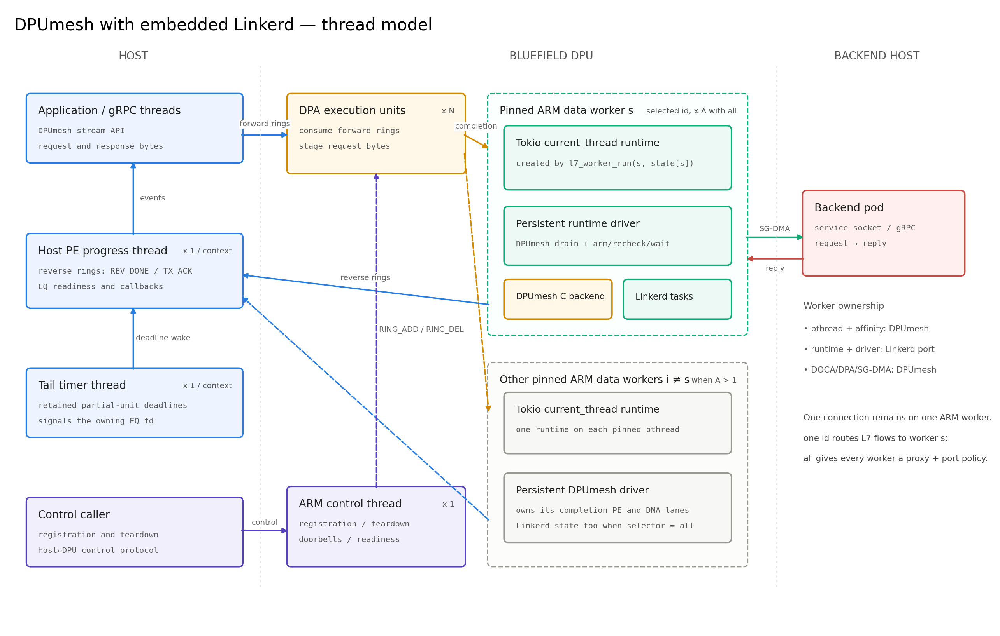
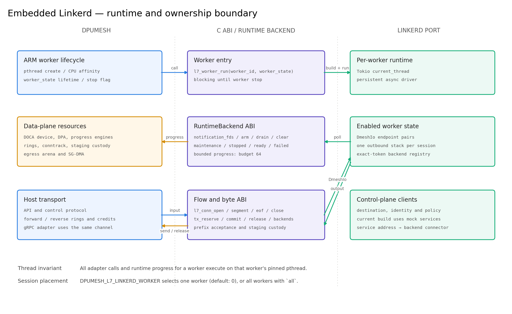
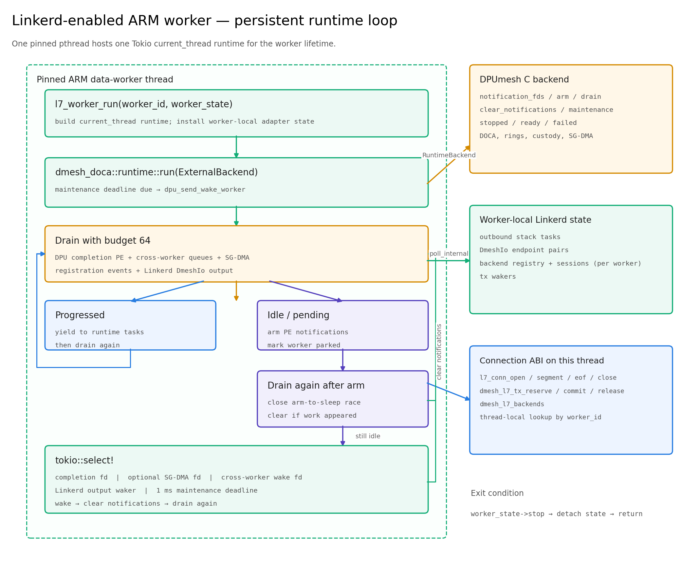

# DPUmesh L7 Execution Model

DPUmesh provides the Host↔DPU transport and the DPU data plane. The embedded
Linkerd port provides outbound proxy tasks over `DmeshIo`. The two components
meet at the C ABI in `linkerd/include/dmesh_l7.h`.

## Architecture



[PDF](figures/dpumesh_threads.pdf)

The DPU binary selects the L7 consumer at build time:

```text
-Dl7_backend=null      linkerd/shim/l7_null.c
-Dl7_backend=linkerd   linkerd/rust/libdmesh_l7.a
```

## Ownership

| Resource | Owner |
|---|---|
| Host API, gRPC transport adapter, control protocol | DPUmesh |
| DOCA device, DPA execution units, progress engines | DPUmesh |
| Forward and reverse rings, credits, conntrack | DPUmesh |
| Staging custody, egress arena, SG-DMA | DPUmesh |
| ARM data-worker creation, affinity, stop state | DPUmesh |
| Per-worker Tokio runtime and persistent driver | Linkerd port runtime |
| `DmeshIo`, backend registry, outbound proxy tasks | Linkerd port |
| Flow and byte-transfer ABI | `dmesh_l7.h` |

The Rust runtime receives opaque DPUmesh worker contexts. It does not initialize
or destroy DOCA resources.



[PDF](figures/linkerd_driven.pdf)

## Service modes

Services are assigned at DPU startup.

| Variable | Mode | Payload path |
|---|---|---|
| `DPUMESH_L7_DECISION_SVC` | decision | DPUmesh data path |
| `DPUMESH_L7_OPAQUE_SVC` | opaque stream | Linkerd adapter |
| `DPUMESH_L7_SVC` | protocol-aware stream | Linkerd adapter |

A service absent from these lists uses L4 forwarding. Duplicate assignments are
rejected. The Linkerd consumer accepts opaque and protocol-aware streams. Its
decision entry point declines the request, and DPUmesh records the decline and
uses L4 forwarding for that connection.

## Worker runtime

With the Linkerd backend, every DPUmesh data-worker thread calls
`l7_worker_run(worker_id, worker_state)`. The call creates one Tokio
`current_thread` runtime on the already pinned ARM thread and runs until the
worker stop flag is set.



[PDF](figures/l7_interaction.pdf)

`DPUMESH_L7_LINKERD_WORKER` selects which workers own Linkerd sessions and
defaults to `0`. A worker id names one; `all` gives every ARM data worker its
own proxy. DPUmesh validates the value against the ARM worker count once, at
initialization. A worker without Linkerd runs the same persistent driver without
session state. Adapter state is thread-local and is accessed only by its
`worker_id`.

With one selected worker, the completion of a request for a service the L7 layer
carries is routed to that worker instead of the one its port hashes to, so a
selected flow never meets a worker that would decline it. With `all` no flow can
meet such a worker, so requests keep the ordinary port policy and spread across
workers. A reply needs no rule either way: its upstream port is allocated in its
owner's residue class, so it returns to the same worker.

Under `all`, each worker builds a complete proxy with its own control-plane
clients, session slots, backend registry and metrics registry. The inbound,
outbound and control listeners are already ephemeral; the admin server is the
one fixed address, so worker `n` serves it at the configured port plus `n`.

The driver iteration is:

```text
maintenance when due
drain DPU completions, cross-worker work, SG-DMA, registrations and Linkerd output
if progress: yield to runtime tasks and repeat
arm DPU notifications
drain again
wait for an fd, Linkerd waker, or maintenance deadline
clear notifications and repeat
```

The runtime supplies a per-queue drain budget of 64. The arm-and-recheck
sequence closes the notification race before the runtime sleeps.

## Connection path

`dmesh_l7_flow` carries socket addresses, pod and service identifiers, workload,
mode and direction. A DPUmesh connection handle is derived from the source pod
and port and remains opaque to Linkerd.

```text
request staging
  └─ l7_conn_segment
       └─ client DmeshIo
            └─ Linkerd outbound stack
                 └─ backend DmeshIo tx
                      └─ dmesh_l7_send(..., BACKEND_ANY)
                           └─ DPUmesh egress arena → SG-DMA → backend pod

backend reply staging
  └─ reply DmeshIo
       └─ Linkerd outbound stack
            └─ client DmeshIo tx
                 └─ dmesh_l7_send(..., ORIGIN)
                      └─ DPUmesh egress arena → SG-DMA → client pod
```

The backend `DmeshIo` is published before the Linkerd connector resolves the
service address. The reply connection attaches to the request session by
`peer_pod` and destination port.

A session is named by a token — worker, slot and generation — for its whole
lifetime. Registrations, lifecycle events, acceptor tasks and backend-registry
keys carry it, so nothing from a closed session can bind to the session that
reuses its slot. The acceptor owns one task per session and cancels exactly the
one a close names.

The backend registry is per worker: the adapter publishes into the same
instance the worker's connector takes from, and no lock is shared between
workers. Publication/removal retain the original service address, while the
connector takes by the generation-safe session token because discovery may
return a different concrete endpoint address. A session-to-service index avoids
walking unrelated services while preserving service-local publication order. A
service the mesh has provided is never dialed over TCP; a missing channel fails
the connection instead of carrying the stream without policy.

## Buffer custody and backpressure

Arrival bytes remain in pod staging until the adapter calls
`dmesh_l7_release`. DPUmesh advances the receive window and returns sender
credit only for released extents. Closing either transport direction aborts the
paired endpoints before every outstanding extent is released. A stack endpoint
that finishes first also closes the session.

Pod disconnect follows the same ownership rule. The control thread only
unpublishes the pod; each ARM worker removes the connection, reply and
conntrack objects it owns and closes any Linkerd session on that worker. A
producer barrier precedes destination-lane quiescence, and a subsequent PE
progress fence ensures DOCA has returned task-internal buffer references before
the imported Host mmap is destroyed.

Linkerd output is drained from `DmeshIo` into the DPUmesh egress arena.
`dmesh_l7_send` returns the accepted prefix. An unaccepted suffix is restored to
the front of the tx queue in order. The tx waker notifies the persistent driver
when new output is available.

The Linkerd output path is:

```text
Linkerd buffer → DmeshIo tx queue → DPUmesh egress arena → DMA
```

The adapter reserves an egress chunk, copies the queued bytes into it and
commits. A commit of `0` cancels the reservation and leaves the bytes queued, so
a refusal costs no ordering. `DMESH_L7_TX_RESERVE=0` restores the earlier path,
which copies into a temporary buffer before `dmesh_l7_send`. This is a startup
compatibility/comparison selection, not an automatic fallback: when the default
reservation path has no chunk, the queued bytes wait for a later driver pass.

## Host transport and gRPC

The Host transport API and wire protocol are unchanged by the L7 runtime. Host
channels continue to register services, publish forward descriptors, drain the
reverse ring and return credits through DPUmesh.

The gRPC integration continues to use one `DmeshRuntime` per process and its EQ
reactors. gRPC frames enter the same DPUmesh channel as native traffic. A
service assigned to an L7 mode is intercepted only after it reaches the DPU ARM
worker.

## Current bounds

- Linkerd sessions run on one selected ARM worker, and every selected flow is
  routed to it; `DPUMESH_L7_LINKERD_WORKER=all` instead gives every worker a
  proxy and returns requests to the port policy.
- The adapter supports outbound opaque and protocol-aware streams.
- Concurrent sessions to one service are isolated. Each DMesh session owns a
  complete outbound stack, including its protocol, endpoint and reconnect
  caches, and its connector takes the exact session backend key. Stock TCP
  cache keys are unchanged.
- Backend selection uses `DMESH_L7_BACKEND_ANY`; DPUmesh selects the pod.
- The deployed Linkerd destination, identity and policy services are reached
  through the host-network gateway; identity material and the signed Service
  target feed are required configuration.
- Node-local transport is plaintext, and pod registration supplies the identity
  authorization needs. A destination service must return no `tls_identity` and
  no tagged transport port for a node-local backend: the outbound stack would
  otherwise run mTLS and a transport header over the `DmeshIo` itself.
- Linkerd output is copied once, into the DPUmesh egress arena.
- A declined session is counted by cause and forwarded at L4 in development
  mode; required trusted registration selects `DPUMESH_L7_FAIL_CLOSED=1` and
  refuses it instead.

The ABI and exact return semantics are specified in
[`linkerd/CONTRACT.md`](../linkerd/CONTRACT.md).
