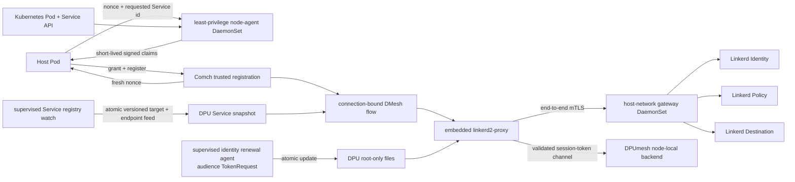

# Linkerd Control Plane on the DPU

This document fixes the contract between the Kubernetes Linkerd control plane
and the `linkerd2-proxy` outbound stack embedded in `dpumesh_dpu`. DPUmesh owns
the node-local transport and backend membership. Linkerd owns identity,
outbound policy, protocol/routing policy and destination metadata.

## Implemented state



This is the final correctness architecture for the current outbound-only,
same-Service milestone. The application can request only a compact Service id;
it cannot assert Pod UID, namespace, labels, ServiceAccount, node or Linkerd
workload. The gateway is byte-transparent, so it cannot mint or terminate mesh
identity. There is no mock fallback.

## Wire interactions

### Identity

1. A DPU identity agent obtains a projected service-account token with the
   Linkerd identity audience, the Linkerd trust roots, and a key/CSR whose DNS
   SAN is `<service-account>.<namespace>.serviceaccount.identity.<trust-domain>`.
2. The embedded proxy sends `Identity.Certify(token, identity, CSR)` to
   `linkerd-identity` over the configured control connection.
3. The returned leaf and intermediate certificates are installed in the
   proxy's in-memory credential watch. Destination and policy clients use that
   watch for mTLS.
4. The stock certify loop refreshes at 70% of certificate lifetime, bounded by
   the configured minimum and maximum. `TokenSource` reloads the token file on
   every certify request, so token rotation does not restart `dpumesh_dpu`.
5. Startup is not ready until the first certificate is installed. A key or CSR
   change requires a controlled process restart because those documents are
   loaded while parsing startup configuration.

Control-service TLS names are distinct from the DPU proxy identity:

| Connection | Default TLS identity |
|---|---|
| Identity | `linkerd-identity.linkerd.serviceaccount.identity.linkerd.cluster.local` |
| Destination | `linkerd-destination.linkerd.serviceaccount.identity.linkerd.cluster.local` |
| Policy | `linkerd-destination.linkerd.serviceaccount.identity.linkerd.cluster.local` |

The DPU does not participate in the Kubernetes Service or Pod CIDRs. On the
current hardware, direct connections from the DPU to both ClusterIPs and Pod
IPs are unreachable. `LINKERD_*_ADDR` therefore names a node-local TCP
pass-through on the Host/DPU management link (the benchmark uses
`192.168.100.1`). TLS remains end-to-end between the embedded proxy and the
Linkerd service; the gateway neither terminates identity nor interprets gRPC.
The host-network DaemonSet opens its upstream connections to the Service/Pod CIDRs,
so the target Pod's Linkerd inbound proxy still terminates mTLS; Kubernetes
API `port-forward` is not suitable because it bypasses that inbound proxy and
reaches the control application as plaintext gRPC.

### Outbound policy

Each DMesh frontend session builds its own outbound stack and policy watch.
`OutboundPolicies.Watch` must contain:

```text
source_workload = the exact workload value granted during Pod registration
target          = the real Kubernetes Service ClusterIP:port
```

For current Linkerd installations the workload is the injector-compatible JSON
object, for example `{"ns":"test-bench","pod":"bench-dpumesh-abc"}`. It is
not the DPUmesh Service name and not the DPU proxy's certificate identity.

The embedded runtime is outbound-only. Its loopback admin and ephemeral
inbound listeners use a fixed local default and do not open `GetPort` watches
for nonexistent DPU ports. This does not disable the per-session outbound
policy watches described above.

An invalid or unroutable policy fails the protected L7 session. A control-plane
disconnect retains only state already held by Linkerd's watches; a new lookup
that cannot obtain policy fails and is never converted to an unobserved TCP
dial. `DPUMESH_L7_FAIL_CLOSED=1` remains mandatory for production protected
services.

### Destination

The original destination presented to Linkerd must be the Service's real
ClusterIP and port. The adapter keeps its synthetic service address only as an
internal DMesh registry key. The DPUmesh registry agent publishes the
service-id mapping as a monotonically versioned watched feed.

Destination/profile streams may update policy metadata while a session is
live. DPUmesh remains the authority for the set of node-local registered Pods.
The controller feed snapshots the Service ClusterIP and ready endpoint IPs. A
selected address outside that snapshot is rejected as `TargetMismatch` and
increments `dmesh_backend_target_mismatches_total`; it is never replaced by a
TCP dial. Within the same Service, DPUmesh retains backend selection. Exact
Linkerd endpoint weighting would require the later Pod-UID/IP-to-DPU-pod-id
translation contract and is intentionally not claimed here.

## Policy boundary

Linkerd's stock `OutboundPolicies.Get/Watch` response contains protocol and
route configuration. It does not expose the inbound `AuthorizationPolicy`
allow/deny decision. Those inbound rules are normally enforced by the
destination's inbound proxy against the authenticated peer identity. The
current node-local DMesh backend path has no Linkerd inbound proxy in that byte
path, and all outbound stacks authenticate to the control plane with the
shared `dpumesh-dpu` delegate certificate. Consequently:

- trusted registration and the authoritative same-Service snapshot are the
  admission boundary implemented here;
- `source_workload` is trustworthy input to stock outbound discovery, but the
  shared DPU certificate is not proof of the originating Pod to a destination;
- a Linkerd `AuthorizationPolicy` allow→deny→allow gate would require a new
  per-workload certificate lifecycle and an inbound enforcement point. It must
  not be simulated by a local mock or misreported as an outbound API feature.

## Operations and alerts

- `bench/linkerd_identity.sh status` reports systemd health, JWT issue/expiry
  timestamps, seconds remaining and consecutive token-renewal errors without
  printing the token.
- Alert before `control_identity_cert_expiration_timestamp_seconds - time()`
  reaches the drain/restart budget. Also alert when the renewal unit is not
  active, `token_seconds_remaining` approaches zero, or
  `control_identity_cert_refreshes_total{result="error"}` increases.
- Trust-root, private-key or CSR replacement is a controlled restart: stop new
  protected admission, drain, atomically replace root-only material, restart,
  and wait for `/ready`. Token-only replacement does not restart the proxy.
- `bench/linkerd_service_registry.sh` rejects rollback and atomically publishes
  add/update/delete generations. Target withdrawal fails every new protected
  session until a newer valid snapshot appears.

Hardware validation covered initial Identity failure, token rotation and fresh
certification, gateway and control-service loss/recovery, dynamic target
withdraw/restore, Linkerd control Pod replacement, registration key overlap and
prune, and final mock-free traffic with no fallback, drops or reorder.
