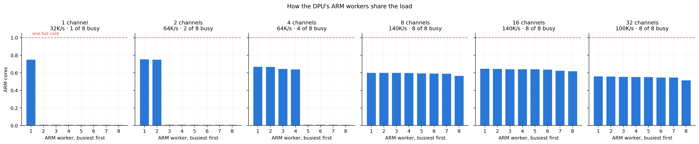
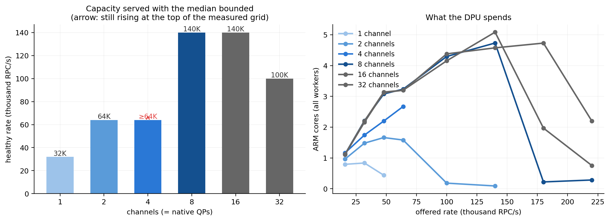
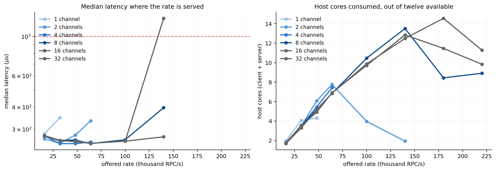
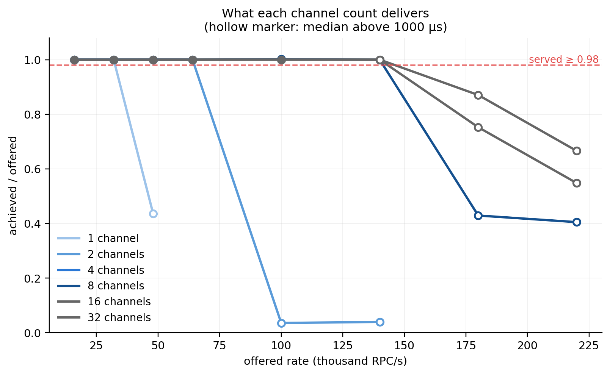

# gRPC Channel Count and Native QPs

The adapter maps one EventEngine endpoint to one native QP, and `dmesh_topology.h`
pins that QP to one forward ring, one DPA EU and one ARM worker. A gRPC channel
therefore reaches one of the DPU's eight data workers. This measures what that
costs and what more channels buy.

The client's offered load is held fixed — thirty-two worker threads at every
point — and only the channel count varies, so the transport connection count is
the single moving variable. Both endpoints get nine exclusive cores, so the host
does not bound the sweep before the transport does.

## Channels map onto workers until the workers run out



The busy worker count equals the channel count up to eight and stays at eight
beyond it, because eight is how many data workers the DPU runs. Idle workers draw
0.011–0.015 core. Which worker is busy changes run to run: port allocation walks
a bump cursor and the worker is `port % 8`, so each new channel lands on the next
one. The figure ranks workers by load rather than by index for that reason.

Past eight channels the extra QPs share workers — two each at sixteen, four each
at thirty-two — and the sweep shows what that sharing is worth.

## Capacity



The highest rate each channel count serves with its median under 1 ms, and what
it costs there:

| Channels | Healthy rate | p50 | ARM cores | Busiest worker | Host cores |
|---:|---:|---:|---:|---:|---:|
| 1 | 32,000/s | 349 µs | 0.84 | 0.749 | 4.06 |
| 2 | 64,000/s | 335 µs | 1.58 | 0.753 | 7.76 |
| 4 | 64,000/s | 254 µs | 2.67 | 0.668 | 7.43 |
| 8 | **140,000/s** | 397 µs | 4.73 | 0.599 | 13.51 |
| 16 | **140,000/s** | 272 µs | 5.09 | 0.645 | 12.85 |
| 32 | 100,000/s | 257 µs | 4.58 | 0.559 | 9.87 |

**One channel is worth 32,000/s and eight are worth 140,000/s, a factor of 4.4.**
The second channel doubles the first; beyond eight nothing more is bought,
because there are only eight workers to spread across. Sixteen and thirty-two
channels deliver the same 140,000/s as eight, at the same worker load — the extra
QPs share workers without adding capacity.

**The 1, 2 and 4 channel rows are lower bounds, not ceilings.** Each of those
sweeps ended when an endpoint died and the rates above the crash were never
measured: at 1 channel driven to 48,000/s, at 2 channels to 100,000/s, and at 4
channels to 100,000/s. `crashes.csv` records each one. The 8, 16 and 32 channel
rows cover the full rate grid.

## Nothing here is short of cycles



No worker reaches a full core anywhere in the sweep — the busiest is 0.753, at
two channels. At the eight-channel knee the workers hold 4.73 of eight ARM cores
and the endpoints 13.5 of eighteen host cores. Both sides have room.

What ends each curve is visible in what happens past it. At 8 channels and
180,000/s the delivered fraction falls to 0.43 and the worker cores fall with it,
from 4.73 to 0.22 — the DPU does less work per second while the backlog it is
draining gets deeper. A saturated core would show the opposite. The queue grows,
batches grow with it, and the per-request cost drops as they do, until delivery
collapses.



## An overload crash

An endpoint terminates with SIGSEGV under sustained overload. Three occurrences
in this sweep, all above the healthy rate for their channel count: 1 channel at
48,000/s, 2 channels at 100,000/s, 4 channels at 100,000/s. The crash leaves the
DPU unable to reclaim the pod's RX mmap, which corrupts every later run until a
full redeploy, and the restarted container comes back without its core pinning.
The driver records the point in `crashes.csv`, redeploys, re-pins, and resumes at
the next channel count rather than collecting through it.

The same fault appears on paths with no DPUmesh code in them, which places it in
the benchmark client rather than in the transport — see
[the L7 report](REPORT_GRPC.md) for the evidence and the sanitizer build that
reproduces it.

## Contract

| Axis | Value |
|---|---|
| Configuration | gRPC over the DPUmesh EventEngine adapter, unary RPC |
| Frame | 64 B (16 B benchmark header plus 48 B body) |
| Channels | 1, 2, 4, 8, 16, 32 — thirty-two client worker threads share them round-robin |
| Load | constant-rate open loop, 10 s per rate, one repetition |
| Rates | 16K–220K/s |
| Host budget | nine exclusive cores per endpoint, cores 18–26 and 27–35 |
| Core placement | NUMA node 1, SMT disabled, performance governor at 2.5 GHz |
| Reactors | 8 client, 8 server |
| Generator | one issuer thread per client worker, each owning a disjoint worker slice and its own share of the arrival timeline |
| DPU | `N/K/A = 32/8/8`, L7 proxy disabled, backend-pinned L4 passthrough |
| ARM accounting | per-tid `utime+stime` of the data-path process over a window opened 2.5 s into the run and closed 6 s later, divided by the DPU's own clock |
| Host accounting | cgroup `usage_usec` per endpoint over the matched window |
| Platform | `rapids4`, Intel Xeon Gold 6554S, Linux 5.15.0-186 |

Healthy means achieved/offered ≥ 0.98 with the median at or below 1 ms. Serving a
rate is not the same as serving it well. Per-point rows are in
[`data/conns-20260810/points.csv`](data/conns-20260810/points.csv) and the
crashes in [`data/conns-20260810/crashes.csv`](data/conns-20260810/crashes.csv).

## Reproduction

```sh
env DPUMESH_DPA_THREADS=32 DPUMESH_RINGS_PER_POD=8 DPUMESH_ARM_WORKERS=8 \
    DPUMESH_PROXY_L7_SVC= BENCH_NUMA_POLICY=local BENCH_DEPLOY_SCOPE=grpc \
    ./bench/bench.sh deploy
./bench/bench.sh pin grpcmax

setsid nohup env PIN_PROFILE=grpcmax ./bench/suite/grpc_conns_sweep.sh \
    --channels "1 2 4 8 16 32" \
    --rates "16000 32000 48000 64000 100000 140000 180000 220000" \
    --reps 1 --threads 32 --out /tmp/conns >/tmp/conns.log 2>&1 </dev/null &

python3 bench/suite/plot_conns.py /tmp/conns/points.csv \
    integrations/grpc/bench/report/figures --stem conns
```

The sweep takes `/tmp/dpumesh-bench.lock`: two campaigns under load contend for
the DPU and the memory system even on disjoint cores. `bench_grpc`'s `OPEN`
command takes the channel count as its last argument, so no redeploy is needed
between points.
