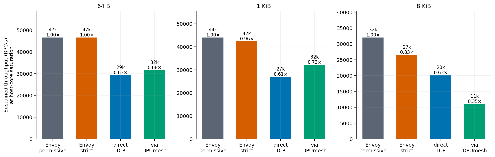

# DPUmesh gRPC Evaluation

Four L7 paths carry the same unary gRPC workload under one client core and one
server core each: gRPC through an Envoy sidecar as a plaintext TCP proxy, the
same with mutual TLS on the inter-pod leg, gRPC straight over TCP, and gRPC over
the DPUmesh EventEngine adapter. Every path runs the same client and server
binaries; only the transport under chttp2 changes.

## Transport

The adapter maps one EventEngine endpoint to one native QP. A logical `Write`
copies consecutive slices into native reservations, commits them with
`dmesh_post_send()`, and calls `dmesh_flush()` once at the write boundary.
`DMESH_EVENT_TX_READY` resumes a write parked on `EAGAIN`, and
`DMESH_EVENT_TX_ERROR` fails the endpoint. Physical batching belongs to
`libdpumesh`; the reactor holds no batch state, tail list, or batching timer,
and bounds its poll wait with `dmesh_eq_next_deadline_ns()`. HTTP/2, protobuf,
and TLS remain ordinary gRPC concerns.

## Host CPU at matched load


Host cores consumed by the client and server cores together, at loads every
path serves:

| Frame | Offered/s | Envoy permissive | Envoy strict | Direct TCP | DPUmesh |
|---|---:|---:|---:|---:|---:|
| 64 B | 8,157 | 1.018 | 1.090 | 0.663 | **0.521** |
| 64 B | 24,472 | 1.921 | 1.916 | 1.649 | **1.265** |
| 64 B | 29,366 | 1.917 | 1.912 | 1.784 | **1.393** |
| 1 KiB | 6,762 | 0.871 | 0.910 | 0.570 | **0.444** |
| 1 KiB | 20,286 | 1.919 | 1.907 | 1.503 | **1.066** |
| 1 KiB | 24,343 | 1.908 | 1.913 | 1.714 | **1.288** |
| 8 KiB | 3,254 | 0.483 | 0.522 | 0.324 | **0.272** |
| 8 KiB | 9,762 | 1.440 | 1.540 | 0.943 | **0.774** |
| 8 KiB | 11,714 | 1.712 | 1.800 | 1.134 | **0.943** |

DPUmesh is the cheapest path at every load measured, including against direct
TCP with no proxy at all: at 64 B and 29,366/s it serves the load on 1.393 core
where the sidecar needs 1.917 and a plain socket needs 1.784. The saving over
Envoy is the sidecar hop; the saving over direct TCP is the kernel network
stack.

Median latency separates the paths further. At 64 B the DPUmesh p50 rises from
235 µs to 447 µs across the measured range, while Envoy's rises from 205 µs to
1,267 µs and direct TCP's from 136 µs to 2,628 µs.

| Frame | Offered/s | Envoy permissive | Envoy strict | Direct TCP | DPUmesh |
|---|---:|---:|---:|---:|---:|
| 64 B | 8,157 | 205 µs | 213 µs | **136 µs** | 235 µs |
| 64 B | 24,472 | 1,046 µs | 1,144 µs | 1,177 µs | **280 µs** |
| 64 B | 29,366 | 1,267 µs | 1,363 µs | 2,628 µs | **447 µs** |
| 8 KiB | 11,714 | 287 µs | 351 µs | **146 µs** | 243 µs |

## Throughput at host-core saturation



The highest offered rate each path serves cleanly, with the endpoint cores
observed there:

| Frame | Configuration | Sustained RPC/s | vs permissive | Client | Server | p99 |
|---|---|---:|---:|---:|---:|---:|
| 64 B | Envoy permissive | **46,595** | 1.00× | 0.960 | 0.895 | 9.07 ms |
| 64 B | Envoy strict | 46,609 | 1.00× | 0.960 | 0.915 | 9.12 ms |
| 64 B | Direct TCP | 29,366 | 0.63× | 0.898 | 0.886 | 5.15 ms |
| 64 B | DPUmesh | 31,624 | 0.68× | 0.802 | 0.690 | 1.30 ms |
| 1 KiB | Envoy permissive | **44,053** | 1.00× | 0.959 | 0.894 | 8.31 ms |
| 1 KiB | Envoy strict | 42,443 | 0.96× | 0.953 | 0.920 | 8.14 ms |
| 1 KiB | Direct TCP | 27,050 | 0.61× | 0.923 | 0.886 | 6.68 ms |
| 1 KiB | DPUmesh | 32,223 | 0.73× | 0.843 | 0.640 | 1.26 ms |
| 8 KiB | Envoy permissive | **32,026** | 1.00× | 0.959 | 0.932 | 5.45 ms |
| 8 KiB | Envoy strict | 26,546 | 0.83× | 0.960 | 0.945 | 7.09 ms |
| 8 KiB | Direct TCP | 20,162 | 0.63× | 0.931 | 0.817 | 2.92 ms |
| 8 KiB | DPUmesh | 11,064 | 0.35× | 0.448 | 0.421 | 5.92 ms |

The two Envoy paths reach their ceiling with both endpoint cores at 0.96 — they
are bound by host CPU, and the fixed two-core budget is what stops them.
DPUmesh is not: it stops at 0.80 core at 64 B and at 0.45 core at 8 KiB, with
0.6–1.2 core of the budget still free. Its ceiling is set by the tail-latency
admission rule below, not by the host budget the comparison holds fixed.

The L4 host-CPU advantage therefore does not convert into an L7 capacity
advantage. Under this workload DPUmesh serves each load for the least host CPU
and the lowest median, and stops first.

## Tail behaviour

Median p99 at 64 B, each the median of three repetitions:

| Offered/s | Envoy permissive | Envoy strict | Direct TCP | DPUmesh |
|---:|---:|---:|---:|---:|
| 8,157 | 725 µs | 768 µs | 588 µs | **465 µs** |
| 16,315 | 651 µs | 1,003 µs | **359 µs** | 520 µs |
| 24,472 | **1,494 µs** | 1,564 µs | 2,271 µs | 10,545 µs |
| 29,366 | 1,741 µs | 1,875 µs | 5,148 µs | **1,287 µs** |

The 24,472/s row is not a trend. Within a 10 s run all connections pause once
for roughly 150–200 ms, and the three repetitions of one rate then differ by two
orders of magnitude:

| Offered/s | rep 1 | rep 2 | rep 3 |
|---:|---:|---:|---:|
| 16,315 | 350 µs | 567 µs | 520 µs |
| 24,472 | **199,175 µs** | 7,089 µs | 10,545 µs |
| 29,366 | 903 µs | 1,287 µs | 2,046 µs |
| 31,625 | 1,330 µs | 1,164 µs | 1,305 µs |

The stall does not attach to a rate, and p50 is unchanged across the
repetitions to within 10 µs. Host and DPU CPU
during a stalled repetition match a clean one to three decimal places, so the
paused state consumes nothing. `fail`, `reorder`, `overflow` and admission drops
are zero across the dataset, and the DPU log records no fault or recovery.
The measured behaviour is a lost wake-up, not saturation, congestion, or loss.

Because the collector requires p99 ≤ 10 ms, a rate whose repetitions include a
stall is rejected, which is what sets the DPUmesh ceilings above. This is an
open defect. Four causes are excluded by measurement: the retained-tail path,
since the adapter flushes at every write boundary and the deadline pass is
bounded at 1.5 ms; the host progress thread's block bound, since shortening it
tenfold leaves the stall length unchanged; TCP retransmission, since the
DPUmesh backend's TCP counters stay at zero while the direct-TCP backend
records 1.19 M segments over the same dataset; and the DPU, whose log records
no fault and whose ARM cores match a clean repetition.

## Correctness

Across 80 DPUmesh runs and 14,152,134 requests: `fail` 0, `reorder` 0,
`overflow` 0, admission drops 0.

The endpoint, channel, reactor, and native-link CTest targets pass in the normal
build and under ThreadSanitizer, as does the native transmit-policy suite. The
same four pass under AddressSanitizer with UndefinedBehaviorSanitizer and leak
detection enabled, with no invalid access, undefined behavior, or leak
reported.

The reactor tests cover logical-write flush, split and multi-slice writes,
`EAGAIN` resume, asynchronous TX failure, RX credit ordering, FIN, close, and
multi-reactor connection dispatch.

## Contract

| Axis | Value |
|---|---|
| Configurations | gRPC via Envoy permissive, via Envoy strict mTLS, direct TCP, via DPUmesh |
| Workload | unary RPC, symmetric request/response |
| Frames | 64 B, 1 KiB, 8 KiB |
| Load | constant-rate open loop; 8 persistent channels; 10 s per rate |
| Host budget | one exclusive client core and one exclusive server core per configuration |
| Core placement | NUMA node 1, SMT disabled, 2.5 GHz performance governor |
| Backend | exactly one ready server per configuration |
| DPU | `N/K/A=32/8/8`; L7 disabled; gRPC uses backend-pinned L4 passthrough |
| Platform | `rapids4`, Intel Xeon Gold 6554S, Linux 5.15.0-186-generic |
| Software | gRPC C++ v1.80.0; Envoy `v1.30-latest`; swap disabled |

A rate counts as clean when achieved/offered ≥ 0.98, admission drops ≤ 0.1% of
scheduled, and p99 ≤ 10 ms. Each reported point is the median of three
repetitions. Envoy strict authenticates and encrypts the inter-pod leg; DPUmesh
does not, and the two are not security-equivalent. DPUmesh spends DPU ARM cores
that the other three do not; the comparison is of host CPU under a fixed host
budget. Host-CPU figures for the L4 paths are in
[the L4 report](../../../../bench/report/REPORT.md).

Per-point medians are in
[`data/grpc-final-20260805/measurements.csv`](data/grpc-final-20260805/measurements.csv).

## Reproduction

```sh
env DPUMESH_DPA_THREADS=32 DPUMESH_RINGS_PER_POD=8 DPUMESH_ARM_WORKERS=8 \
    DPUMESH_PROXY_L7_SVC= BENCH_NUMA_POLICY=local BENCH_DEPLOY_SCOPE=grpc \
    ./bench/bench.sh deploy
./bench/bench.sh pin grpc

CONFIGS="grpc-envoy-permissive grpc-envoy-strict grpc-tcp grpc-dpumesh" \
    ./bench/suite/l4_proxy_data.sh --no-deploy --no-perf --out /tmp/grpc-run

python3 bench/suite/distill.py /tmp/grpc-run measurements.csv
python3 integrations/grpc/bench/suite/plot_grpc.py measurements.csv \
    integrations/grpc/bench/report/figures
```
