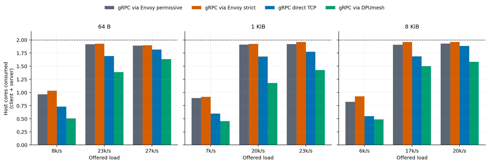
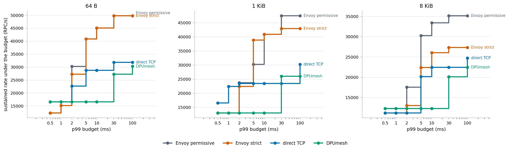
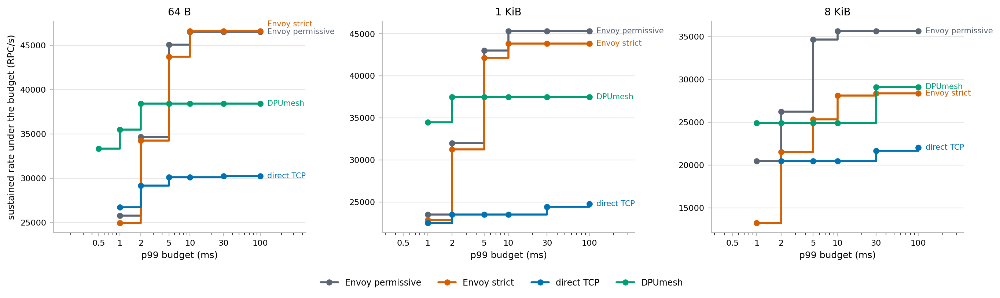

# DPUmesh gRPC Evaluation

Four L7 paths carry the same unary gRPC workload under one client core and one
server core each: gRPC through an Envoy sidecar as a plaintext TCP proxy, the
same with mutual TLS on the inter-pod leg, gRPC straight over TCP, and gRPC over
the DPUmesh EventEngine adapter. Every path runs the same client and server
binaries; only the transport under chttp2 changes.

Two load models are used, because they answer different questions. A constant
rate open loop asks what a given load costs; a fixed in-flight window asks what
the path sustains. The second matters here because an open loop lets the queue
grow without bound, which rewards whichever path is willing to queue deepest.

## Transport

The adapter maps one EventEngine endpoint to one native QP. A logical `Write`
copies consecutive slices into native reservations, commits them with
`dmesh_post_send()`, and calls `dmesh_flush()` once at the write boundary.
`DMESH_EVENT_TX_READY` resumes a write parked on `EAGAIN`, and
`DMESH_EVENT_TX_ERROR` fails the endpoint. Physical batching belongs to
`libdpumesh`; the reactor holds no batch state, tail list, or batching timer,
and bounds its poll wait with `dmesh_eq_next_deadline_ns()`. HTTP/2, protobuf,
and TLS remain ordinary gRPC concerns.

## Host CPU at matched load



Host cores consumed by the client and server cores together, at loads every path
serves. DPUmesh also spends DPU ARM cores, shown after the plus:

| Frame | Offered/s | Envoy permissive | Envoy strict | Direct TCP | DPUmesh |
|---|---:|---:|---:|---:|---:|
| 64 B | 7,568 | 0.963 | 1.034 | 0.729 | **0.507** + 0.77 |
| 64 B | 15,135 | 1.875 | 1.919 | 1.378 | **0.931** + 1.41 |
| 64 B | 22,703 | 1.919 | 1.927 | 1.694 | **1.387** + 1.96 |
| 64 B | 27,243 | 1.892 | 1.898 | 1.816 | **1.636** + 2.30 |
| 1 KiB | 6,513 | 0.891 | 0.915 | 0.595 | **0.453** + 0.78 |
| 1 KiB | 13,026 | 1.684 | 1.775 | 1.162 | **0.800** + 1.18 |
| 1 KiB | 19,539 | 1.912 | 1.925 | 1.682 | **1.178** + 1.70 |
| 1 KiB | 23,447 | 1.919 | 1.961 | 1.775 | **1.427** + 2.02 |
| 8 KiB | 5,606 | 0.820 | 0.924 | 0.548 | **0.486** + 0.87 |
| 8 KiB | 11,211 | 1.621 | 1.821 | 1.102 | **0.887** + 1.33 |
| 8 KiB | 16,817 | 1.906 | 1.960 | 1.685 | **1.500** + 2.08 |
| 8 KiB | 20,180 | 1.929 | 1.958 | 1.884 | **1.581** + 2.30 |

DPUmesh is the cheapest host path at every load measured, including against a
plain socket with no proxy at all. The saving over Envoy is the sidecar hop; the
saving over direct TCP is the kernel network stack.

How large it is depends on where it is taken. At the lowest load of each frame
DPUmesh sits 41–49% below the sidecar and 11–30% below direct TCP; at the highest
it sits 14–26% and 10–20% below them. The socket paths close the gap as load
rises because their per-message cost falls with it — a byte-stream read returns
whatever queued since the last one — while DPUmesh starts closer to its floor and
has less to gain. A single percentage taken at one load would therefore overstate
the saving; the shape of the table is the result.

The ARM column is the other half of the trade. At 64 B and 7,568/s the total is
1.28 cores against Envoy's 0.963; at 8 KiB and 20,180/s it is 3.88 against 1.929.
DPUmesh buys host cores with ARM cores, and the exchange worsens as the frame
grows. Host and ARM cores are not interchangeable — one is a general-purpose
socket, the other is a card already in the machine — so both are reported rather
than summed into a verdict.

## What the runtime costs

The rates on this page are two orders of magnitude below the ones the same
transports reach at L4. Carrying a 64-byte payload as a raw byte stream against
carrying it as a unary RPC, one core per endpoint:

| Path | L4 byte stream | L7 unary gRPC | Ratio |
|---|---:|---:|---:|
| via Envoy | 2,021,585/s | 47,481/s | 43× |
| via DPUmesh | **10,532,411/s** | 30,270/s | **348×** |

Between those two rows sits everything gRPC does per call: HTTP/2 framing and
flow control, the promise and filter machinery, protobuf, and the allocator that
serves them. It costs more than the transport underneath it by a wide margin, and
it costs the same regardless of which transport that is — which is why a path
that is 5.2× ahead at L4 is not ahead at L7 under a one-core budget. Six cores
per endpoint move DPUmesh to 130,309/s, still 80× below what the same transport
carries at L4 on a single core.

The comparison is between different units of work — a byte-stream exchange is not
an RPC — so the ratio measures what the runtime adds, not an efficiency loss in
the transport. The consequence for this report is the same either way: at L7 the
transport is not what the budget is being spent on.

## Rate under a latency budget

A single "maximum rate" rewards deep queueing: a deeper queue amortises the
per-wake cost over more messages, and the offered rate is still delivered, just
later. The number means nothing until a latency ceiling is attached, and any one
ceiling decides the ranking. These curves report, for each p99 budget, the
highest rate a path delivered while staying under it.



Open loop, 64 B:

| p99 budget | Envoy permissive | Envoy strict | Direct TCP | DPUmesh |
|---|---:|---:|---:|---:|
| 0.5 ms | 12,300 | 12,300 | **16,607** | 16,606 |
| 1 ms | **16,607** | 15,135 | **16,607** | 16,606 |
| 2 ms | **30,272** | 27,243 | 22,702 | 16,606 |
| 5 ms | **40,889** | 40,870 | 28,760 | 16,606 |
| 10 ms | **45,111** | 45,100 | 28,760 | 16,606 |
| 30 ms | **49,830** | 49,829 | 31,825 | 27,243 |

Under an open loop DPUmesh leads only at the tightest budget and then stops
improving: 16,606 from 0.5 ms all the way to 10 ms. Envoy converts a looser
budget into rate the whole way, tripling from 12,300 to 45,111.



The same measurement with the in-flight window held fixed, 64 B:

| p99 budget | Envoy permissive | Envoy strict | Direct TCP | DPUmesh |
|---|---:|---:|---:|---:|
| 0.5 ms | — | — | — | **33,348** |
| 1 ms | 25,759 | 24,945 | 26,720 | **35,476** |
| 2 ms | 34,649 | 34,251 | 29,156 | **38,437** |
| 5 ms | **45,089** | 43,739 | 30,122 | 38,437 |
| 10 ms | 46,526 | **46,630** | 30,122 | 38,437 |

The ranking inverts below 5 ms. At 0.5 ms DPUmesh is the only path that reaches
the budget at all; at 1 ms and 2 ms it leads by 33% and 11%.

The two models disagree because they present different arrival patterns: an open
loop pushes a schedule set outside the system and produces bursts, while a fixed
window is self-clocking, since a completion is what releases the next request.
The size of that effect is visible on one path alone — Envoy permissive delivers
47,490/s at a median of 10,904 µs under the open loop and 46,526/s at 5,484 µs
under the fixed window. **The same rate costs half the latency when the arrivals
are paced by completions.** Neither model is the correct one; a service whose
callers do not wait sees the first, and one whose callers do sees the second.

DPUmesh is the path most sensitive to the difference: best when it paces itself,
worst when a burst arrives — the same property that shows up as the collapse
below.

## Concurrency

Delivered rate and p99 against the in-flight window, 64 B, one core per endpoint:

| In-flight | Envoy permissive | Envoy strict | Direct TCP | DPUmesh |
|---:|---|---|---|---|
| 8 | 17,844 / 551 µs | 16,877 / 599 µs | 22,826 / 514 µs | **33,348 / 480 µs** |
| 16 | 25,759 / 734 µs | 24,945 / 756 µs | 26,720 / 853 µs | **35,476 / 804 µs** |
| 32 | 34,649 / 1,118 µs | 34,251 / 1,127 µs | 29,071 / 1,566 µs | **38,437 / 1,373 µs** |
| 64 | **41,399 / 2,090 µs** | 40,581 / 2,123 µs | 30,011 / 2,942 µs | 31,509 / 13,880 µs |
| 128 | **45,089 / 3,948 µs** | 43,739 / 4,029 µs | 29,799 / 6,415 µs | 30,459 / 27,720 µs |
| 256 | 46,526 / 7,625 µs | **46,630 / 7,568 µs** | 30,233 / 12,696 µs | 26,830 / 91,812 µs |

DPUmesh leads to 32 in-flight and then reverses: past that point its delivered
rate *falls* — 38,437 to 26,830 — while its p99 goes from 1.4 ms to 92 ms. The
other three keep trading latency for rate monotonically. Direct TCP saturates at
30,000 and converts nothing after that.

## What the one-core budget was hiding

One core per endpoint is a tight budget, and it does not press on the four paths
equally. Repeating the fixed-window sweep with nine cores available per endpoint
— one path at a time, the other three confined outside the benchmark range, so
every path is measured against the same budget — reorders the result:

| Frame | Path | 1+1 cores | 6+6 cores | Gain | Client | Server |
|---|---|---:|---:|---:|---:|---:|
| 64 B | Envoy permissive | 46,526 | 111,701 | 2.40× | 4.15 | 5.35 |
| | Envoy strict | 46,630 | 110,980 | 2.38× | 4.17 | 5.38 |
| | Direct TCP | 30,233 | 121,122 | 4.01× | 4.03 | 5.12 |
| | **DPUmesh** | 38,437 | **130,309** | 3.39× | **3.67** | 5.06 |
| 1 KiB | Envoy permissive | 45,332 | 109,581 | 2.42× | 4.20 | 5.38 |
| | Direct TCP | 24,757 | 118,651 | 4.79× | 4.68 | 5.08 |
| | **DPUmesh** | 37,467 | **129,588** | 3.46× | **3.73** | 5.11 |
| 8 KiB | Envoy permissive | 35,655 | 95,322 | 2.67× | 4.32 | 5.38 |
| | Direct TCP | 22,029 | 108,600 | 4.93× | 4.83 | 5.16 |
| | **DPUmesh** | 29,106 | **121,267** | 4.17× | **3.95** | 5.20 |

At one core the sidecar leads by 1.21×; at six DPUmesh leads by 1.17×, at every
frame, and does it on fewer client cores. **The ranking under a one-core budget
is a property of that budget, not of the transports.**

What changes is the cost per request. At 64 B, taken at each budget's own peak:

| Path | 1+1 client | 6+6 client | Change |
|---|---:|---:|---:|
| Envoy permissive | 20,176 ns | 37,169 ns | **+84%** |
| Direct TCP | 32,881 ns | 33,264 ns | +1% |
| DPUmesh | 25,002 ns | 28,137 ns | +12% |

On one core the sidecar is the cheapest of the three per request: the application
handles only a loopback socket and the sidecar batches many connections through
one event loop. Spread across six cores that same structure pays for itself —
work on one connection crosses workers, and the per-request cost nearly doubles.
DPUmesh keeps its proxying on the DPU and its host side per QP, so there is
little to coordinate across cores, and it converts the extra cores at more than
three times the rate. **That the per-request cost moves this way is measured;
attributing it to cross-worker coordination is an inference this dataset does not
separate from cache locality or allocator behaviour.**

The DPU moves the other way. Its ARM cores rise only from 1.90 to 2.75 while the
rate rises 3.4×, so the cost per request on the DPU falls from 49 µs to 21 µs:
more load per worker means deeper batching there too.

## Delivered rate, with the latency it costs

The highest rate each path delivered at 98% or better under an open loop, and
what the median and tail were there:

| Frame | Configuration | Delivered/s | vs permissive | Client | Server | p50 | p99 |
|---|---|---:|---:|---:|---:|---:|---:|
| 64 B | Envoy permissive | **47,481** | 1.00× | 0.995 | 0.911 | 10,904 µs | 18,393 µs |
| 64 B | Envoy strict | 47,481 | 1.00× | 0.995 | 0.915 | 10,973 µs | 17,460 µs |
| 64 B | Direct TCP | 30,270 | 0.64× | 0.973 | 0.934 | 2,122 µs | 10,674 µs |
| 64 B | DPUmesh | 30,270 | 0.64× | 0.931 | 0.897 | 2,201 µs | 77,067 µs |
| 1 KiB | Envoy permissive | **47,481** | 1.00× | 0.995 | 0.935 | 15,524 µs | 24,594 µs |
| 1 KiB | Envoy strict | 40,865 | 0.86× | 0.995 | 0.938 | 4,293 µs | 6,054 µs |
| 1 KiB | Direct TCP | 30,270 | 0.64× | 0.995 | 0.995 | 24,295 µs | 56,930 µs |
| 1 KiB | DPUmesh | 26,052 | 0.55× | 0.815 | 0.789 | **242 µs** | 18,388 µs |
| 8 KiB | Envoy permissive | **35,171** | 1.00× | 0.995 | 0.922 | 9,617 µs | 16,515 µs |
| 8 KiB | Envoy strict | 26,052 | 0.74× | 0.995 | 0.971 | 5,444 µs | 7,144 µs |
| 8 KiB | Direct TCP | 26,052 | 0.74× | 0.995 | 0.995 | 57,219 µs | 180,539 µs |
| 8 KiB | DPUmesh | 22,422 | 0.64× | 0.885 | 0.912 | **312 µs** | 40,902 µs |

Every one of these rates is deep in queueing. Envoy reaches its ceiling with a
median of 10–15 ms and direct TCP at 8 KiB with a median of 57 ms; DPUmesh
reaches its lower ceiling with a median of 242–312 µs, two orders of magnitude
below, and a tail that is worse than any of them. **DPUmesh's median is the best
in the table and its tail is the worst**, which is why the delivered ceiling on
its own is not the comparison to read.

mTLS lands where it should: identical to plaintext at 64 B, 0.86× at 1 KiB and
0.74× at 8 KiB, tracking the byte count.

## Correctness and an open defect

Across the retained runs `fail`, `reorder` and `overflow` are zero, and the
endpoint, channel, reactor, and native-link CTest targets pass in the normal
build, under ThreadSanitizer, and under AddressSanitizer with
UndefinedBehaviorSanitizer and leak detection enabled.

Under sustained overload an endpoint can terminate with SIGSEGV. It was observed
on the DPUmesh server driven past its knee, and on the **direct TCP** client at
32 in-flight — a path that involves no DPUmesh code, which places the fault in
the benchmark client's teardown of in-flight calls rather than in the transport.
The kernel records a general protection fault at a fixed small offset in libc,
the signature of a call through a corrupted function pointer. A container that
dies takes its log with it, so the images carry an ASan build selectable with
`BENCH_GRPC_BUILD=asan` and write the report to a host path. This is an open
defect; the sweeps record each occurrence, redeploy, and re-pin rather than
collect through it.

## Contract

| Axis | Value |
|---|---|
| Configurations | gRPC via Envoy permissive, via Envoy strict mTLS, direct TCP, via DPUmesh |
| Workload | unary RPC, symmetric request/response |
| Frames | 64 B, 1 KiB, 8 KiB (16 B header plus body) |
| Open loop | constant rate, 8 persistent channels, 8 worker threads, 10 s per rate, one repetition |
| Fixed window | 1–32 in-flight per worker over 8 workers, 10 s per point, one repetition; run at one core and at six cores per endpoint |
| Host budget | one exclusive client core and one exclusive server core per configuration; the six-core comparison gives one path 18–23/24–29 at a time and confines the other three to cores outside the benchmark range |
| Core placement | NUMA node 1, SMT disabled, 2.5 GHz performance governor |
| Host CPU | runqueue runtime of the endpoint cores (`/proc/schedstat`) for the open loop; pod cgroup `usage_usec` for the fixed window, which includes the sidecar |
| CPU window | 6 s, opened 2.5 s into each run so connection setup and teardown fall outside it |
| DPU | `N/K/A=32/8/8`; L7 disabled; backend-pinned L4 passthrough; ARM cores from per-tid ticks, 0.14 core at idle |
| Platform | `rapids4`, Intel Xeon Gold 6554S, Linux 5.15.0-186-generic |
| Software | gRPC C++ v1.80.0; Envoy `v1.30-latest`; swap disabled |

A rate is delivered when achieved/offered ≥ 0.98 with no failure, reorder or
histogram overflow, and the generator's own schedule holds. **Latency is not part
of that test**, which is why every delivered rate is reported with the p50 and
p99 observed there, and why the latency-budget curves rather than the delivered
ceiling are the comparison to read.

Envoy strict authenticates and encrypts the inter-pod leg; DPUmesh does not, and
the two are not security-equivalent. DPUmesh spends DPU ARM cores that the other
three do not.

Per-point data is in [`data/grpc-20260810/`](data/grpc-20260810/):
`measurements.csv` and `knees.csv` for the open loop, `closed_1core.csv` and `closed_6core.csv` for the fixed window at each budget. Host-CPU figures for the L4 paths are in
[the L4 report](../../../../bench/report/REPORT.md).

## Reproduction

```sh
env DPUMESH_DPA_THREADS=32 DPUMESH_RINGS_PER_POD=8 DPUMESH_ARM_WORKERS=8 \
    DPUMESH_PROXY_L7_SVC= BENCH_NUMA_POLICY=local BENCH_DEPLOY_SCOPE=grpc \
    ./bench/bench.sh deploy
./bench/bench.sh pin grpc

CONFIGS="grpc-envoy-permissive grpc-envoy-strict grpc-tcp grpc-dpumesh" REPS=1 \
    ./bench/suite/l4_proxy_data.sh --no-deploy --no-perf --out /tmp/grpc-open
./bench/suite/grpc_closed_sweep.sh --out /tmp/grpc-closed --reps 1

python3 bench/suite/distill.py /tmp/grpc-open measurements.csv
python3 integrations/grpc/bench/suite/plot_grpc.py measurements.csv \
    integrations/grpc/bench/report/figures
python3 bench/suite/plot_slo.py integrations/grpc/bench/report/figures \
    slo_grpc_open /tmp/grpc-open
python3 bench/suite/plot_slo.py integrations/grpc/bench/report/figures \
    slo_grpc_closed /tmp/grpc-closed/points.csv
```

Both sweeps take `/tmp/dpumesh-bench.lock`: two campaigns under load contend for
the DPU and the memory system even on disjoint cores, and each one's traffic
lands in the other's CPU window.
