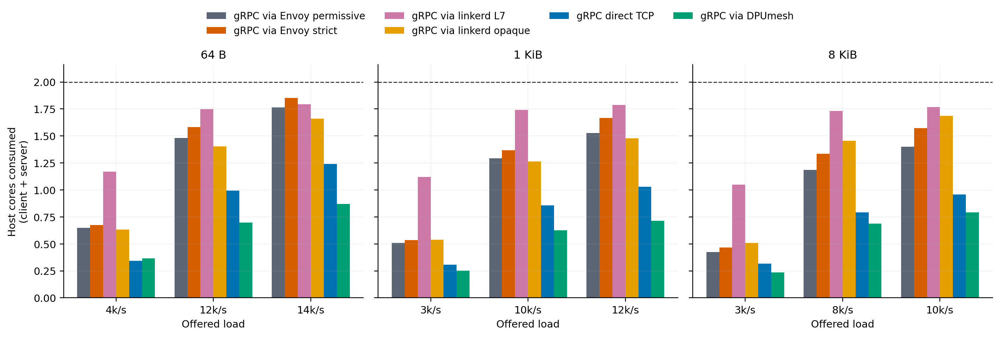
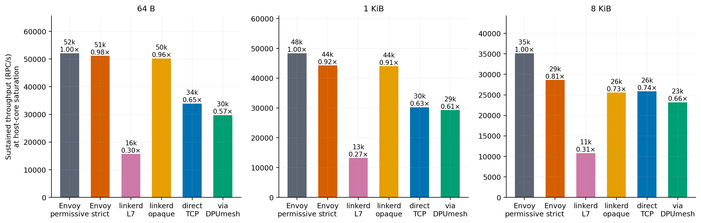
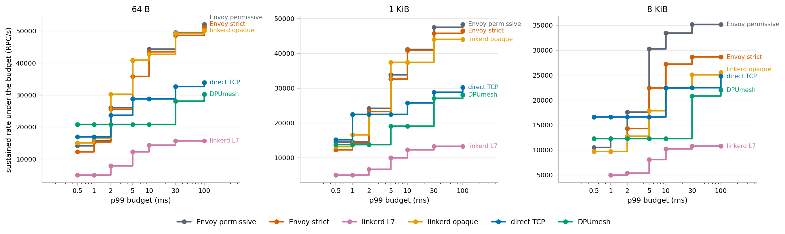
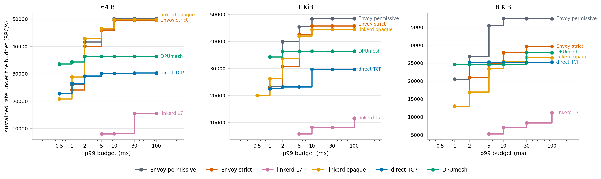

# linkerd on the gRPC L7 Evaluation

Six L7 paths carry the same unary gRPC workload under one client core and one
server core each: gRPC through an Envoy sidecar as a plaintext TCP proxy, the
same with mutual TLS on the inter-pod leg, gRPC through a linkerd2-proxy sidecar
in each of its two modes, gRPC straight over TCP, and gRPC over the DPUmesh
EventEngine adapter. Every path runs the same client and server binaries; only
what sits under chttp2 changes.

The two mesh implementations are not configured the same way, because they
cannot be. Envoy is given a `tcp_proxy` filter and forwards bytes. linkerd has
no plaintext mode between meshed pods and detects HTTP/2 by default, so it is
measured twice: once as it ships, and once with the benchmark port marked
opaque, which turns it into the byte forwarder Envoy already is. **The opaque
column is the matched comparison; the difference between the two linkerd columns
is the price of the L7 work itself**, measured on one proxy, one host, one hour.

## What each column is

| Column | Inter-pod leg | Proxy behaviour |
|---|---|---|
| Envoy permissive | plaintext | `tcp_proxy`, byte forwarding |
| Envoy strict | mTLS | `tcp_proxy`, byte forwarding |
| linkerd opaque | mTLS | byte forwarding, `protocol="opaq"` |
| linkerd L7 | mTLS | HTTP/2 parsed and re-encoded, per-request balancing |
| direct TCP | — | no mesh |
| DPUmesh | — | proxying on the DPU, host side per QP |

Each column was proved to be what it claims before it was measured: the L7 path
reports `outbound_http_*` families and `protocol="detect"`, the opaque path
reports `protocol="opaq"` and no HTTP families, and the receiving proxy on both
records `client_id=default.test-bench.serviceaccount.identity.linkerd.cluster.local`
— the mesh identity it authenticated the caller as, which is the evidence that
the leg is mTLS.

## Host CPU at matched load



Host cores consumed by the client and server cores together, at loads every path
serves. DPUmesh also spends DPU ARM cores, shown after the plus:

| Frame | Offered/s | Envoy perm. | Envoy strict | linkerd opaque | linkerd L7 | Direct TCP | DPUmesh |
|---|---:|---:|---:|---:|---:|---:|---:|
| 64 B | 3,925 | 0.649 | 0.676 | 0.631 | 1.170 | 0.344 | **0.364** + 0.48 |
| 64 B | 11,776 | 1.482 | 1.582 | 1.403 | 1.747 | 0.994 | **0.698** + 1.05 |
| 64 B | 14,131 | 1.765 | 1.852 | 1.662 | 1.793 | 1.240 | **0.870** + 1.30 |
| 1 KiB | 3,316 | 0.510 | 0.533 | 0.539 | 1.121 | 0.306 | **0.251** + 0.45 |
| 1 KiB | 9,947 | 1.292 | 1.366 | 1.263 | 1.741 | 0.857 | **0.625** + 0.94 |
| 1 KiB | 11,936 | 1.528 | 1.667 | 1.478 | 1.788 | 1.028 | **0.713** + 1.07 |
| 8 KiB | 2,698 | 0.425 | 0.467 | 0.508 | 1.048 | 0.316 | **0.235** + 0.47 |
| 8 KiB | 8,093 | 1.186 | 1.337 | 1.455 | 1.732 | 0.790 | **0.687** + 1.11 |
| 8 KiB | 9,711 | 1.401 | 1.573 | 1.687 | 1.767 | 0.956 | **0.790** + 1.21 |

Taking direct TCP as the no-mesh floor at 64 B and 11,776/s, a sidecar adds 41%
(linkerd opaque), 49% (Envoy permissive), 59% (Envoy strict) or 76% (linkerd L7)
to the host bill. DPUmesh is 30% *below* the floor and spends 1.05 ARM cores to
be there.

The linkerd L7 column is at 90% of its own ceiling by the third load of each
frame, which is why it flattens near 1.79 rather than continuing to climb: it has
run out of core, not out of work.

## What the sidecar itself costs

The collector attributes each pod's cgroup CPU to the application container and
the proxy container separately, so the proxy's own share is measured rather than
inferred. At 64 B:

| Offered/s | | Envoy perm. | Envoy strict | linkerd opaque | linkerd L7 |
|---:|---|---:|---:|---:|---:|
| 3,925 | proxy cores | 0.251 | 0.276 | **0.228** | 0.706 |
| | p50 | 187 µs | 194 µs | **182 µs** | 455 µs |
| 11,776 | proxy cores | 0.575 | 0.634 | **0.504** | 1.063 |
| | p50 | 202 µs | 207 µs | **197 µs** | 2,963 µs |
| 14,131 | proxy cores | 0.700 | 0.751 | **0.580** | 1.133 |
| | p50 | 185 µs | 243 µs | **181 µs** | 5,414 µs |

**linkerd's transport layer is not what costs.** Forwarding bytes under mTLS, its
proxy is cheaper than Envoy's *plaintext* TCP proxy at every load — 9%, 12% and
17% below it — and 17–23% below Envoy's mTLS proxy, which is the security
equivalent. Its median is the lowest of the four meshed columns.

**The L7 work is what costs.** The same proxy, on the same connection, with
protocol detection allowed to succeed, spends 2.0–3.1× the CPU of its own opaque
mode. Nothing else about the deployment changed: one annotation moved.

Two cautions about this table before the next section corrects for both.

The latency column is not a like-for-like comparison. 14,131/s is 90% of the L7
path's ceiling and 27% of Envoy's, so most of the L7 median there is queueing
against its own limit, not processing. The honest processing comparison is the
first row, at a quarter of the L7 path's ceiling: 455 µs against 182 µs. Even
that includes contention for the core the proxy shares with the application, and
this dataset does not separate the two.

The CPU columns move in opposite directions, because the application's own cost
is not a constant across paths. At 14,131/s the same client and server binaries
spend 48 µs of CPU per request behind the L7 proxy and 77 µs behind Envoy's:
linkerd's queueing delivers work to the application in deeper batches, which
makes the application cheaper. The pod total therefore *understates* what the L7
proxy adds, and the sidecar column *overstates* the net penalty. Neither is wrong;
they answer different questions.

## The measurement that does not depend on where you read it

A matched load compares paths at very different utilisations — 14,131/s is 90%
of the L7 path's ceiling and 27% of Envoy's — and the ranking it produces moves
with the load chosen. At 3,925/s the L7 path costs 1.80× Envoy permissive; at
14,131/s it costs 1.02×, which reads as a tie and is not one. Cost per request
removes the choice. Host CPU per delivered request at 64 B, µs of one core:

| Offered/s | | Envoy perm. | linkerd opaque | linkerd L7 | Direct TCP | DPUmesh |
|---:|---|---:|---:|---:|---:|---:|
| 3,925 | total | 165.2 | 160.7 | 298.1 | 87.7 | **92.7** |
| | of it, proxy | 64.1 | 58.0 | 180.0 | — | — |
| 11,776 | total | 125.9 | 119.2 | 148.4 | 84.4 | **59.3** |
| | of it, proxy | 48.8 | 42.8 | 90.3 | — | — |
| 14,131 | total | 124.9 | 117.6 | 126.8 | 87.9 | **61.5** |
| | of it, proxy | 49.5 | 41.0 | 80.2 | — | — |
| own ceiling | total | 36.9 | 38.1 | 115.7 | 58.0 | 60.4 |
| | of it, proxy | **1.3** | **1.4** | **74.7** | — | — |

At the same rate the L7 path is barely the expensive one, and at the top of its
range it stops being so at all: 115.7 µs per request at its 15,709/s ceiling
against Envoy's 122.1 µs at 15,645/s. What separates them is what happens next.
A byte-forwarding proxy amortises: as load rises one read covers more requests,
and by the time Envoy reaches its ceiling its proxy costs 1.3 µs per request —
it has very nearly amortised itself away. linkerd's opaque mode amortises
identically, to 1.4 µs. **linkerd's L7 mode does not amortise at all**: it floors
at 74.7 µs, because a parse, a policy lookup and a balancer dispatch happen once
per request no matter how many requests arrive together.

That is why both paths run out of the same client core — 0.982 at every ceiling
— and one of them stops at 15,709/s while the other continues to 52,094/s. At
their ceilings Envoy's proxy holds 0.034 of that core and linkerd's L7 proxy
holds 0.634.

The comparison in the previous section, 2.0–3.1×, is the most forgiving reading
of this difference, taken where the byte forwarder has not yet amortised. It is
the number to quote for a service running well below capacity. The floor above
is the number to quote for one running near it.

## Capacity

Highest rate each path delivered at 98% or better under a constant-rate open
loop, one core per endpoint:

| Frame | Envoy perm. | Envoy strict | linkerd opaque | linkerd L7 | Direct TCP | DPUmesh |
|---|---:|---:|---:|---:|---:|---:|
| 64 B | **52,094** | 51,153 | 50,209 | 15,709 | 33,898 | 29,708 |
| 1 KiB | **48,366** | 44,281 | 44,047 | 13,264 | 30,247 | 29,300 |
| 8 KiB | **35,161** | 28,622 | 25,568 | 10,790 | 25,870 | 23,195 |



linkerd opaque lands within 2% of Envoy strict at 64 B and 1 KiB, and 11% below
it at 8 KiB. linkerd L7 delivers 0.30×, 0.27× and 0.31× of the plaintext Envoy
sidecar — a factor of three, consistent across frame sizes, which is what a
per-request HTTP/2 hop costs on a core it shares with the application.

## What happens past the ceiling

The two meshes answer overload differently, and the difference is a design
choice rather than a defect.

Driven at 1.05× its discovered ceiling — 16,486/s against a 15,701/s knee — the
linkerd L7 path issued 164,832 requests in ten seconds and completed 95,707.
**56,083 of them failed**, the median latency was 1.03 s, and 47,569 samples ran
past the one-second bound of the latency histogram. Repeated four times, the
result moved by less than 2%. The proxy's own counters show requests standing in
`outbound_http_balancer_queue_length` and the balancer's failfast path returning
errors: linkerd sheds.

Every other path answers the same over-offer by queueing. Envoy permissive at
1.3× its knee still delivers, just later; direct TCP and DPUmesh return late or
drop admission, but not RPC errors. This is why the collector's rule — a rate is
delivered when achieved/offered ≥ 0.98 with no failure — rejects the linkerd
point rather than crediting it, and why the campaign records rather than retries
it.

For a caller, the distinction is the one that matters: past capacity the Envoy
paths make you wait, and the linkerd L7 path makes you handle an error.

## Rate under a latency budget

A single maximum rate rewards whichever path queues deepest. These curves report,
for each p99 budget, the highest rate a path delivered while staying under it.



Open loop, 64 B:

| p99 budget | Envoy perm. | Envoy strict | linkerd opaque | linkerd L7 | Direct TCP | DPUmesh |
|---|---:|---:|---:|---:|---:|---:|
| 0.5 ms | 14,131 | 12,301 | 15,069 | 4,997 | 16,937 | **20,794** |
| 1 ms | 15,645 | 15,354 | 16,607 | 4,997 | 16,937 | **20,794** |
| 2 ms | 26,075 | 25,589 | **30,266** | 7,851 | 23,713 | 20,794 |
| 5 ms | 40,871 | 35,829 | **40,916** | 12,302 | 28,805 | 20,794 |
| 10 ms | **44,325** | 43,508 | 42,697 | 14,297 | 28,805 | 20,794 |
| 30 ms | **49,546** | 48,612 | 49,282 | 15,709 | 32,643 | 28,101 |



The same measurement with the in-flight window held fixed, 64 B:

| p99 budget | Envoy perm. | Envoy strict | linkerd opaque | linkerd L7 | Direct TCP | DPUmesh |
|---|---:|---:|---:|---:|---:|---:|
| 0.5 ms | — | — | 20,818 | — | 22,740 | **33,584** |
| 1 ms | 26,065 | 24,162 | 28,892 | — | 26,533 | **34,373** |
| 2 ms | 41,691 | 40,160 | **42,972** | — | 29,219 | 36,403 |
| 5 ms | **46,667** | 46,032 | 46,519 | 8,061 | 30,189 | 36,403 |
| 10 ms | **50,202** | 49,633 | 49,749 | 8,121 | 30,189 | 36,403 |

linkerd opaque leads the mesh field below 5 ms under both load models and gives
that lead back above it. linkerd L7 clears no budget tighter than 5 ms at any
rate: its floor is 2.1 ms of p99 at eight requests in flight, against 453 µs for
its own opaque mode on the same proxy.

## Concurrency

Delivered rate and p99 against the in-flight window, 64 B, one core per endpoint:

| In-flight | Envoy perm. | Envoy strict | linkerd opaque | linkerd L7 | Direct TCP | DPUmesh |
|---:|---|---|---|---|---|---|
| 8 | 17,742 / 587 µs | 16,668 / 609 µs | 20,818 / 453 µs | 4,477 / 2,146 µs | 22,740 / 500 µs | **33,584 / 437 µs** |
| 16 | 26,065 / 771 µs | 24,162 / 791 µs | 28,892 / 659 µs | 5,894 / 3,107 µs | 26,533 / 860 µs | **34,373 / 810 µs** |
| 32 | 34,859 / 1,116 µs | 33,460 / 1,160 µs | 37,301 / 1,046 µs | 8,061 / 4,954 µs | 29,219 / 1,513 µs | **36,403 / 1,433 µs** |
| 64 | 41,691 / 1,880 µs | 40,160 / 1,958 µs | **42,972 / 1,847 µs** | 8,121 / 8,749 µs | 30,189 / 2,924 µs | 31,667 / 14,018 µs |
| 128 | 46,667 / 3,400 µs | 46,032 / 3,460 µs | **46,519 / 3,240 µs** | 8,849 / 16,335 µs | 29,620 / 7,599 µs | 28,134 / 27,937 µs |
| 256 | **50,202 / 6,372 µs** | 49,633 / 6,484 µs | 49,749 / 6,481 µs | 15,544 / 27,873 µs | 30,305 / 12,728 µs | 28,289 / 65,013 µs |

Between 8 and 128 in flight the linkerd L7 path barely moves — 4,477 to 8,849 —
while its p99 rises 7.6×, and its endpoint cores sit at 0.53 and 0.46. It is not
short of CPU there; it is short of something else. Only at 256 in flight does it
reach the core and the rate its open-loop ceiling predicted.

## Cores it cannot use

Repeating the fixed-window sweep with six cores per endpoint — one path at a
time, every other gRPC pod confined outside that budget — separates the paths
that were core-bound from the path that was not:

| Frame | Path | 1+1 cores | 6+6 cores | Gain | Client | Server |
|---|---|---:|---:|---:|---:|---:|
| 64 B | Envoy permissive | 50,202 | 111,782 | 2.23× | 4.14 | 5.35 |
| | Envoy strict | 49,633 | 109,104 | 2.20× | 4.12 | 5.34 |
| | linkerd opaque | 49,749 | 105,898 | 2.13× | 3.72 | 5.05 |
| | **linkerd L7** | 15,544 | **22,421** | **1.44×** | **1.68** | **2.07** |
| | Direct TCP | 30,305 | 120,217 | 3.97× | 4.01 | 5.12 |
| | **DPUmesh** | 36,403 | **128,739** | 3.54× | 3.63 | 5.05 |
| 1 KiB | Envoy permissive | 48,445 | 107,729 | 2.22× | 4.13 | 5.33 |
| | linkerd opaque | 44,411 | 99,657 | 2.24× | 3.67 | 5.01 |
| | **linkerd L7** | 11,683 | **19,353** | **1.66×** | **1.75** | **2.15** |
| | **DPUmesh** | 36,392 | **128,680** | 3.54× | 3.73 | 5.10 |
| 8 KiB | Envoy permissive | 37,380 | 94,508 | 2.53× | 4.26 | 5.33 |
| | linkerd opaque | 26,527 | 53,249 | 2.01× | 2.71 | 3.48 |
| | **linkerd L7** | 11,215 | **16,226** | **1.45×** | **1.72** | **2.09** |
| | **DPUmesh** | 27,966 | **119,016** | 4.26× | 3.91 | 5.20 |

Given twelve cores, linkerd L7 uses fewer than four of them and converts the
extra ones at 1.44×, where every other path converts at 2.0–4.3×. It leaves more
than half of each endpoint's budget idle while its own balancer queue is 57
requests deep.

**The opaque mode has the same weakness, and 8 KiB exposes it.** At 64 B and
1 KiB it converts cores as well as Envoy does — 2.13× and 2.24× against 2.23× and
2.22× — and reaches 95% and 93% of Envoy's ceiling. At 8 KiB it converts at 2.01×
against Envoy's 2.53× and stops at 53,249 against 94,508, using 2.71 and 3.48 of
its six cores where Envoy uses 4.26 and 5.33. Something in the linkerd proxy stops
taking cores once the bytes per request grow, whether or not it is parsing them,
and the L7 mode is the case where that limit is reached at every frame size
rather than only the largest. **This qualifies "linkerd's transport is not what
costs": it is not what costs under a one-core budget at 64 B and 1 KiB, which is
where this campaign's headline comparison sits, and it is a real limit at 8 KiB
once cores are available.**

During a loaded run the client proxy reports one ready balancer endpoint, and the
L7 path opened 78 inter-proxy connections over the whole campaign against 1,488
for the opaque path on the same topology — it pools and reuses a small number of
long-lived HTTP/2 connections where the opaque path opens one per client
connection. **That the L7 path is not core-bound at six cores is measured; that
connection pooling is the reason is an inference this dataset supports but does
not isolate from balancer scheduling or flow control.**

DPUmesh moves the other way: 3.5–4.3× on the same cores and the highest ceiling
at every frame, on fewer client cores than any socket path, with ARM cores
rising only to 2.76–3.24.

## Correctness

Every point was measured once. The repetition noise is visible on the path with
no proxy and a flat cost curve: direct TCP's host CPU per request wanders between
84.2 and 94.8 µs across its measured range with no trend, so about ±6% is the
floor below which a difference on this page means nothing. The 9–23% proxy-cost
differences between linkerd opaque and Envoy sit above that floor but not far
above it, and should be read as "comparable, slightly in linkerd's favour" rather
than as a measured constant. The 2–3× and 57× differences are far above it.

Across the retained runs `fail`, `reorder` and `overflow` are zero. Every point
in the three datasets was audited for the things the collector does not check:
that no endpoint exceeded its core budget, that the cgroup attribution and the
runqueue runtime of the same core agree, that a meshed path reports a non-zero
sidecar and an unmeshed one reports none, that DPU ARM samples exist on every
DPUmesh row, and that host cost rises with load wherever the path was not already
saturated. 483 rows, nothing flagged.

Two things were not clean and are recorded rather than smoothed over.

The direct-TCP gRPC client terminated with SIGSEGV once, at 16 in flight and
1 KiB, and the kernel logged a general protection fault at a fixed small offset
in libc — the signature of a call through a corrupted function pointer, and the
same open defect the gRPC evaluation reports on this path. It involves no mesh
and no DPUmesh code. The sweep recorded the restart, re-resolved the endpoint and
continued; the lost point was re-measured on the same deployment and merged.

The linkerd L7 overload points fail by design, as described above. They are
retained in `results.csv` with `validation_status=overload_shed` and
`served_clean=0`, and are excluded from every reported rate.

## Contract

| Axis | Value |
|---|---|
| Configurations | gRPC via Envoy permissive, via Envoy strict mTLS, via linkerd L7, via linkerd opaque, direct TCP, via DPUmesh |
| Workload | unary RPC, symmetric request/response |
| Frames | 64 B, 1 KiB, 8 KiB (16 B header plus body) |
| Open loop | constant rate, 8 persistent channels, 8 worker threads, 10 s per rate, one repetition, 267 retained points |
| Fixed window | 1–32 in-flight per worker over 8 workers, 10 s per point, one repetition, 108 points at each budget |
| Host budget | one exclusive client core and one exclusive server core per configuration; the sidecar shares its application's core. The six-core comparison gives one path 18–23/24–29 at a time and confines the other five to 30–35 |
| Core placement | NUMA node 1, SMT disabled, 2.5 GHz performance governor |
| Host CPU | runqueue runtime of the endpoint cores (`/proc/schedstat`) for the open loop; pod cgroup `usage_usec` for the fixed window, which includes the sidecar |
| CPU window | 6 s, opened 2.5 s into each run so connection setup and teardown fall outside it |
| DPU | `N/K/A=32/8/8`; L7 disabled; backend-pinned L4 passthrough |
| Platform | `rapids4`, Intel Xeon Gold 6554S, Linux 5.15.0-186-generic |
| Software | gRPC C++ v1.80.0; Envoy `v1.30-latest`; linkerd `edge-26.8.1`; swap disabled |

An injected linkerd proxy does not start under the `numactl` wrapper the
benchmark images use, so its pages are migrated onto the benchmark node after
pinning. Without that the linkerd columns would read their own memory across the
interconnect and carry a penalty no other path pays.

Envoy strict and both linkerd columns authenticate and encrypt the inter-pod leg;
Envoy permissive, direct TCP and DPUmesh do not, and they are not
security-equivalent. DPUmesh spends DPU ARM cores that the others do not.

The rate grid is anchored on the lowest knee among the selected paths. linkerd L7
holds that knee, so the matched loads on this page are lower than those in the
four-path [gRPC evaluation](../../grpc/bench/report/REPORT_GRPC.md); the two
tables are not row-comparable, which is why all six paths were re-measured here
in one session rather than four of them being carried over.

Per-point data is in [`data/linkerd-20260810/`](data/linkerd-20260810/):
`open/` and `measurements.csv` for the open loop, `closed_1core.csv` and
`closed_6core.csv` for the fixed window, `proxy-metrics-*.txt` for the data-path
verification.

## Reproduction

```sh
integrations/linkerd/bench/suite/linkerd_campaign.sh all
python3 integrations/linkerd/bench/suite/check_campaign.py \
    integrations/linkerd/bench/report/data/linkerd-20260810/open \
    integrations/linkerd/bench/report/data/linkerd-20260810/closed_1core.csv \
    integrations/linkerd/bench/report/data/linkerd-20260810/closed_6core.csv
```

The campaign takes `/tmp/dpumesh-bench.lock`: two campaigns under load contend
for the DPU and the memory system even on disjoint cores, and each one's traffic
lands in the other's CPU window.
